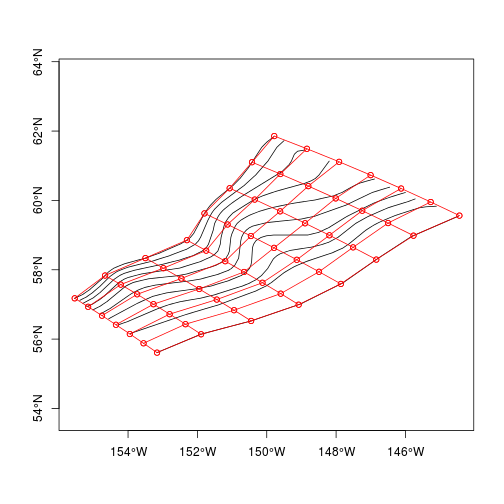
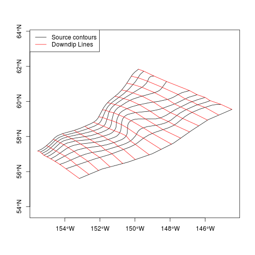

# **Making unit sources from contours defining the earthquake source geometry**
------------------------------------------------------------------------------

*Note: Do not edit the tutorial.md file directly, as it is auto-generated by the
corresponding tutorial.Rmd file. Edit the latter instead.*

# Background

This document explains how to use the script
'[produce_unit_sources.R](produce_unit_sources.R)' to convert earthquake
source contours (defining an irregularly dipping surface on which earthquake
slip can occur) into tsunami unit sources. 

You may find it helpful to directly read
'[produce_unit_sources.R](produce_unit_sources.R)' first (or instead),
particularly if you have programming experience. All functions used therein are
documented in the rptha package or other packages, and so R's help system can
be consulted for details. 

In a typical application you would make a copy of
'[produce_unit_sources.R](produce_unit_sources.R)' in a new working
directory, and then edit the script parameters as required before running. You
might also edit the code, depending on your needs.

To create a set of unit sources, you first need to have a set of source
contours. These describe the earthquake source geometry, which we will
discretize into unit sources. The source contours need to be in line shapefile
format, where each line corresponds to a contour with given depth. The actual
depths are stored in the shapefile attribute table, with an attribute name
'level' giving the depth in km.  Lon-lat coordinates should be used (WGS84).

The source contours will be used to define the unit sources, so they should
only cover areas where you want unit sources to be made. On a typical
subduction zone they would extend from the subduction zone trench to a depth
of around 50 km, though the latter depth may vary (see e.g.  Berryman et al.,
2015). 

The unit sources will be arranged in a logically rectangular grid which covers
the source contours. The number of unit-sources down-dip and along-strike is
chosen based on the user-provided value for the desired unit-source length and
width. The user can precisely control the location of the along-strike
boundaries of the unit-sources by providing a 'downdip_lines' shapefile, or use
code to make the latter automatically from the contours. The best approach
(implemented here) is to create the downdip-lines from the source contours as
outlined below, and then edit it later in GIS if required. 


# Example data

In this example we work with some contours for the Alaska source-zone. This is
situated at the eastern end of the Aleutians-Alaska subduction interface in the
North Pacific. The code below demonstrates how to read them in R and make a basic plot. 

**Note the code in this section is not required when using
'[produce_unit_sources.R](produce_unit_sources.R)' -- however, we include
this to demonstrate the input data requirements**


Here we load the rptha package. This causes numerous other packages to be
loaded automatically, which lead to various messages being printed to the
console.

```r
# Load packages. Various messages are printed (most suppressed here) -- 
# you can ignore warnings about 'changing locked binding'..
library(rptha)
```

```
## Warning: changing locked binding for 'antipodal' in 'geosphere' whilst
## loading 'rptha'
```

Here we read the source contours shapefile, and make a plot

```r
# Read the shapefile
alaska = readOGR(dsn='CONTOURS/alaska.shp', layer='alaska', verbose=FALSE)

# Print some information about it
summary(alaska)
```

```
## Object of class SpatialLinesDataFrame
## Coordinates:
##        min       max
## x 204.4529 215.52723
## y  55.6071  61.83479
## Is projected: FALSE 
## proj4string :
## [+proj=longlat +datum=WGS84 +no_defs +ellps=WGS84 +towgs84=0,0,0]
## Data attributes:
##      level      
##  Min.   : 0.00  
##  1st Qu.:16.25  
##  Median :27.50  
##  Mean   :27.00  
##  3rd Qu.:38.75  
##  Max.   :50.00
```

```r
# There should be a single attribute named 'level' containing the contour depths
names(alaska)
```

```
## [1] "level"
```

```r
print(alaska$level)
```

```
##  [1]  0.000 10.000 15.000 20.000 25.000 30.000 35.000 40.000 45.000 49.999
```

```r
# Make a quick plot of the input data
spplot(alaska, main='Alaska sourcezone contours giving the interface depth in km', 
    scales=list(draw=TRUE), aspect='iso')
```



# Creation of downdip lines

The downdip lines shapefile is used to define the along-strike boundaries of the
unit sources. An initial downdip lines shapefile can be created with the script
'[make_initial_downdip_lines.R](make_initial_downdip_lines.R)'. The code is pasted
below to illustrate the process. 

```r
#
# This file defines the subduction interface -- it is provided by the user
#
source_shapefile = 'CONTOURS/alaska.shp'

# This file is created
out_shapefile = 'DOWNDIP_LINES/alaska_downdip.shp'

# Set the along-strike spacing of the unit-sources in km
desired_unit_source_length = 50

# We will need the rptha package for a few functions below
library(rptha)

# Read the contours
source_contours = readOGR(source_shapefile, 
    layer=gsub('.shp','',basename(source_shapefile)))
```

```
## OGR data source with driver: ESRI Shapefile 
## Source: "CONTOURS/alaska.shp", layer: "alaska"
## with 10 features
## It has 1 fields
```

```r
# Make the downdip lines
ds1 = create_downdip_lines_on_source_contours_improved(
    source_contours, 
    desired_unit_source_length=desired_unit_source_length)

# Convert to a SpatialLinesDataFrame (this is the data structure R uses for
# line-shapefiles)
downdip_lines = downdip_lines_to_SpatialLinesDataFrame(ds1)

# Write to a shapefile
writeOGR(downdip_lines, 
    dsn=out_shapefile, 
    layer=gsub('.shp', '', basename(out_shapefile)),
    driver='ESRI Shapefile', overwrite=TRUE)
```

Here we plot the source contours and downdip lines, to illustrate how they
relate to each other. Note that if you are unhappy with the spacing or
orthogonality of the `downdip_lines`, you can simply edit the corresponding
shapefile (defined as `out_shapefile` above) in GIS, before proceeding to make
the unit-sources. 

```r
plot(source_contours, col='black', asp=1, axes=TRUE)
plot(downdip_lines, add=TRUE, col='red')
legend('topleft', c('Source contours', 'Downdip Lines'), 
    lty=c(1,1), col=c('black', 'red'))
```



# Setting input parameters in produce_unit_sources.R

To make the unit-sources, the script
'[produce_unit_sources.R](produce_unit_sources.R)' is used. The code below
comes directly from that script.

In typical usage of '[produce_unit_sources.R](produce_unit_sources.R)', the
user would edit the input parameters to define the source contour filename(s),
the assumed earthquake rake, the desired unit-source length and width, the
resolution of the output raster, and some numerical parameters, the most
important of which are the sub-unit-source grid spacing.

If Kajiura filtering is to be applied, then the user must also provide an
elevation raster (in lon-lat coordinates, with elevation in m, and negative
value being below MSL). The input source zones should of course have longitudes
inside the extent of the raster (although if they are off by 360 degrees then
the code will make the correction). Use of Kajiura filtering will cause the
code to run more slowly.

Note that more than one source-contour shapefile can be provided -- the code
will loop over them.

If you are running linux on a shared memory machine with multiple cores, then
you can run in parallel by setting `MC_CORES` to be a number greater than one. In
this case each core will run separate unit sources, until all are completed. 


```r
# Main 'driver' script to create the unit sources
#
# Gareth Davies, Geoscience Australia 2015
#
suppressPackageStartupMessages(library(rptha))
suppressPackageStartupMessages(library(raster))

###############################################################################
#
# Main input parameters 
#
###############################################################################

# A vector with shapefile names for all contours that we want to convert to
# unit sources
all_sourcezone_shapefiles = Sys.glob('./CONTOURS/*.shp') # Matches all shapefiles in CONTOURS
all_sourcezone_downdip_shapefiles = Sys.glob('./DOWNDIP_LINES/*.shp') # Matches all shapefiles in DOWNDIP_LINES

# Desired unit source geometric parameters
desired_subfault_length = 50 # km
desired_subfault_width = 50 # km

# A vector with the desired rake angle (one entry per sourcezone)
sourcezone_rake = rep(90, len=length(all_sourcezone_shapefiles)) # degrees

# Desired spacing of sub-unit-source points
# Lower values (e.g. 1000) may be required for accuracy in unit sources
# near the trench, because shallow deformation tends to be quite localised.
# For deeper unit sources, a much coarser point spacing can be used without
# sacrificing accuracy. 
# Hence we use different values for the 'shallow' sub-unit-source points (i.e.
# < 50km down dip) and the deeper ones.
# The computational effort approximately scales with the inverse square of
# the point density. 
shallow_subunitsource_point_spacing = 1000 # m
deep_subunitsource_point_spacing = 4000 #m

# Taper edges of unit_source slip with circular filter having this radius (m)
# This can be useful to avoid features of the Okada solution associated with
# slip discontinuities at the rupture edges. 
# E.G. For ruptures with shallow (but non-zero) top depth, the Okada solution
# suggests a high 'ridge' of deformation just above the top-edge, which is
# entirely due to the discontinuity in the slip. Slip tapering will smooth out
# such features.
slip_edge_taper_width = 10000

# For computational efficiency, only compute the okada deformation at
# distances <= okada_distance_factor x (depth of sub-unit-source point) 
# This can save computational effort for shallow unit sources.
# But be careful if using a wide subunitsource_point_spacing.
okada_distance_factor = 20 # Inf 

# elevation raster (required for Kajiura filtering). Should give elevation in m, 
# with the ocean having elevation < 0. Should have a lon/lat spatial projection. 
# Set to NULL to not use Kajiura filtering.
elevation_raster = NULL 
## A realistic example would look like:
#elevation_raster = raster('../../../../DATA/ELEV/GEBCO_08/gebco_08.nc')
## Note that for Kajiura filtering, a minimum depth of 10m will be assumed 
## (to avoid passing negative depths to the Kajiura smoothing routine)

# For computational efficiency, only apply Kajiura filtering in a box
# containing all points where the unit source deformation exceeds
# kajiura_use_threshold. Set to zero to apply Kajiura filter everywhere.
#
# Use of a small positive number can be faster.
# Since the unit sources have 1m slip, use of e.g. 1e-03 suggests an
# error of < 1cm to the free surface, even if the slip were 10m. 
# In practice there might be greater difference because our Kajiura routine
# involves interpolation to/from cartesian coordinates. Interpolation creates
# slight diffusion, and changes to the Kajiura box will affect the
# interpolation and so also affect this, though not in a systematic way.
kajiura_use_threshold = 1.0e-03

# When applying the kajiura filter, the data is regridded onto a grid with
# spacing=kajiura_gridspacing. The latter should be small compared to the
# horizontal distance over which the free surface deformation changes
# significantly (and small compared with the distance of
# tsunami_source_cellsize). If this is not small enough, artefacts
# can be observed especially when summing tsunami sources.
# A numerically easier alternative is to apply kajiura AFTER summing
# the sources [see script in 'combine_tsunami_sources' folder]
kajiura_grid_spacing = 1000 # m

# Cell size for output rasters
# The computation time will scale inversely with tsunami_source_cellsize^2
# Here we use a relatively coarse discretization, for demonstration purposes
tsunami_source_cellsize = 4/60 # degrees. 

# Spatial scale for sub-cell point integration
# During the Okada computation, points with "abs(deformation) > 10% of max(abs(deformation)"
# will have deformations re-computed as the average of the 16 Okada point values
# around point p. These 16 points have coordinates:
#     points = expand.grid(p[1] + cell_integration_scale[1]*c(-1,-1/3,1/3,1), 
#                          p[2] + cell_integration_scale[2]*c(-1,-1/3,1/3,1))
# If 'cell_integration_scale' is close to half the grid size, then this is an approximation
# of the within-pixel average Okada deformation. We do this because near the trench,
# the Okada deformation might not be smooth [e.g. when rupture depth --> 0], and this
# reduces the chance of artificial 'spikes' in the Okada deformation.
# In the code below, this is only applied along the 'top' row of unit-sources
# where the trench depth might --> 0.
cell_integration_scale = c(2000, 2000)

# Number of cores for parallel parts. Values > 1 will only work on shared
# memory linux machines.
MC_CORES = 12

# Option to illustrate 3d interactive plot creation
#
# Only make the 3d interactive plot if you can use interactive graphics and
# have rgl (i.e. use FALSE on NCI). 
make_3d_interactive_plot = FALSE

# Make a multi-page pdf plot of the sources
make_pdf_plot = FALSE

# Option to reduce the size of RDS output
# TRUE should be fine for typical usage
minimise_tsunami_unit_source_output = TRUE

# Location to save outputs. Make sure it ends with a '/'
output_base_dir = './OUTPUTS/'
# Make it if it does not exist!
dir.create(output_base_dir, recursive=TRUE, showWarnings=FALSE)
```

# Running the script

Assuming the rptha package has been successfully installed, the script can be
run from within R using the syntax:

```r
source('produce_unit_sources.R', echo=TRUE, max.deparse.length=Inf)
```

where the `echo=TRUE` command prints the commands to the screen as they are
executed. 

Alternatively the script can be run from the commandline directly. It
is setup to run a single shapefile, selected with an integer argument, e.g.:

    Rscript produce_unit_sources.R 10

The above command would run the 10th shapefile from within CONTOURS (assuming
alphabetical ordering). The main purpose of this option is to facilitate
running each sourcezone separately in a HPC environment (since it is relatively
easy to automatically submit many jobs with different integer arguments). Note
that in this case, the filenames of the source contours and downdip lines must
match, and no other files should be contained in their directories.

In either case the working directory must be the directory containing
'[produce_unit_sources.R](produce_unit_sources.R)'.

The speed of the code depends heavily on a number of input parameters. If it is
too slow, you can try decreasing the `tsunami_source_cellsize`. More
dangerously you can try increasing the `subunitsource_point_spacing`
parameters, or increasing the `kajiura_grid_spacing` (the latter only matters
if you provide elevation data). But if the parameters in the last sentence are
too coarse, you can expect numerical artefacts.


# Outputs

If the code successfully runs, it will generate: 
* a set of tiff files (one for each unit source) with the computed tsunami
deformation for each unit source (assuming 1m of earthquake slip).
* a pdf file for each source zone, with various plots that can be used to check
that the unit sources and tsunami deformations seem sensible.
* an RDS file for each unit source. This is a native R format file, and contains
the tsunami unit sources as a native R data-structure. It can be useful for
programming and debugging, since it contains the underlying data (such as
sub-unit-source points, exact unit source discretization, etc.). If using it
for debugging, you can ensure that more information is saved by setting
`minimise_tsunami_unit_source_output=FALSE`. This is not done by default, since
the output files can be rather large.

# Tips

* If you don't like the shape of the unit-sources, you may provide
a shapefile defining the along-strike boundaries of the unit sources as input.
This gives the user much more control over the lateral boundaries of the unit
sources. For more information see the associated R help page, using the
command: `?discretized_source_from_source_contours`.

* If `slip_edge_taper_width > 0`, then instead of having uniform slip, each source
has its slip smoothed to zero around the edges. To do this, the original
unit-source slip (1 inside the unit source, 0 outside) is convolved with a
circular filter with radius `slip_edge_taper_width`. This implies that if two
neighbouring sources are added, their smoothed slips will sum to 1 - and so the
smoothing should have no effect in the interior of uniform slip multi-source
rupture. However, smoothing can be useful to reduce artefacts caused by the
slip discontinuity at the boundaries of the rupture. For example, if the
rupture top-edge is buried a few km below the earth surface, then for
relatively low dips, the Okada solution implies a sharp 'ridge' of deformation
along the upper edge of the unit-source.  Although mathematically this is
correct, it is enhanced by the slip dropping discontinuously from '1' to '0',
which might not be physically realistic. Slip tapering smooths out such
features. 

* You should visually check that the computed initial conditions seem
reasonable. If the subgrid point spacing is too coarse, or the input contours
are poorly behaved, then artefacts can occur, particularly near the trench.
Typically these are minor spikes in deformation, and can be prevented by using a
finer `cell_integration_scale`. Numerically it is challenging to compute very
shallow ruptures over irregular source contours, because the Okada solutions
for each sub-unit-source become very concentrated at shallow depths (high
peaks/troughs of slip over a narrow area), and we rely on exact cancellation of
neighbouring peaks/troughs to avoid artefacts.

* If using Kajiura filtering with unit-sources, you can either apply the Kajiura
filter to the unit sources directly before summing them
('filtering-before-combining'), or you can sum the unit sources and
subsequently apply the Kajiura filter ('filtering-after-combining'). The above
code directly supports 'filtering-before-combining'( see codes in the
combine_tsunami_sources folder for 'filtering-after-combining'). Mathematically
the problem is linear, and there should be no difference between these two
cases. However, in practice our Kajiura filtering algorithm involves some
interpolation to move to and from cartesian and spherical coordinates. This
leads to some discretization error, and the approach of
'filtering-before-combining' is numerically more sensitive to this than
'filtering-after-combining'. If this is a problem you might consider using the
'filtering-after-combining' approach. The basic issue that that in the
filtering-before-combining approach, individual unit source deformations can
have steep gradients that would be cancelled by neighbouring sources after
combination. These steep gradients cause relatively high smoothing with the
Kajiura filter, especially if `slip_edge_taper_width=0`. To avoid artefacts any
discretization errors in this smoothing must cancel with those from
neighbouring unit source deformations.
