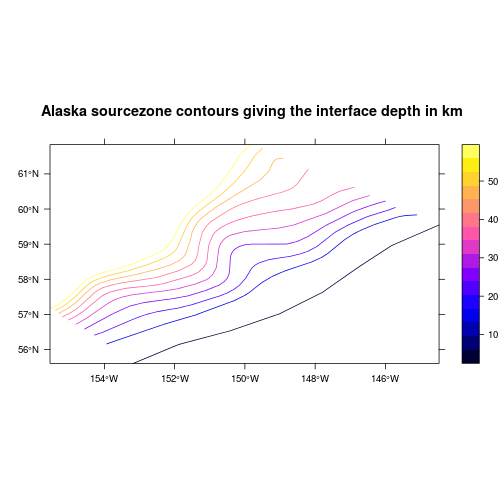

# **Making unit sources from contours defining the earthquake source geometry**
------------------------------------------------------------------------------

*Note: Do not edit the tutorial.md file directly, as it is auto-generated by the
corresponding tutorial.Rmd file. Edit the latter instead.*

# Background

This document explains how to use the script
*'[produce_unit_sources.R](produce_unit_sources.R)'* to convert earthquake
source contours (defining an irregularly dipping surface on which earthquake
slip can occur) into unit sources. It also provides some explanation
of the data structures used.

You may find it helpful to directly read
*'[produce_unit_sources.R](produce_unit_sources.R)'* first (or instead),
particularly if you have programming experience. All functions used therein are
documented in the rptha package or other packages, and so R's help system can
be consulted for details. 

In a typical application you would make a copy of *'[produce_unit_sources.R](produce_unit_sources.R)'* in a
new working directory, and then edit the script parameters as required before
running. You might also edit the code, depending on your needs.

To create a set of unit sources, you first need to have a set of source
contours. These describe the earthquake source geometry, which we will
discretize into unit sources. The source contours need to be in line shapefile
format, where each line corresponds to a contour with given depth. The actual
depths are stored in the shapefile attribute table, with an attribute name
'level' giving the depth in km.  Lon-lat coordinates should be used (WGS84).

The source contours will be used to define the unit sources, so they should
only cover areas where you want unit sources to be made. On a typical
subduction zone they would extend from the subduction zone trench to a depth
of around 50 km, though the latter depth may vary (see e.g.  Berryman et al.,
2015). 

The unit sources will be arranged in a logically rectangular grid which covers
the source contours. The number of unit-sources down-dip and along-strike is chosen
based on the user-provided value for the desired unit-source length and width. 

# Example data

In this example we work with some contours for the Alaska source-zone. This is
situated at the eastern end of the Aleutians-Alaska subduction interface in the
North Pacific. The code below demonstrates how to read them in R and make a basic plot. 

**Note the code in this section is not required when using
*'[produce_unit_sources.R](produce_unit_sources.R)'* -- however, we include
this to demonstrate the input data requirements**


```r
# Read the shapefile
library(rgdal)
```

```
## Loading required package: methods
## Loading required package: sp
## rgdal: version: 1.0-4, (SVN revision 548)
##  Geospatial Data Abstraction Library extensions to R successfully loaded
##  Loaded GDAL runtime: GDAL 1.10.1, released 2013/08/26
##  Path to GDAL shared files: /usr/share/gdal/1.10
##  Loaded PROJ.4 runtime: Rel. 4.8.0, 6 March 2012, [PJ_VERSION: 480]
##  Path to PROJ.4 shared files: (autodetected)
##  Linking to sp version: 1.1-1
```

```r
alaska = readOGR(dsn='CONTOURS/alaska.shp', layer='alaska')
```

```
## OGR data source with driver: ESRI Shapefile 
## Source: "CONTOURS/alaska.shp", layer: "alaska"
## with 10 features
## It has 1 fields
```

```r
# Print some information about it
summary(alaska)
```

```
## Object of class SpatialLinesDataFrame
## Coordinates:
##        min       max
## x 204.4529 215.52723
## y  55.6071  61.83479
## Is projected: FALSE 
## proj4string :
## [+proj=longlat +datum=WGS84 +no_defs +ellps=WGS84 +towgs84=0,0,0]
## Data attributes:
##      level      
##  Min.   : 0.00  
##  1st Qu.:16.25  
##  Median :27.50  
##  Mean   :27.00  
##  3rd Qu.:38.75  
##  Max.   :50.00
```

```r
# There should be a single attribute named 'level' containing the contour depths
names(alaska)
```

```
## [1] "level"
```

```r
print(alaska$level)
```

```
##  [1]  0.000 10.000 15.000 20.000 25.000 30.000 35.000 40.000 45.000 49.999
```

```r
# Make a quick plot of the input data
spplot(alaska, main='Alaska sourcezone contours giving the interface depth in km', 
    scales=list(draw=TRUE), aspect='iso')
```

 

# Input parameters

The code below comes directly from *'[produce_unit_sources.R](produce_unit_sources.R)'*.

The script can be run directly from the commandline using the syntax:

    Rscript produce_unit_sources.R

or from within R using:

    source('produce_unit_sources.R', echo=TRUE, max.deparse.length=Inf)

where the 'echo=TRUE' command prints the commands to the screen as they are executed. In
either case the working directory must be the directory containing
*'[produce_unit_sources.R](produce_unit_sources.R)'*.

In typical usage of *'[produce_unit_sources.R](produce_unit_sources.R)'*, the
user would edit the input parameters to define the source contour filename(s),
the desired unit-source length and width, the resolution of the output raster,
and some numerical parameters describing the density of sub-unit-source
gridpoints inside each unit source.

Note that more than one source-contour shapefile can be provided -- the code
will loop over them.

If you are running linux on a shared memory machine with multiple cores, then
you can run in parallel by setting MC_CORES to be a number greater than one. In this
case each core will run separate unit sources, until all are completed. 


```r
# Main 'driver' script to create the unit sources (currently pure thrust events
# only)
#
# Gareth Davies, Geoscience Australia 2015
#
library(rptha)
```

```
## Loading required package: rgeos
## rgeos version: 0.3-15, (SVN revision 515)
##  GEOS runtime version: 3.4.2-CAPI-1.8.2 r3921 
##  Linking to sp version: 1.1-1 
##  Polygon checking: TRUE 
## 
## Loading required package: geosphere
## Loading required package: raster
## Loading required package: FNN
## Loading required package: minpack.lm
## Loading required package: geometry
## Loading required package: magic
## Loading required package: abind
## 
## Attaching package: 'magic'
## 
## The following object is masked from 'package:raster':
## 
##     shift
```

```r
###############################################################################
#
# Main input parameters 
#
###############################################################################

# A vector with shapefile names for all contours that we want to convert to
# unit sources
all_sourcezone_shapefiles = Sys.glob('./CONTOURS/*.shp') # Matches all shapefiles in CONTOURS

# Desired unit source geometric parameters
desired_subfault_length = 100 # km
desired_subfault_width = 50 # km

# Desired spacing of sub-unit-source points
# Lower values (e.g. 1000) may be required for accuracy in unit sources
# along the trench, but in deeper unit sources a coarser point spacing
# can be used. Hence 2 different values are provided.
# The computational effort approximately scales with the inverse square of
# the point density. 
shallow_subunitsource_point_spacing = 1000 # m
deep_subunitsource_point_spacing = 6000 #m

# For computational efficiency, only compute the okada deformation at
# distances <= okada_distance_factor x (depth of sub-unit-source point) 
# This can save computational effort for shallow unit sources.
# But be careful if using a wide subunitsource_point_spacing.
okada_distance_factor = 50 # Inf 

# Cell size for output rasters
tsunami_source_cellsize = 1/60 # degrees

# Number of cores for parallel parts. Values > 1 will only work on shared
# memory linux machines.
MC_CORES = 12 

# Option to illustrate 3d interactive plot creation
#
# Only make the 3d interactive plot if you can use interactive graphics and
# have rgl (i.e. use FALSE on NCI). 
make_3d_interactive_plot = FALSE 
```

# Outputs
Note that the alaska sourcezone make take a while to run using the parameters
provided in the script. (e.g. a few hours on a 6 CPU machine). To make it run
faster you can increase the subunitsource_point_spacing to e.g. 20000. 

If the code successfully runs, it will generate: 
* a set of tiff files (one for each unit source) with the computed tsunami deformation for each
unit source (assuming 1m of earthquake slip).
* a pdf file for each sourcezone, with various plots that can be used to check
that the unit sources and tsunami deformations seem sensible.
* an RDS file for each sourcezone. This is a native R format file, and contains
the tsunami unit sources as a native R data-structure. It can be useful for
programming, since it contains the underlying data (such as sub-unit-source
points, exact unit source discretization, etc).

<!---
# Geometric discretization

Here we create the unit source geometry. The computation of the tsunami
deformation comes later. The key step is the function call
*discretized_source_from_source_contours* which converts source contours
to a list of unit sources.


The above figures illustrate that the source contours are converted to a logically
retangular grid of unit sources.

# Further exploration of the data structures

Here we explore the unit source data structures in more detail. Perhaps the
most important point is that the unit source grid is stored as a 3d array.


```r
# discretized_sources is a list containing unit source information for each sourcezone.
length(discretized_sources) # Should be equal to the number of input shapefiles
```

```
## Error in eval(expr, envir, enclos): object 'discretized_sources' not found
```

```r
names(discretized_sources)
```

```
## Error in eval(expr, envir, enclos): object 'discretized_sources' not found
```

```r
# Taking the example of alaska, we look at the unit source information for a single source
names(discretized_sources$alaska)
```

```
## Error in eval(expr, envir, enclos): object 'discretized_sources' not found
```

```r
# The depth contours are as before
plot(discretized_sources$alaska$depth_contours, asp=1, axes=TRUE)
```

```
## Error in plot(discretized_sources$alaska$depth_contours, asp = 1, axes = TRUE): error in evaluating the argument 'x' in selecting a method for function 'plot': Error: object 'discretized_sources' not found
```

```r
# The unit sources are in a grid of these dimensions down-dip and along-strike 
discretized_sources$alaska$discretized_source_dim
```

```
## Error in eval(expr, envir, enclos): object 'discretized_sources' not found
```

```r
ndip = discretized_sources$alaska$discretized_source_dim['dip']
```

```
## Error in eval(expr, envir, enclos): object 'discretized_sources' not found
```

```r
nstrike = discretized_sources$alaska$discretized_source_dim['strike']
```

```
## Error in eval(expr, envir, enclos): object 'discretized_sources' not found
```

```r
# The unit source grid is represented as a 3d array of x,y,depth points. These
# define the boundaries of the unit sources. Obviously there must be 'ndip+1'
# lines down dip, and 'nstrike+1' lines along-strike
#
# First dimension: Down-dip
# Second dimension: x,y,z
# Third dimension: Along-strike
#
dim(discretized_sources$alaska$unit_source_grid)
```

```
## Error in eval(expr, envir, enclos): object 'discretized_sources' not found
```

```r
discretized_sources$alaska$unit_source_grid
```

```
## Error in eval(expr, envir, enclos): object 'discretized_sources' not found
```

```r
# Add to the plot
for(j in 1:(nstrike+1)) points(discretized_sources$alaska$unit_source_grid[,1:2,j], t='o', col='red')
```

```
## Error in eval(expr, envir, enclos): object 'nstrike' not found
```

```r
for(j in 1:(ndip+1)) points(t(discretized_sources$alaska$unit_source_grid[j,1:2,]), t='o', col='red')
```

```
## Error in eval(expr, envir, enclos): object 'ndip' not found
```


# Tsunami deformation

Finally we compute the tsunami initial condition for each unit source.


--->
