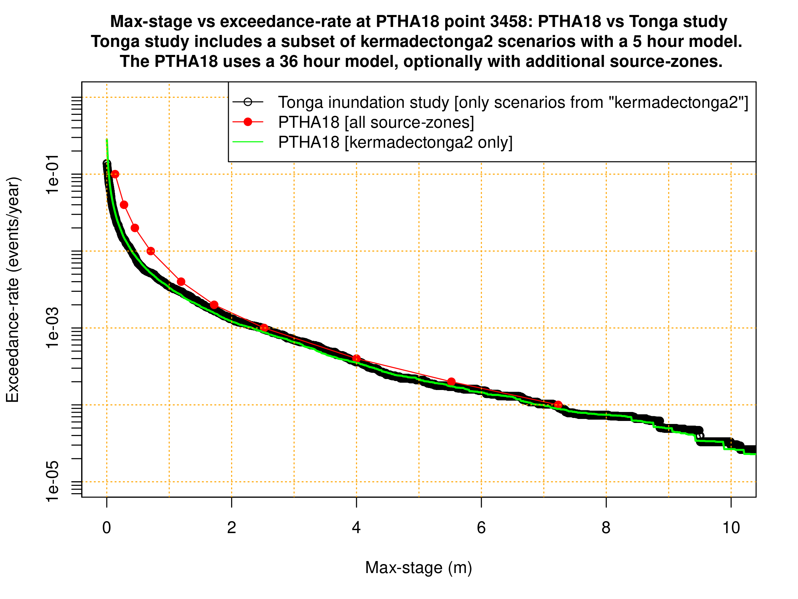

Probabilistic inundation calculations
-------------------------------------

This folder contains various scripts to do probabilistic inundation computations.

Among the outputs, we provide a separate download of rasters depicting the tsunami inundation depth around Tongatpu with a 10% and 2% chance of exceedance in 50 years. We provide the [results using a background sea-level of 0m MSL](http://dapds00.nci.org.au/thredds/fileServer/fj6/PTHA/Tonga_2020/alternate_ptha18_tonga_MSL0.zip), as well as the same [results using a more conservative background sea-level of 0.8m MSL](http://dapds00.nci.org.au/thredds/fileServer/fj6/PTHA/Tonga_2020/alternate_ptha18_tonga_MSL0.8.zip). These correspond to the results using regular importance sampling, as opposed to self-normalised importance sampling. The codes herein do to the computations for both cases, and while both cases give similar results, we preference the regular importance sampling results because of the statistical properties of the estimator (see discussion at the end of the [scenario sampling tutorial](../../../../ptha_access/example_event_access_scripts/random_scenario_sampling/random_scenario_sampling.md)).

## Key files

* [make_probabilistic_inundation.sh](make_probabilistic_inundation.sh) creates rasters with max-depth exceedance-rates for various threshold depths. The rasters are created for domains 3,4,5,6,7 around Tongatapu, with a separate raster being created for the unsegmented kermadectonga2 model and each of the three segmented models (as this is how the kermadectonga2 source-zone is represented in PTHA18).
* [probabilistic_inundation.R](probabilistic_inundation.R) - This computes exceedance-rate rasters for a range of inundation-depth-thresholds, and also computes depth rasters associated with prescribed exceedance-rates. It needs to be given a directory name [containing many SWALS model runs] and an integer defining the domain of interest. Only one domain is done at a time. We use [make_probabilistic_inundation.sh](make_probabilistic_inundation.sh) to run multiple domains and multiple simulation-sets [e.g. models with different MSL, or different resolution]. Other options are controlled via hard-coded arguments inside the script. Note that
    * In this script, exceedance-rate rasters associated with the given depth-thresholds are computed SEPARATELY for the unsegmented and segmented sources. They are NOT combined into a single raster in this script - although that calculation is straightforward, and is done in [raster_plots.R](raster_plots.R).
    * In contrast, the depth-rasters associated with the given exceedance-rates are computed ONLY for the combined segmented/unsegmented sources. This is because, unlike the previous case, this result cannot be trivially derived from the result with separate source representations. 
* [raster_plots.R](raster_plots.R) This can be run after [make_probabilistic_inundation.sh](make_probabilistic_inundation.sh) is run. It creates exceedance-rate rasters for the combined `segmented + unsegmented` source representation. It also makes a basic plot of the depths with a 2\% chance of exceedance in 50 years, which is an exceedance-rate commonly used for risk management purposes (although other values could be used with a simple change to the `target_exrate` in the script). 
* [depth_vs_exrate_at_gauge.R](depth_vs_exrate_at_gauge.R) is used to compute the exceedance-rates of maximum depth (and maximum-stage) at two sites; the Parliament site (for application), and a PTHA18 point (to compare results with the original PTHA18 study). It uses the gauge-outputs stored by SWALS, so can be adapted for other sites where there are gauges, but cannot be used for arbitrary points. This is useful for testing (to confirm we get almost the same result from the independent raster-based calculations at that site, as implemented in [probabilistic_inundation.R](probabilistic_inundation.R)). In addition the outputs themselves provide a useful means of looking at the depth-vs-exceedance-rate result at a single site -- and because the calculation only involves a single gauge, it is much faster than the raster-based calculations. See further discussion in the script comments. The code is run with the following commandline calls: `Rscript depth_vs_exrate_at_gauge.R parliament ptha18_tonga_MSL0` and `Rscript depth_vs_exrate_at_gauge.R 'ptha18_point_3458.3' ptha18_tonga_MSL0 `. 
* [plot_depth_vs_exrate_at_parliament.R](plot_depth_vs_exrate_at_parliament.R) can be run after the previous script has been run to generate RDS files with outputs at Parliament. It makes a plot of the depth-vs-exceedance-rate curve.
* [plot_stage_vs_exrate_at_gauge_3458.R](plot_stage_vs_exrate_at_gauge_3458.R) makes a plot comparing the max-stage exceedance-rates from this study and the original PTHA18 at a PTHA18 output point. That is shown at the end of this README. Some differences are expected due to the use of different hydrodynamic models (which are run for different durations on different datasets with different resolutions and solver options), as well as the use of a random subset of scenarios (magnitude above 7.5) here rather than all the PTHA18 scenarios. Neverthess we expect reasonable agreement if all is working well, and do obtain that in practice.
* [plot_depth_raster_at_target_exrates.R](plot_depth_raster_at_target_exrates.R) makes a quick plot of the rasters with the depth at various exceedance-rates. 

## Example of running the codes

Assuming all the hydrodynamic model results have been run, and all the dependencies are installed, one can do:

```
# Create the exceedance-rate rasters, and depth-vs-exceedance-rate curve information at a couple of key points.
source make_probabilistic_inundation.R

```

## Comparison with PTHA18 at the deep-water site

Here we compare the max-stage vs exceedance-rate curve derived with our probabilistic inundation model with PTHA18, at an offshore PTHA18 point to the east of Tonga (gaugeID 3458). The plot is generated by the script [plot_stage_vs_exrate_at_gauge_3458.R](plot_stage_vs_exrate_at_gauge_3458.R). 

There is good agreement with the model herein, and the PTHA18 results that only use the `kermaedectonga2` source-zone. This is exactly what we expect if everything is working well. Some differences are expected due to the random sampling of scenarios in this study ([further background in this tutorial](../../../../ptha_access/example_event_access_scripts/random_scenario_sampling/random_scenario_sampling.md) ), as well as the different hydrodynamic model used in this study (higher resolution, nonlinear, better elevation data, shorter model duration). In addition the current study neglects earthquake magnitudes below 7.5, which will make a difference for smaller waves (at the left-hand-side of the figure).


