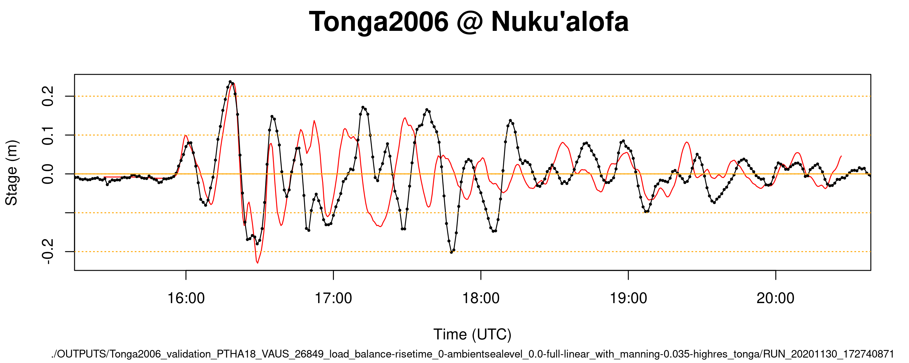
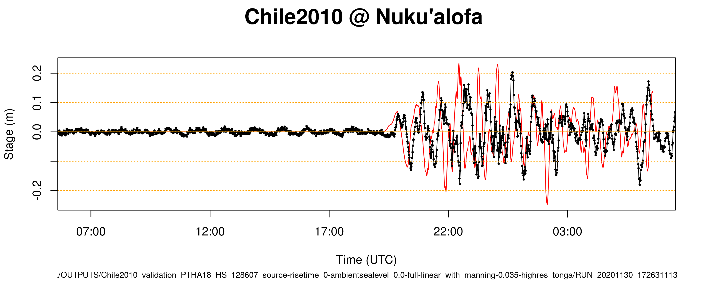
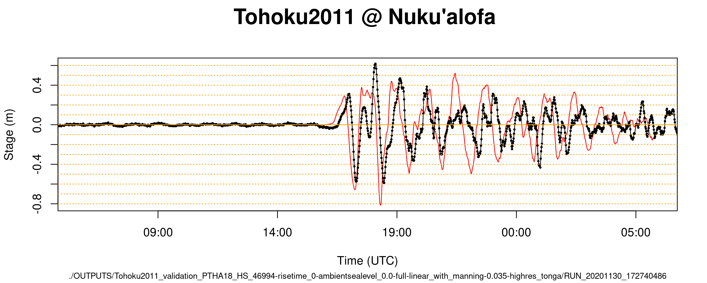
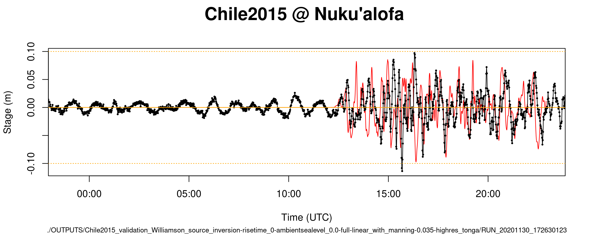

# Tsunami model codes
---------------------

This folder contains code to run the tsunami models for all scenarios, and do some basic post-processing of results [e.g. computing max-depth rasters for each model run].

## Key files

### Model code and compilation

* [model.f90](model.f90) and [model_local_routines.f90](model_local_routines.f90) contains code to run the SWALS model for Tongatapu. See comments in the code for documentation. In the course of running the simulations, I usually had the line `integer(ip), parameter :: mesh_refine=4_ip` in `model.f90`. However, to run coarser resolution convergence tests, I manually edited it to set `mesh_refine=2_ip` and recompiled. 
* [SWALS_ifort_modules.sh](SWALS_ifort_modules.sh) is a script to load the modules required to compile the code on NCI. Call it like `source SWALS_ifort_modules.sh`.
* [make_model_ifort](make_model_ifort) is the makefile used to compile the model. The command `make -B -f make_model_ifort` will compile on NCI (after loading the required modules with `source SWALS_ifort_modules.sh`).
* [load_balance_partition.txt](load_balance_partition.txt) is a SWALS load-balance file that works quite well when the models herein are spread over 4 MPI processes.

### Running models

* [create_random_ptha_qsub_scripts.R](create_random_ptha_qsub_scripts.R) is used to make qsub files for every random PTHA18 scenario, in batches. I manually edited this file a couple of times during the course of the project, to create jobs with `msl=0` and `msl=0.8`, and also to run jobs with coarser resolution (the latter also required recompiling the model.f90 with `mesh_refine=2_ip`). For the current project the command `Rscript create_random_ptha_qsub_scripts.R` will create 74 qsub files each time it is run. Individually they can be submitted on NCI, and moved to `submitted_qsub_files`, with the following command: `for i in run_ptha18_random*.sh; do echo $i; qsub $i; mv $i submitted_qsub_files; done`. When editing the R code to make another batch of jobs, I would edit the `ambient_sea_level` and the start of the `output_qsub_filename` and also the `PBS_WALLTIME` (the latter when running coarse-res models).
* [create_random_ptha_qsub_scripts_msl0.8.R](create_random_ptha_qsub_scripts_msl0.8.R) is just like above, but uses a higher sea level (0.8m)
* [create_random_ptha_qsub_scripts_meshrefine2_msl0.R](create_random_ptha_qsub_scripts_meshrefine2_msl0.R) is just like above, but was used to run a coarser model. To do this I manually changed `model.f90` to have `mesh_refine=2_ip`, and recompiled, before running these jobs.
* A number of qsub scripts to submit jobs for comparison with historical observations:
    - For Chile 2010 Mw 8.8, see [run_validation_Chile2010.sh](run_validation_Chile2010.sh) 
    - For Chile 2015 Mw 8.3, see [run_validation_Chile2015.sh](run_validation_Chile2015.sh) 
    - For Tohoku 2011 Mw 9.1, see [run_validation_Tohoku2011_PTHA18_46994.sh](run_validation_Tohoku2011_PTHA18_46994.sh) 
    - For Tonga 2006 Mw 8.0, see [run_validation_Tonga2006_load_balance_no_animation.sh](run_validation_Tonga2006_load_balance_no_animation.sh).

### Post-processing models

* [create_all_depth_rasters.R](create_all_depth_rasters.R) is used to create depth rasters for all model runs in a specified output folder inside `OUTPUTS`. Edits are required to `all_md_dirs` to specify or change the output folder. Then it can be run with `Rscript create_all_depth_rasters.R`. Note it assumes that 48 cores are available.
* [make_rasters.R](make_rasters.R) is used for one-off creation of multiple rasters (elevation/max-stage/max-depth) for each domain in a specified multidomain output directory. This can be useful for plotting, for example. Run it with `Rscript make_rasters.R multidomain_folder_name`
* [plot_max_stage_and_elevation.R](plot_max_stage_and_elevation.R) - This contains a number of plotting functions that can be called interactively, for instance to plot the maximum stage and elevation for a given multidomain, or to create an animation. 
* [plots/plot_all.R](plots/plot_all.R) - This contains a function `historic_event_gauge_plot(md_dir)` which can be used to plot models vs data at Nukualofa gauge (that assumes a particular naming convention for the `md_dir`, followed herein). Note that when you source this plotting code, you need to add the `chdir=TRUE` argument for it to work (e.g., if you started R in the current directory and wanted to run the plotting script, you would do `source('plots/plot_all.R', chdir=TRUE)`). 
* [plot_validation_runs.R](plot_validation_runs.R) - Plot model-vs-data at Nuku'alofa for all the historic event test cases.


# How to run everything
-----------------------

Below we show the linux commands to run everything. This does not reflect exactly the process I went through; it is far cleaner, avoids the iterative process of model debugging and some associated checks, etc.

Also, while working on this project I had to migrate files to `/scratch/n74/Tonga_2020_scratch_space/Tonga_2020` to work-around some emegency maintainence with the `gdata` file-system. This has some effect on the files. For instance you may find that some of the qsub scripts avoid accessing `gdata`, while others do not. 

```
# Get the modules
source SWALS_ifort_modules.sh

# Build the code
make -B -f make_model_ifort

# Run validation jobs
qsub run_validation_Chile2010.sh
qsub run_validation_Chile2015.sh
qsub run_validation_Tohoku2011_PTHA18_46994.sh
qsub run_validation_Tonga2006_load_balance_no_animation.sh

# After the above jobs have finished, for each one we plot the model-vs-data at 
# Nuku'alofa tide gauge. The figures are written to plots/historic_events_time_series_plots
source R_400_NCI_modules.sh
Rscript plot_validation_runs.R


#
# Below here we run the random PTHA18 scenarios
#

# Put submitted random-ptha-scenario qsub files here
mkdir submitted_qsub_files

# Create the qsub commands to run all the random PTHA sources (assuming they have already been created)
source R_400_NCI_modules.sh
Rscript create_random_ptha_qsub_scripts.R

# Submit all the random ptha jobs in the queue, and once that is done, move the file to submitted_qsub_files.
# In practice I would just submit one manually to start with, to make sure it's all working fine, and eventually
# submit a large number of runs like this.
for i in run_ptha18_random*.sh; do echo $i; qsub $i; mv $i submitted_qsub_files; done

# In practice, at this point after the models had been run I repeated these steps with a different MSL (0.8m)
# and also with a coarser model. In the latter case I edited model.f90 to set mesh_refine=2_ip, which leads to 
# a 2x coarser-grid than the default mesh_refine=4_ip, and then then recompiled. 

#
# .... wait until all the model runs are finished ...
#

# Create max-depth rasters for all model runs [saved in their multidomain_dir]
# Note this has a hard-coded 'glob' output folder search, and specifies 48 cores
# on the machine -- both values are appropriate for what I did, but might need updating.
Rscript create_all_depth_rasters.R

## Workaround for an unstable run.
# Out of the 1101 x 3 runs, one went unstable (an extreme Mw 9.5 with MSL=0.8). 
# To workaround this I recompiled the model, without including the 
# option -DLOCAL_TIMESTEP_PARTITIONED_DOMAIN, and then ran the code
# with the following script -- under these conditions it ran successfully. 
qsub run_failed_after_recompiling_without_local_timestepping.sh
# I then deleted the failed model run, and generated the depth rasters for the new run
# using make_rasters.R

```

# Figures comparing observations with model runs

Here we include a few figures comparing de-tided tsunami observations at Nuku'alofa (in black) with the model (in red). We do not expect perfect agreement. The model was run using initial conditions that aim to be similar to the historic event, based on either PTHA18 scenarios or (for Chile 2015) a published source inversion. The model ignores tides and assumes an ambient sea-level of 0m; this is expect to have some impact on the modelled time-series after the leading wave. 

In the figures below the horizontal scale is either 5 hours (for the Tonga 2006 event) or 24 hours (for all other events). The vertical scale varies case-by-case, but the dotted horizontal lines denote 10cm intervals, and help make clear that the tsunami size varies considerably among the 4 cases.
 







