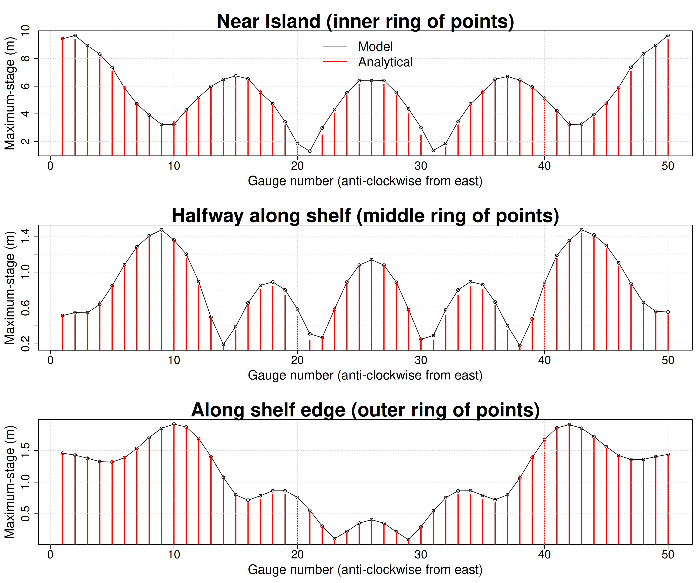

# Conical island analytical solution

This problem simulates the period wave-field around a conical island that is
contained within in a uniform depth ocean and subject to monochromatic plane waves.
The waves are modified by the island topography. For the linear shallow water
equations, there is an analytical solution described by
[Zhang and Zhu (1994)](https://doi.org/10.1017/S0022112094003769).

The [SWALS model](circular_island_testcase.f90) solves this problem with the
linear shallow water equations, using grid nesting to better resolve the
island. The offshore wave is generated using a Flather boundary condition with
periodic waves travelling from east to west. This generates the desired
offshore wave field while enabling radiation of outgoing waves from the domain.

To focus on the periodic steady-state solution, we reset the stored tsunami maxima
after an initial burn-in period, which is long enough to allow the model to reach steady state.

[Figure 1](model_data_comparison_1.png) shows the computed wave maxima along
with 3 rings of points (inner, middle, outer) around the conical island, at
which [Figure 2](model_data_comparison_2.png) compares the modelled stage
maxima with the analytical solution. The automated test confirms that these
solutions are within an prescribed tolerance, and that mass conservation errors
are negligible. 

