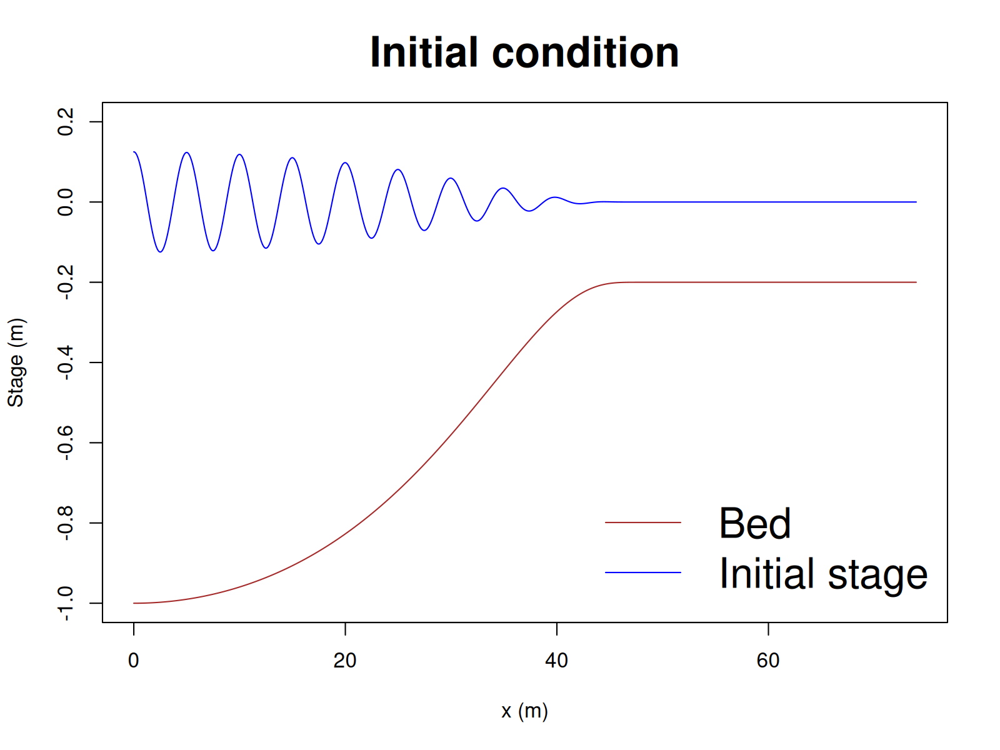

# Shoaling of a dispersive nonlinear wave over a variable seabed

This problem was proposed by [Kennedy et al. (2000)](https://www1.udel.edu/kirby/papers/kennedy-etal-icce00.pdf) and is also
used in [Coulaud et al. (2025)](http://dx.doi.org/10.1016/j.coastaleng.2024.104645) (their Case 2). 

A wave train is initialised with non-uniform stage, and zero velocities, over a
sloping seabed. The solution is evolved for a set time period. The initial
wavelengths are only 5x greater than the depth, so dispersion is very
significant (in principle beyond the limits of the simple dispersive model in
SWALS), while nonlinearity is also significant because the wave amplitudes are
around 10% of the depth.

We compare the numerical water surface maxima/minima with the Whispers3D
reference solution of [Coulaud et al. (2025)](http://dx.doi.org/10.1016/j.coastaleng.2024.104645), digitized from their paper. The
SWALS models are run at a range of resolutions to check they are converging.

While the results are reasonable, the short wavelength to depth ratios in this problem
mean we should not expect high accuracy from the simple dispersive solver in SWALS. There
is some tendency to understimate the top of the wave envelope, although within the range of
other solvers studied by [Coulaud et al. (2025)](http://dx.doi.org/10.1016/j.coastaleng.2024.104645).

All solvers give quite similar solutions at the finest resolution. The midpoint
solver converges more quickly than the other solvers, which is not surprising
since it is the only one which retains second order accuracy for both
dispersive and nonlinear terms.

The models are also run in transposed domains (i.e. the 1D test
separately exercises the UH and VH momentum equations) to check that they 
give near identical results.

## Midpoint

## rk2

## Leapfrog nonlinear

## Cliffs

