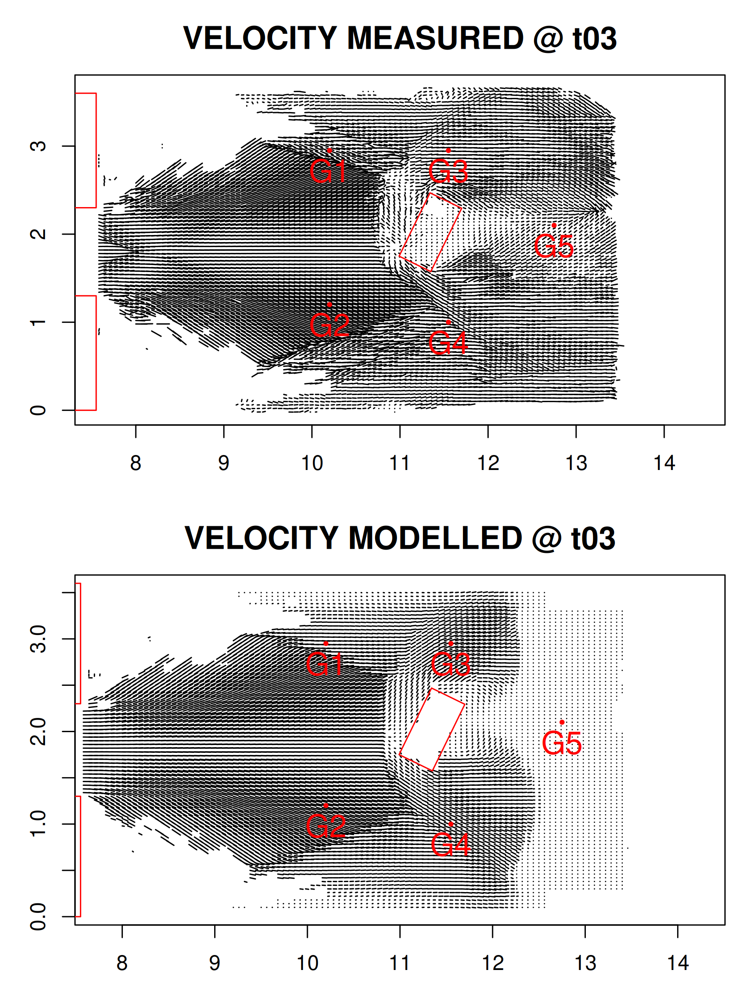
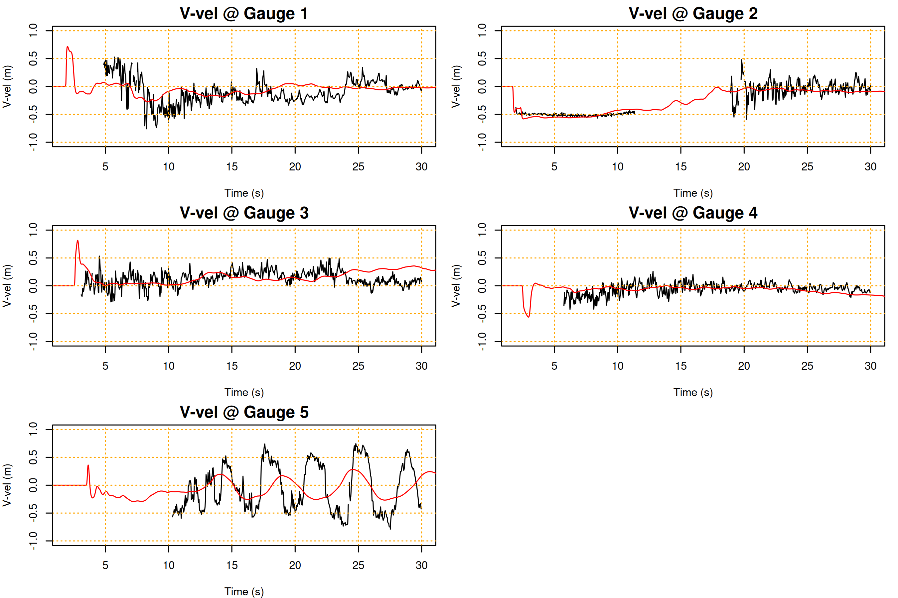

# Isolated building dam-break test

This problem simulates the flume experiment of [Soares-Frazão and Zech 2007](https://doi.org/10.1080/00221686.2007.9521830) in which a dam-break interacts with an isolated building oriented oblique to the flow. The flow is strongly affected by shock waves, and at later times shows coherent unsteady flows downstream of the building.

The same experiment is used in the flood modelling benchmark tests of [Neelz and Pender, 2013](https://assets.publishing.service.gov.uk/government/uploads/system/uploads/attachment_data/file/290884/scho0510bsno-e-e.pdf), which found different 2D flood models produced quite variable results, in part because slight differences in the computed positions of shockwaves can have a large impact on the model at individual gauges.

The [SWALS model](model.f90) simulates the problem using the nonlinear shallow water equations with Manning friction on a relatively coarse grid (0.1m cell-size, as suggested in the aforementioned benchmark report). Manning's n is set to 0.01 as suggested in the original paper. No eddy viscosity model is used (although commented-out parts of the test code allow experimenting with eddy-viscosity). 

The figures below show the observed and modelled velocity fields at times of 3, 5, 10, 15 seconds, as well as time-series of stage and velocity (x/y) at the gauge locations G1-G6. Note the velocity was not measured at G6. 

At this resolution the numerical model captures the broad main of the flow, but it is not numerically convergent. Mesh refinement can better resolve the unsteady velocities downstream of the building (Gauge 5), but also changes the locations of shocks enough to affect the modelled flow at some gauges. These features are also affected by the choice of friction and use of eddy-viscosity. 

## Minor discrepancies in the experiment description.

There is a 15cm difference between the length of the upstream-of-dam region as depicted in the paper (their Figure 1), vs the sketch that is included in the supplementary material of the paper. 

The appendix of the paper reports that velocity fields are given at times of 1, 5, 10, 20 seconds. But the data itself reports the times as 1, 3, 5, 10, 15 seconds.

The downstream depth is stated to be 2cm at the start of the experiment - but all the gauges report an initial depth of 0m.
