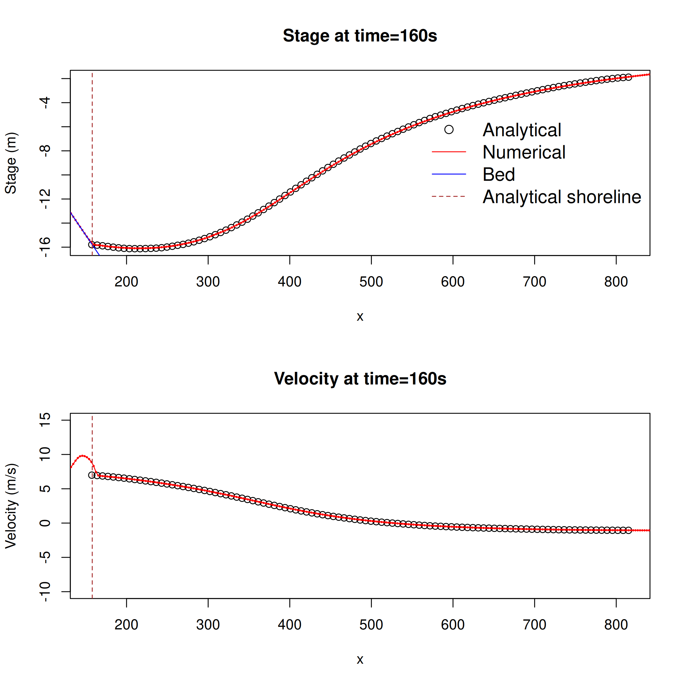
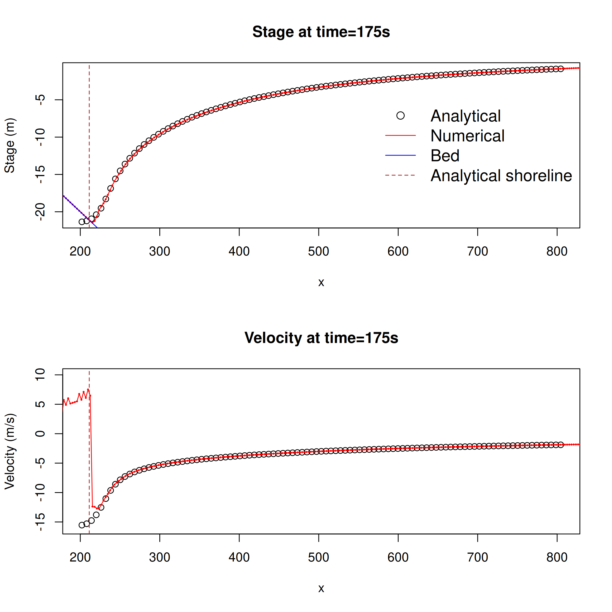
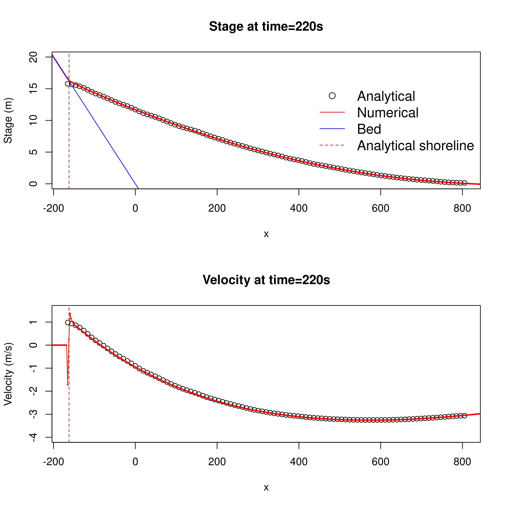
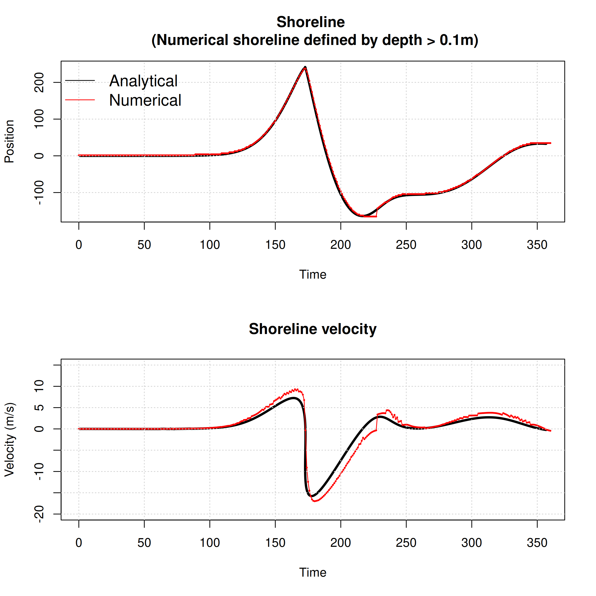

## 1D "Landslide" runup on uniformly sloping beach

This test case is `Benchmark Problem 1` from the `Third International workshop on long-wave runup models, June 17-18 2004`. 

It simulates the runup of an initial waveform on a linearly sloping beach. The analytical solution was produced
using the techniques of Carrier, Wu and Yeh (2003). It models the flow using the nonlinear shallow water equations (without friction)

The problem descriptions and solution were sourced from the (now-defunct) website [http://isec.nacse.org/workshop/2004_cornell/bmark1.html](http://isec.nacse.org/workshop/2004_cornell/bmark1.html).

The [SWALS model](benchmark_problem1.f90) simulates this problem with the nonlinear shallow water equations. A nested grid is used to better resolve the shoreline.

The figures below compare the analytical solution with the model at times of 160, 175 and 220 seconds. The analytical solution to this problem is complicated to derive, and the version we obtained has the strange property that near the shoreline, the free-surface elevation can fall below the bed. This is also seen in other publications that use the same solution (e.g. [Delis et al., 2008](https://onlinelibrary.wiley.com/doi/10.1002/fld.1537)). 

The analytical solution to this problem produces a sharp wet/dry front during the initial drying phase (due to the initial drawdown in the solution). While the model can approximate this, it tends to have a very thin layer of water in the drying zone even after the time of analytical drying. This is hard to see in the stage plots (because the water layer is so thin), but is clear in the modelled velocity profiles which have non-zero velocities in the drying zone. This numerical artefact can be reduced by refining the numerical model grid within the nesting zone.

The figures below compare the analytical and numerical time-series of the shoreline position, and the water velocity at the shoreline (which can be derived analytically from the time-derivative of the shoreline position). In the numerical model, the "shoreline" was defined as the first cell in the down-slope direction with depth exceeding 0.1m, and the shoreline velocity is the velocity in this cell. This prevents the thin layer of water in the numerical model drying zone from having a large effect on the solution. There is good agreement between the analytical and modelled shoreline position. The errors are larger in the modelled shoreline velocity, but this can be reduced by refining the numerical model grid size.

