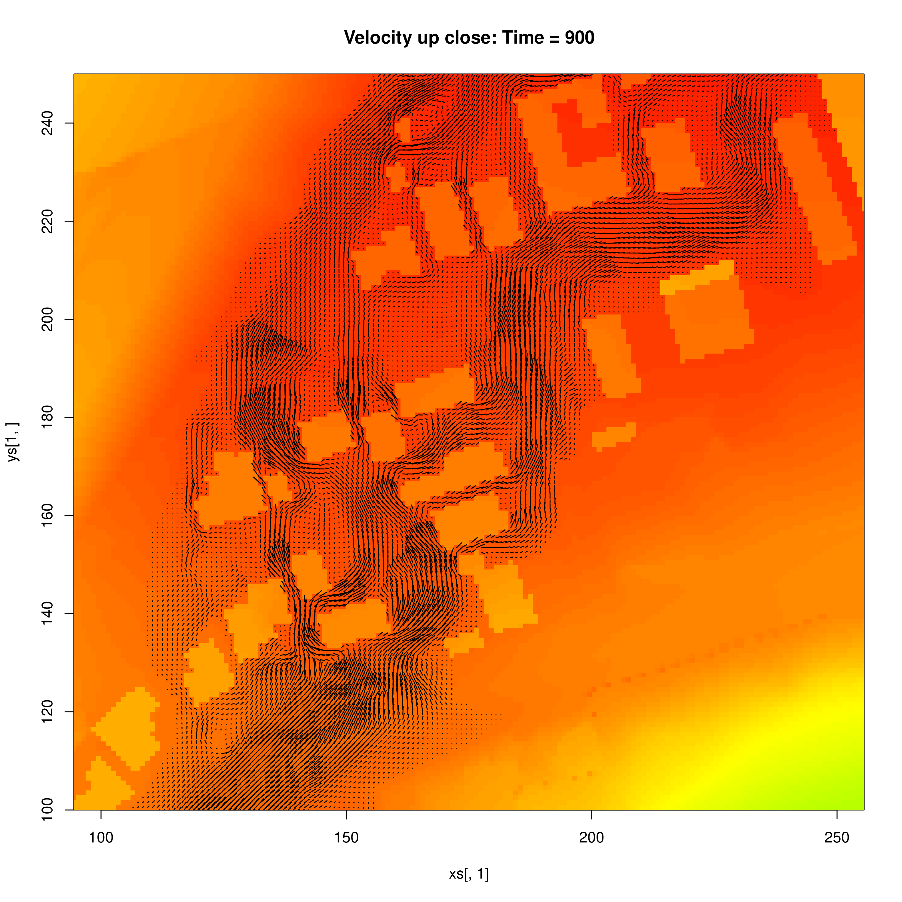
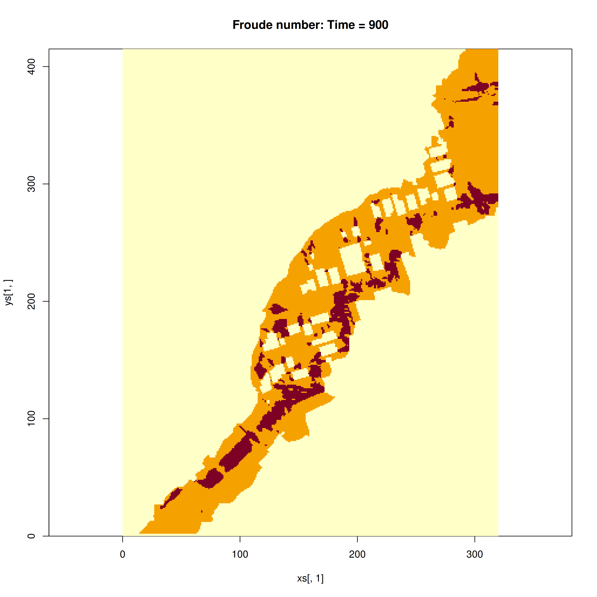
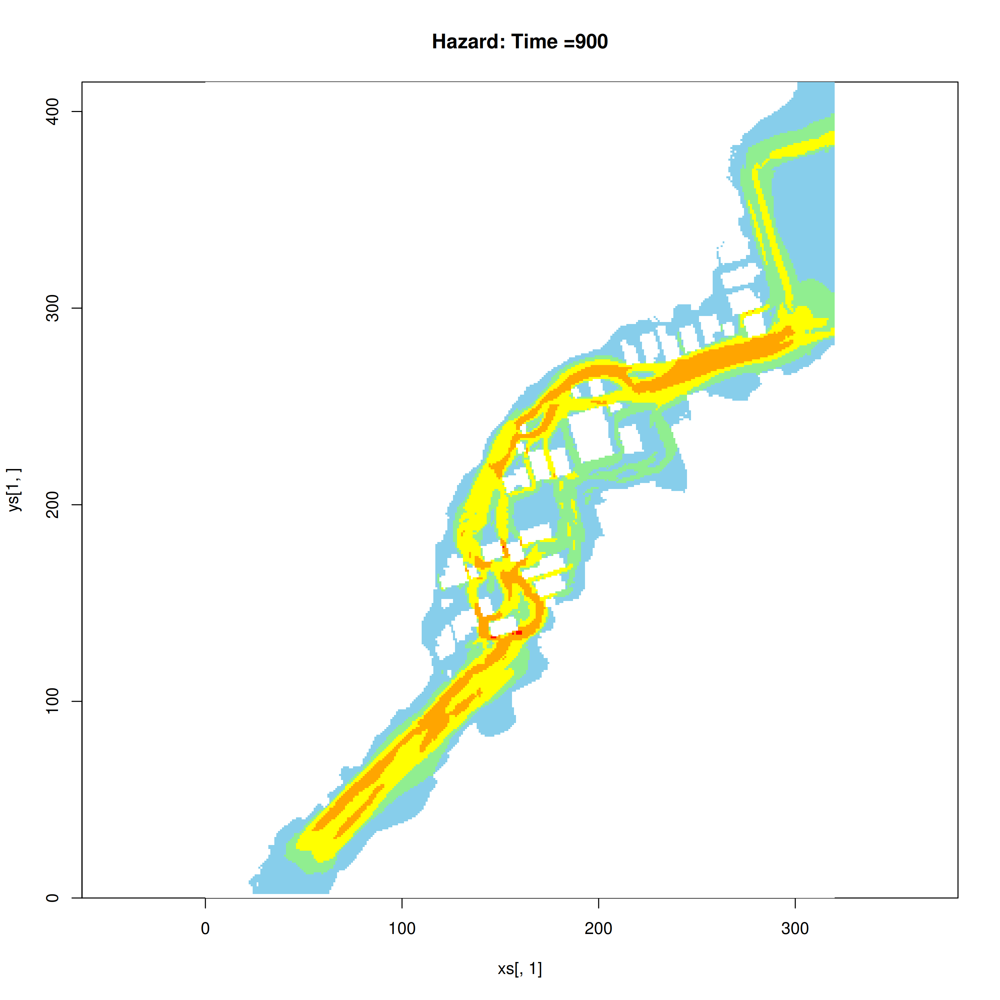

## Urban flooding testcase

This problem simulates the Merewether urban flooding test-case from Australian Rainfall and Runoff, reported in:
[Smith, G. & Wasko, C. Revision Project 15: Two Dimensional Simulations In 
Urban Areas - Representation of Buildings in 2D Numerical Flood Models. Australian 
Rainfall and Runoff, Engineers Australia, 2012](https://arr.ga.gov.au/__data/assets/pdf_file/0014/40523/ARR_Project_15_Subproject_report_buildings_final.pdf).

It simulates steady flow around complex urban topography. A constant discharge
is input within a circular region of the model domain, and the model is run to
steady state. 

Some data from this test problem was previously released as part of the 
[ANUGA model test-suite](https://github.com/GeoscienceAustralia/anuga_core/tree/main/validation_tests/case_studies/merewether),
which was used to make the test here.

The [SWALS model](merewether_example.f90) and associated plotting code makes
several figures that can be compared with figures in Smith and Wasko (2012).
Note that the SWALS model results should not be identical, in part because we
are using different datasets to define the friction (and don't have those
inputs used in the ARR report).

* The velocity vector plot can be compared with their Figure 30

* The Froude number plot can be compared with their Figure 29

* The "Hazard" plot gives the speed-times-depth, and can be compared with their Figure 35

The test code checks that:

* The model conserves mass well. Because SWALS mass-conservation tracking does
  not account for the circular input discharge, we check that the latter
  precisely accounts the unexplained component of SWALS mass conservation
  calculations. 

* The model gives reasonable predictions of the max-depth at a number of sites
  with known max-depth (see Table 4 of Smith and Wasko 2012). In particular we
  check that the mean absolute error of the model is less than that obtained by
  some other models that use 0.5m, 1m and 2m grids (from Table 9 of Smith and Wasko,
  2012).

