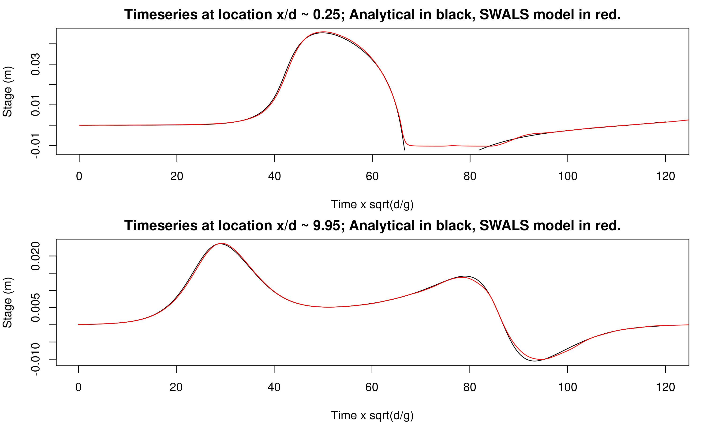
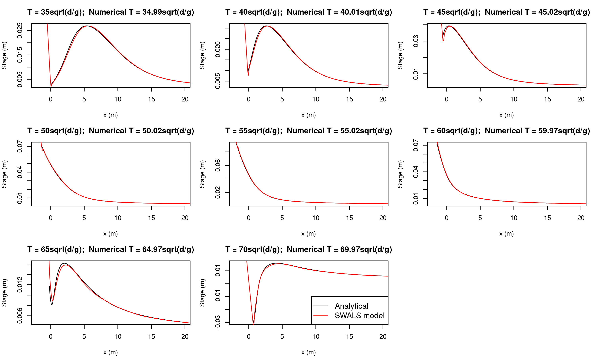
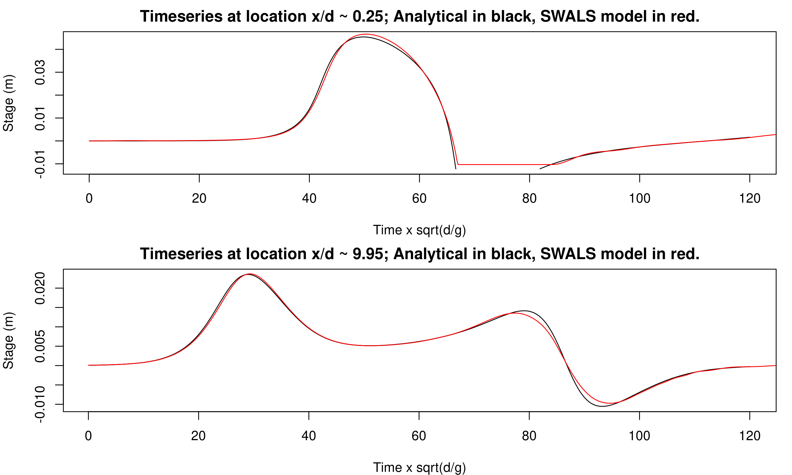
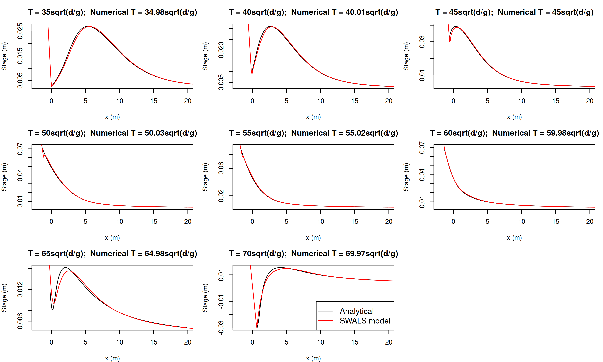

# NTHMP test problem 1: Solitary wave on a simple beach (analytical version)

We model the runup of a 1D solitary wave on a sloping beach. The analytical solution to this problem is known ([Synolakis, 1987](https://doi.org/10.1017/S002211208700329X)).

This test problem is from the NTHMP benchmark suite. The test data and a problem description is available in [Randy LeVeque's repository](https://github.com/rjleveque/nthmp-benchmark-problems/tree/master/BP01-DmitryN-Single_wave_on_simple_beach). 

The [SWALS model](BP1_testcases.f90) solves this problem using the nonlinear shallow water equations without friction. The code allows the numerical method to be specified on the commandline, and we test both the `rk2` finite volume solver, and the `leapfrog_nonlinear` finite-difference solver. Both solvers perform well, although for this kind of problem the `rk2` method is somewhat more accurate.

## Results from the rk2 finite volume method

The results below use a grid size of 10cm and the `rk2` finite volume scheme.

Below we compare the modelled and analytical time-series at two sites in the model domain. The model compares very well with the analytical solution. The gap in the analytical solution (top panel) represents drying at that site. Minor deviations between the numerical and analytical solutions can be reduced by refining the mesh.

Below we compare the modelled free-surface profiles at several instants in time. Due to the finite model time-step, the modelled time is close to, but not exactly equal, the analytically desired times. Again the model performs well.

## Results from the leapfrog nonlinear finite difference method

The results below use a grid size of 10cm (as above) with the `leapfrog_nonlinear` finite difference scheme. 

Below we compare the modelled and analytical time-series at two sites in the model domain. The model compares well with the analytical solution, although is slightly less accurate than the `rk2` solution above with the same grid size. Minor deviations from the analytical solution can be reduced by refining the mesh.

Below we compare the modelled free-surface profiles at several instants in time. Due to the finite model time-step, the modelled time is close to, but not exactly equal, the analytically desired times. Again the model performs well.

