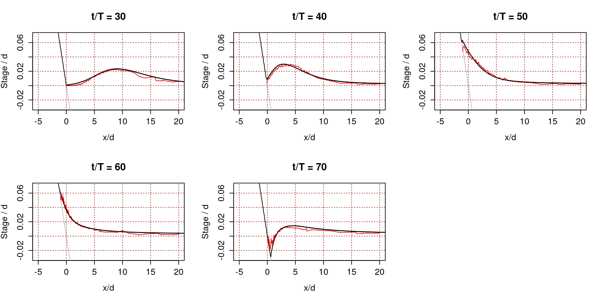
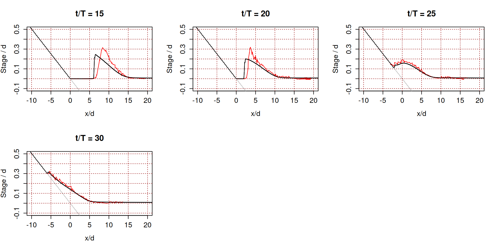
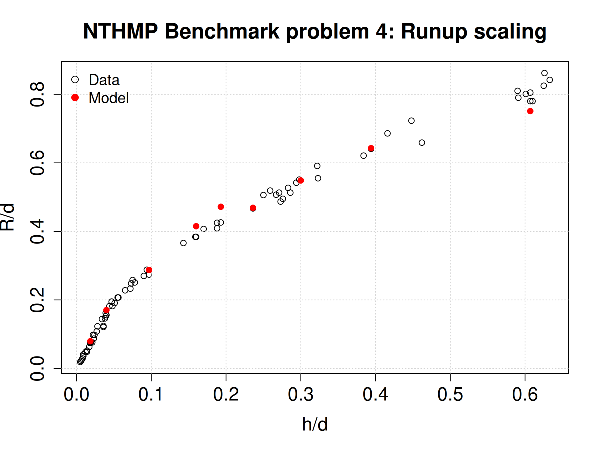

# NTHMP test problem 4: Solitary wave on a simple beach (experimental version)

We model the runup of a 1D solitary wave on a sloping beach. An analytical solution to this problem is known for the frictionless nonlinear shallow water equations, and was studied in [benchmark problem 1](../BP01). Here we instead compare a model with experimental data. The test includes multiple cases with varying wave amplitudes and depths. 

This test problem is from the NTHMP benchmark suite. The test data and a problem description is available in [Randy LeVeque's repository](https://github.com/rjleveque/nthmp-benchmark-problems/tree/master/BP04-JosephZ-Single_wave_on_simple_beach). 

The [SWALS model](BP4_testcases.f90) solves this problem using the nonlinear shallow water equations with friction, using the `rk2` solver. Simulations use a low friction coefficient (Manning's $n = 0.005$) which reasonably reproduces the runup observations with `rk2`. The code allows key experimental parameters to be specified on the commandline, to facilitate testing a wide range of cases. 

## The case with a small amplitude wave, $h/d = 0.0185$

The figure below compares modelled (black) and observed (red) free surface profiles for a relatively small amplitude wave. They show generally good agreement. 

## The case with a large amplitude wave, $h/d = 0.3$ 

The figure below compares modelled (black) and observed (red) free surface profiles for a relatively large amplitude wave. In this case the runup is well reproduced, but in the propagation phase the model produces a shock, while dispersive processes cause the observed wave to arrive later with a higher peak. Such results are typical for this problem, for example see
[the GEOCLAW nonlinear shallow water solver for benchmark 4](https://depts.washington.edu/clawpack/links/nthmp-benchmarks/geoclaw-results.pdf). 

## Dimensionless runup vs dimensionless wave amplitude

For this case a we focus on the relationship between the runup and the initial wave amplitude, both normalised by the depth (which varies substantially among the experiments). With our chosen Manning coefficient of 0.005, the `rk2` solver shows good agreement with the general trend of the experimental data.

