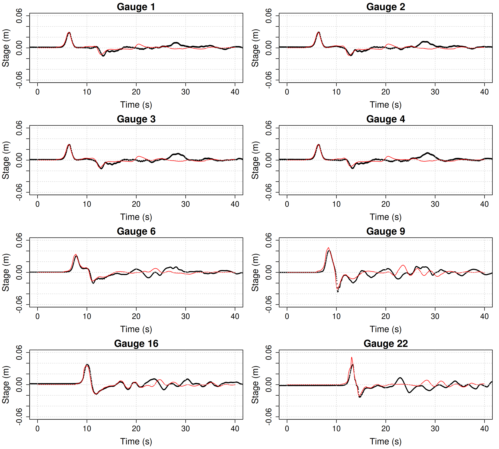
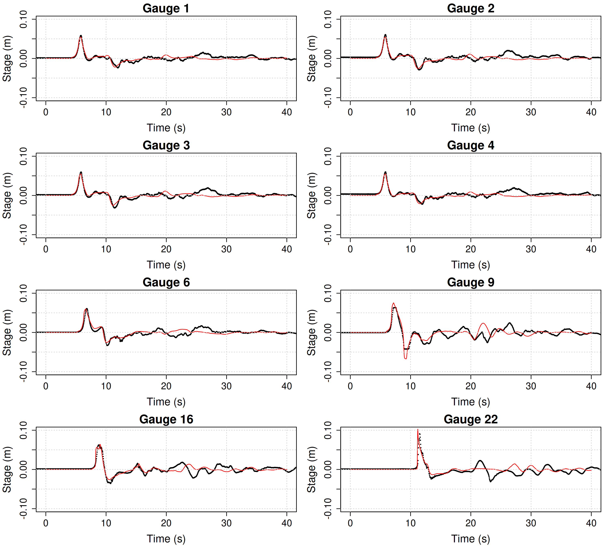

# NTHMP test problem 6: Solitary wave runup on a conical island.

We model the runup of three different solitary waves around a conical island. The three cases (A, B, and C) are forced with increasingly large solitary wave amplitudes, slightly less than 5%, 10% and 20% of the offshore depth. They were studied experimentally by [Briggs et al., 1995](https://doi.org/10.1007/bf00874384) and have been modelled in many publications.

The test problem is from the NTHMP benchmark suite. The test data and a problem description is available in [Randy LeVeque's repository](https://github.com/rjleveque/nthmp-benchmark-problems/tree/master/BP06-FrankG-Solitary_wave_on_a_conical_island). This includes gauge time-series between the wavemaker and the island (gauges 1,2,3,4), gauge time-series around the island (gauges 6, 9, 16, 22), and records of the runup maxima around the island. Note the locations of gauges 1-4 differ for cases A, B, and C.

The [SWALS model](BP06.f90) uses a nested grid around the island. It has a options to use different solvers, grid resolutions, and forcings, reflecting our experiments with this problem. 

* For example, the solitary wave forcing can be created in three different ways: an analytical initial condition; an approximate wavemaker forcing; or a forcing based on observed waves at gauge 2 (between the wavemaker and the island). A setup using the `cliffs` solver was also implemented to mimic the results of [Tolkova, 2014](https://doi.org/10.1007/s00024-014-0825-8). 

For the example below the wave forcing was derived from observations at gauge 2 (between the wavemaker and the island). This gauge is well inside the model domain so not used directly as a boundary condition. Instead we use a heuristic approach to determine a boundary condition compatible with the observations at gauge 2; see [convert_obs_to_wavemaker.R](convert_obs_to_wavemaker.R). 

In the [SWALS model](BP06.f90) the first command line argument takes the value 1, 2 or 3, corresponding to cases A, B and C. The second command line argument takes the value `default` for all results below (to use the default nonlinear solver `rk2`). 

## Differing runup observations are reported for this problem

For this problem the runup data provided for the NTHMP benchmark, and used in many publications (e.g.  [Tolkova, 2014](https://doi.org/10.1007/s00024-014-0825-8) and [Horillo et al., 2014](10.1007/s00024-014-0891-y)), differs noticeably to data in other publications ([Liu et al., 1995](https://doi.org/10.1017/S0022112095004095), [Choi et al., 2007](https://doi.org/10.1016/j.coastaleng.2007.02.001), [Ma et al., 2019](https://doi.org/10.1080/19942060.2019.1642960)). The latter publications also attribute their data to [Briggs et al., 1995](https://doi.org/10.1007/bf00874384), and there do not appear to be any other differences in the problem description. Runup maxima are especially different for Case A, where runups in the latter publications are consistently 30-50% larger than for the NTHMP data.

Comparisons with models and data in the literature do not consistently show better agreement with one or other dataset, but there is considerable variation between models. The reasons are not clear, but several factors likely contribute.

* The wave forcing in this problem can be defined several ways. Some studies use empirical wavemaker data. Others specify an initial solitary wave (as for FUNWAVE herein). Others adapt the measured wave time-series to specify a boundary condition (as for SWALS herein).

* The experiment involves solitary waves, which feature both dispersion and nonlinearity. They are not well represented with non-dispersive shallow water models (used in many studies). However some shallow water models can emulate physical dispersion by deliberately using a coarse grid (e.g. [Tolkova, 2014](https://doi.org/10.1007/s00024-014-0825-8)). 

But even when this problem is approached with more complicated physics (i.e. dispersive or 3D models), we see reports of good agreement for some models using the NTHMP dataset (e.g. SELFE in the [NTHMP 2011 workshop report](https://nws.weather.gov/nthmp/documents/nthmpWorkshopProcMerged.pdf)), and for other models using the alternative runup dataset (e.g. [Choi et al., 2007](https://doi.org/10.1016/j.coastaleng.2007.02.001), [Ma et al., 2019](https://doi.org/10.1080/19942060.2019.1642960)). Because it is unclear which dataset should be used, both are included below. 

## Reference FUNWAVE model, without dispersion, using analytical forcing

We also compare the SWALS runup results with a high-resolution FUNWAVE simulation. FUNWAVE was run __without dispersion__ on a 2.5cm uniform grid, and initialised with an analytical solitary wave. [See here for FUNWAVE model setup files](funwave_comparison). 

This serves as a high-order reference solution to the shallow water equations, while using a different style of wave forcing than the SWALS model. It is not intended to test the FUNWAVE model itself, for which better results might be obtained using dispersion. Rather it enables cross-checking the SWALS results with a different shallow water solver and forcing. 

# Results for Case A

Figure 1 compares the SWALS model with the gauge time-series. For early times the model agrees well with the offshore gauges (1-4) and the gauges around the island (6,9,16,22). At later times the waves are affected by interaction with the flume boundary, which is designed to reduce reflections, and not perfectly represented in the model (which uses a Flather boundary so waves can radiate from the domain). 

Figure 2 compares the modelled and observed runups around the island. Note the large difference between the two runup datasets. The SWALS runups agree well with the reference FUNWAVE shallow water simulation, and with the "alternative" runup data. Both modelled runups are significantly larger than the NTHMP runup data. 

* This does not imply that the alternative runup data is necessarily more accurate. If dispersion is included in the FUNWAVE simulation then the modelled runup is in better agreement with the NTHMP dataset, suggesting the importance of non-hydrostatic physics that are not captured by the shallow water equations.

# Results for Case B

Figure 3 compares the SWALS model with the gauge time-series. For early times the model agrees well with the offshore gauges (1-4) and the gauges around the island (6,9,16,22). At later times the waves are affected by interaction with the flume boundary, which is designed to reduce reflections, and not perfectly represented in the model (which uses a Flather boundary so waves can radiate from the domain). 

Figure 4 compares the modelled and observed runups around the island. The SWALS runups are similar to the datasets. They are also similar to the reference FUNWAVE shallow water simulation, except around 200-350 degrees where the SWALS model predicts less runup. This is due to the different forcings of the FUNWAVE and SWALS models herein. If we run the SWALS model with the analytical forcing (as used in the FUNWAVE model) then it produces runups similar to the FUNWAVE model in this region. 

# Results for Case C

Figure 5 compares the SWALS model with the gauge time-series. For early times the model agrees well with the offshore gauges (1-4) and the gauges around the island (6,9,16,22). At later times the waves are affected by interaction with the flume boundary, which is designed to reduce reflections, and not perfectly represented in the model (which uses a Flather boundary so waves can radiate from the domain). 

Figure 6 compares the modelled and observed runups around the island. The SWALS runups are similar to the datasets and the reference FUNWAVE model.

