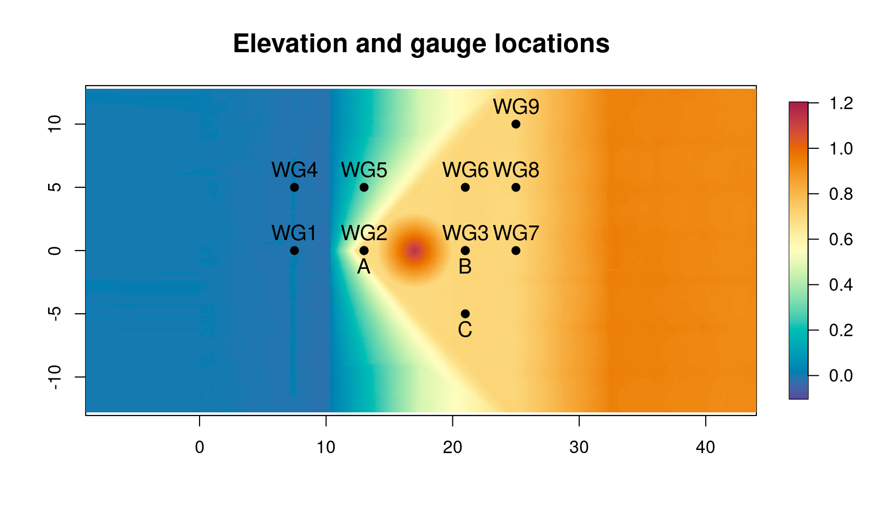
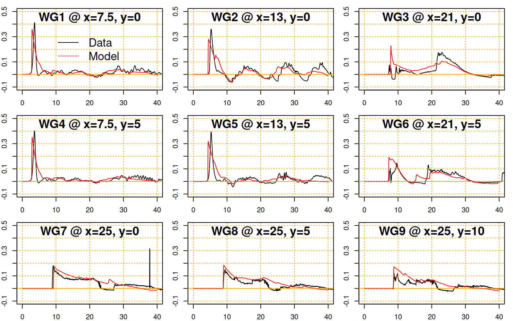
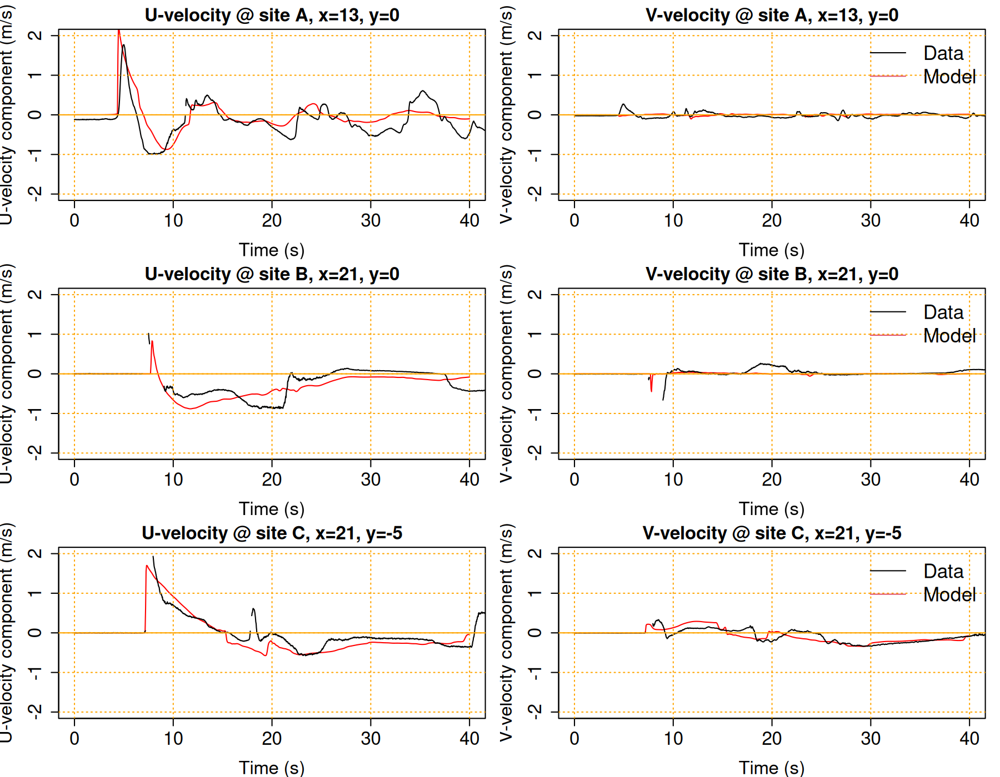

# NTHMP currents benchmark problem 5: Solitary wave over a shelf with a Conical Island

We model the propagation of a solitary wave over a shelf containing a conical island, and compare the model with measurements of the free surface and velocities at a number of gauges. Data from this problem was obtained from the [NTHMP tsunami currents benchmark suite](http://coastal.usc.edu/currents_workshop/problems.html). 

The [SWALS model](model.f90) simulates this problem on the domain shown in Figure 1. Gauges with names starting with `WG` record water-levels, while gauges `A, B` and `C` record velocities. In the experiment the wave was created using a wave-maker on the left-hand-side of the domain. Herein the [SWALS model](model.f90) simulates this by extending the domain to the left and using a solitary wave initial condition (similar to [Macais et al., 2020](https://doi.org/10.1016/j.ocemod.2020.101645)).  

Solitary waves are defined by a balance between non-linearity and dispersion, and so we don't expect experiments involving solitary waves to be precisely represented by non-dispersive shallow water models. Nonetheless the shallow water model gives a reasonable representation of the observed wave heights and their attenuation around the island (Figure 2). 

At gauges near the left hand side of the domain (around `x=7.5`) the model develops a steep leading wave front (and longer leading wave tail) due to the neglect of dispersion, which is not seen in the observations. Similar results are reported for this problem by other shallow water models (e.g., [Macais et al., 2020](https://doi.org/10.1016/j.coastaleng.2020.103667)). Non-dispersive shallow water models can reduce this effect by using the left-most gauge as a forcing, but even then the over-steepening will still be seen at gauges further to the right (e.g. see this [NAMI-DANCE presentation](http://coastal.usc.edu/currents_workshop/presentations/Yalciner.pdf)). 

Figure 3 compares the modelled and observed velocities at sites A, B, and C. The model shows general agreement with data for the U-velocities (directed along the flumes x-axis). The V-velocities (directed along the y-axis) are smaller and not represented as well. Notably the model predicts V-velocities lower than observed at sites A and B (along y=0), although the agreement is better at site C.

Because the flume nearly symmetric about y=0, as is the forcing, we physically expect V-velocities to be small at sites A and B (located along y=0), but not necessarily site C. Low V-velocities along y=0 have also been predicted by other modellers, whether using non-dispersive models (e.g.[Macais et al. 2020](https://doi.org/10.1016/j.coastaleng.2020.103667), [NAMI-DANCE](http://coastal.usc.edu/currents_workshop/presentations/Yalciner.pdf)) or dispersive models (e.g. [Macais et al. 2020](https://doi.org/10.1016/j.coastaleng.2020.103667), [FUNWAVE](http://coastal.usc.edu/currents_workshop/presentations/Kirby.pdf)). Thus it seems likely that the measured velocities at sites A and B reflect asymmetries in the experiment that are not well characterised by the problem description. If so, we don't expect models to capture these V-velocities well.
