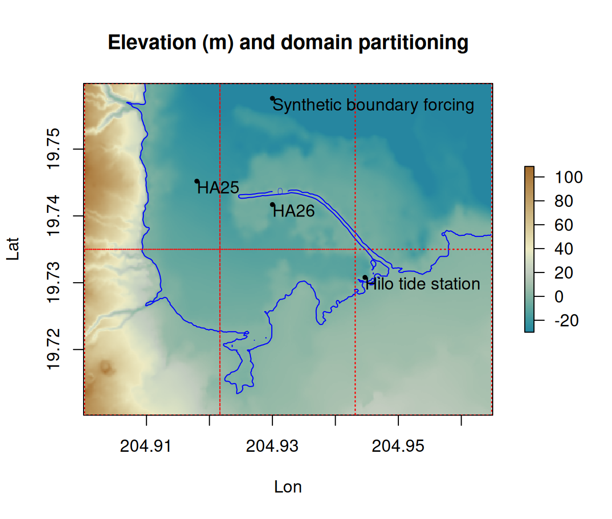
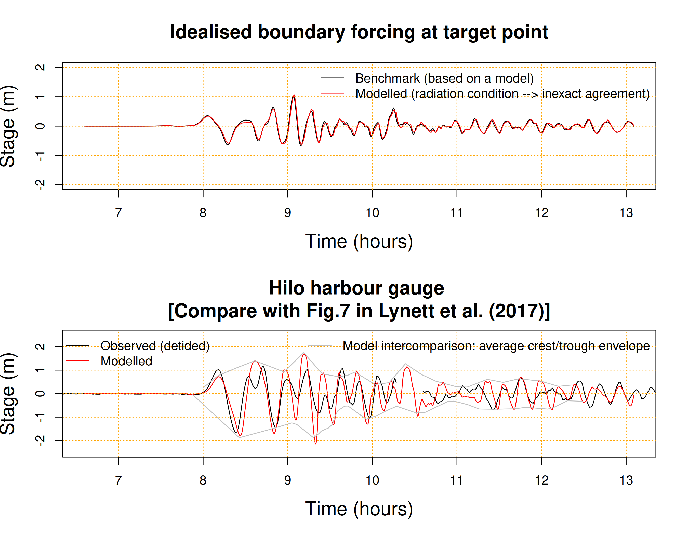

# NTHMP tsunami currents benchmark problem 2: Tohoku tsunami at Hilo Harbour 

The data for this problem is based on the NTHMP currents test set, downloaded
from http://coastal.usc.edu/currents_workshop/problems.html in Feb 2018. 

The problem is an idealised simulation of the Tohoku tsunami in
Hilo Harbour. It is idealised in that it uses a simulated boundary forcing
(extracted at a point from another model, Figure 1), with modified bathymetry. The model
is compared with observations at two ADCP gauges (HA25 and HA26) as well as the
Hilo tide-gauge (Figure 1). See Lynett et al. (2017) for a discussion of this problem and
the results of an inter-model comparison.

The [SWALS model](model.f90) solves this problem on a single grid. To support some
parallel reproducibility tests it is partitioned into 6 pieces (Figure 1) by
passing a [load balance file](load_balance_partion.txt) to
`md%load_balance_file`. The boundary conditions use the specified idealised
stage combined with a radiation treatment of the fluxes. In future it might be
better to applying a separate flather-type condition to the eastern side, but
the sites of interest are simulated well by using the synthetic forcing
everywhere.

Here test problem is simulated using a resolution of 2/3 arc-seconds (about 20m), corresponding to the coarser of the three resolutions suggested (20m, 10m, 5m) by Lynett et al (2017). 

## Modelled flow and comparison with gauges

Figure 2 shows the modelled maximum stage and speed near the harbour. The speed
color-range is limited to 3m/s because Lynett et al (2017) and other studies
use this color range.

The modelled stage at the synthetic boundary forcing point agrees well with the
provided boundary forcing (Figure 3, top panel). The synthetic forcing was extracted
from another model at the specified site, and then applied to our model along
the wet boundary (along with a radiation treatment of the momentum). The
slight differences are due to the use of a radiation treatment of the momentum,
and the spatial difference between the model boundary and site.

The model agrees quite well with the tide-gauge at Hilo harbour (Figure 3,
bottom panel). Exact agreement is not expected because of the idealised
forcing. For comparison we also show the envelope reported by Lynett et al. (2017)
by averaging the wave crests and troughs over several different models. 
The SWALS model results are quite consistent with this multi-model average envelope. 

The speeds at HA25 and HA26 are compared with the model in Figure 4. The data
apparently represents 6-min averaged speeds, so we compare with the model using
both raw and 6-min averaged speeds. We also compare with a model-average
envelope reported by Lynett et al. (2017) for 6-min averaged speeds. 

Although the observed data is supposed to represent a 6-min average, our raw model
values seem to better represent the range of the data. For instance the time-averaging tends
to remove speeds close to zero which are present in the data, and occur in the
raw model results. The modelled 6-minute averaged speeds are quite consistent with the 
model-average envelope reported by Lynett et al. (2017), and the performance seems typical
of the models discussed in that study. 

## Parallel reproducibility 

To check the parallel reproducibility the model is run with two different
parallel treatments (openmp, and mixed openmp/MPI), both using this partition. 

As both models use the same domain partitioning we expect identical results
in the output grids. 

The test checks that this is the case by comparing the northerly flux in both
models at a late timestep, and will report an error for nonzero differences.

## References 

Lynett, P. J.; Gately, K.; Wilson, R.; Montoya, L.; Arcas, D.; Aytore, B.; Bai, Y.; Bricker, J. D.; Castro, M. J.; Cheung, K. F.; David, C. G.; Dogan, G. G.; Escalante, C.; González-Vida, J. M.; Grilli, S. T.; Heitmann, T. W.; Horrillo, J.; Kânoğlu, U.; Kian, R.; Kirby, J. T.; Li, W.; Macias, J.; Nicolsky, D. J.; Ortega, S.; Pampell-Manis, A.; Park, Y. S.; Roeber, V.; Sharghivand, N.; Shelby, M.; Shi, F.; Tehranirad, B.; Tolkova, E.; Thio, H. K.; Velioğlu, D.; Yalciner, A. C.; Yamazaki, Y.; Zaytsev, A. & Zhang, Y. Inter-model analysis of tsunami-induced coastal currents Ocean Modelling, Elsevier BV, 2017, 114, 14-32
