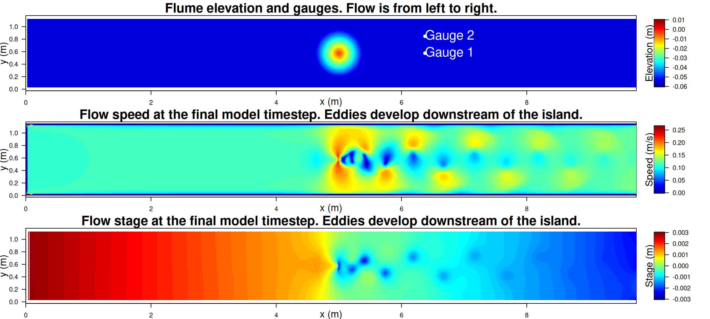

# NTHMP tsunami currents benchmark problem 1: Eddy shedding downstream of a conical island.

We simulate an experiement in which a steady flow is input to a mostly flat-bedded flume, which contains a submerged rise or island (with the shape of a truncated cone). As the flow passes the submerged island, turbulent eddies develop. These are evident in the velocities measured at two gauges downstream of the island. The problem is described in the [NTHMP tsunami velocities benchmark suite](http://coastal.usc.edu/currents_workshop/problems/prob1.html). 

The [SWALS model](model.f90) simulates this problem in a flume with walls on three sides (bottom, left, top), a discharge forcing on the left-hand-side, and a Flather boundary (to radiate outgoing waves) on the right hand-side. The discharge is computed to match the velocity specified in the experiment (0.115 m/s). The target stage for the Flather boundary is tuned to give adequate outflow and ensure that the modelled stage near the island matches the desired value (0 m in our setup which has a flume-bottom depth of -0.054 m). The problem is simulated using a Manning friction coefficient of 0.025, which was found to give a reasonable match with the experiments. An increased Manning friction is prescribed along the flume walls (0.05) to account for the combined bed and wall friction there.

After the model is run for some time, eddies develop downstream of the island, eventually developing a (statistically) steady state. Figure 1 shows the flume elevation and modelled speed and stage at the final timestep, with eddies clearly visible.

Figure 2 compares the modelled and observed velocity vector (with x,y components denoted u,v) at Gauges 1 and 2 after the model has reached a statistically steady state. As the overall flow is directed downstream we see the u-components fluctuate about a non-zero mean, while the v-components fluctuate about zero. The model gives a reasonable representation of the unsteady velocities measured at these sites. 

