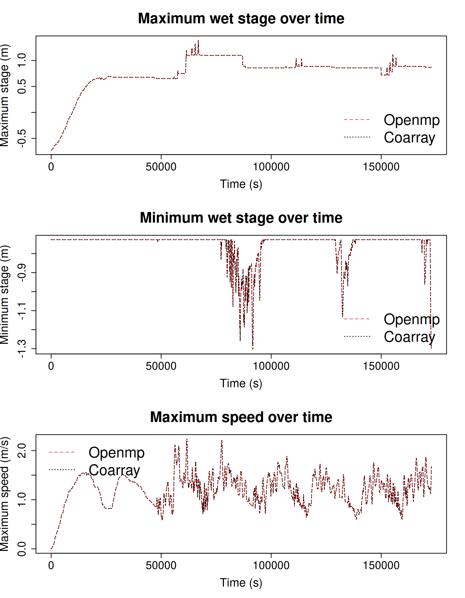

# NTHMP tsunami currents benchmark problem 3: Tohoku tsunami at Tauranga Harbour, NZ

We simulate waves and currents in Tauranga harbour (New Zealand) following the Tohoku tsunami. The data for this problem is available at the [NTHMP velocities benchmark suite](http://coastal.usc.edu/currents_workshop/problems.html).

The [SWALS model for this problem](tauranga.f90) uses two nested domains and spatially rotated elevation data provided in the NTHMP problem description (Figure 1). The outer domain has a coarse cell size (100 m), with factor 3 refinement (33.33 m) in the inner domain near the harbour entrance containing the ADCP. The model is forced along the top boundary with a stage time-series observed at the "A Beacon" gauge and a radiation treatment of the fluxes. Walls are used along the left and right boundaries. Alternative boundary conditions can be invoked via options in the [SWALS model for this problem](tauranga.f90) but are not discussed here. For this problem, because the boundary is so close to the coast, it is nontrivial to prescribe the stage while properly radiating outgoing waves. A variety of interesting approaches to boundary conditions were presented in the [NTHMP benchmarking workshop](https://nws.weather.gov/nthmp/documents/NTHMP_Currents_Workshop_Report.pdf) and [associated slides](http://coastal.usc.edu/currents_workshop/agenda.html).

We compare modelled and observed water elevations at four water-level gauges (A Beacon, Moturiki, Tug Berth, Sulphur Point), and modelled and observed flow speeds at the ADCP (Figure 1). The ADCP location is subject to some uncertainty and so two points are included there (discussed below).

Figure 2 shows the modelled and observed water-levels at 4 gauges. The model reproduces the observations quite well. 

Figure 3 shows the modelled and observed speed at the ADCP. If the modelled speed is taken from the ADCP coordinate in the problem description, then speeds are underestimated. But the problem description notes uncertainty in the ADCP location, while currents here are varying rapidly in space. Much better results are obtained by moving the ADCP location a few grid points towards the channel (Figure 3). Similar underestimates at the original ADCP location were reported by [NTHMP benchmarking workshop](https://nws.weather.gov/nthmp/documents/NTHMP_Currents_Workshop_Report.pdf) participants including [Elena Tolkova using CLIFFS](http://coastal.usc.edu/currents_workshop/presentations/Tolkova.pdf), [Jim Kirby using FUNWAVE](http://coastal.usc.edu/currents_workshop/presentations/Kirby.pdf), and [Diego Arcas using MOST](http://coastal.usc.edu/currents_workshop/presentations/Arcas_PMEL.pdf). Tolkova found better results could be obtained by shifting the ADCP coordinate slightly toward the channel, as found above (see also page 85 of [NTHMP 2017](https://nws.weather.gov/nthmp/documents/NTHMP_Currents_Workshop_Report.pdf)). 

## Similarity of results with different domain partitions

For this problem we run the same model twice with different domain partitions and check that results are almost identical. The first model run (denoted `Openmp`) uses the domain partition in Figure 1; the second (denoted `Coarray`) splits each domain into 6 pieces for parallel computation with MPI. 

Because these domain partitions differ, we do not expect bitwise identical results in the two runs. But results should be practically indistinguishable, unless chaotic processes dominate (e.g. long time eddy evolution) which is not the case here.

Figure 4 shows the intantaneous stage maxima and minima over time in both models. They are visually indistinguishable. The test code checks that the modelled instantaneous stage maxima and stage minima in both models differ by less than $1 \times 10^{-6}$, while the speed maxima differ by less than $1 \times 10^{-5}$. It also compares the VH flux at a late model timestep and checks that they differ by less than $2 \times 10^{-5}$ everywhere in the multidomain. 

If the models had been run with the same domain partition then results would be bitwise identical. While not tested here, such tests are included in other SWALS test problems (see [../../paraboloid_bowl](../../paraboloid_bowl) and [../Hilo_Tohoku_tsunami](../Hilo_Tohoku_tsunami)). 
