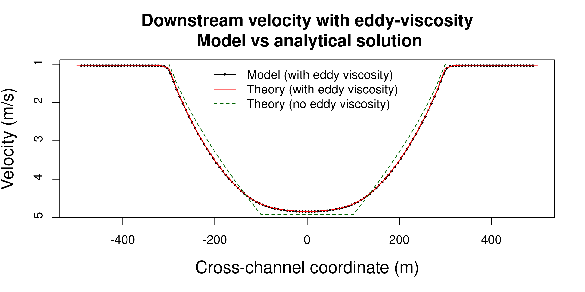

# Overbank flow in a compound channel with eddy-viscosity

This problem simulates steady uniform flow in a channel/floodplain system. The channel has a trapezoidal geometry and is flanked by constant-depth floodplains. The discharge is large enough to inundate both the channel and the floodplains. A key feature of this problem is that we use an eddy-viscosity model. This changes both the cross-channel velocity distribution and the stage-discharge relation, as compared to the solution without eddy-viscosity. 

For a constant input discharge, the steady state solution to the cross-channel flow (depths and velocities) can be computed directly as shown by [Shiono and Knight (1991)](https://doi.org/10.1017/S0022112091001246). The form of eddy-viscosity used in the latter study is consistent with that used by SWALS, although the Shiono and Knight (1991) solution also accounts for secondary flow and a slope-related adjustment to the drag term (which are not treated by SWALS). A [separate script](shiono_knight_model.R) is employed to compute the steady state cross-channel velocity and depth distribution, using a finite difference technique. 

The [SWALS model](model.f90) solves this problem using the nonlinear shallow water equations with friction. A constant discharge is applied for long enough that the model reaches steady state in the interior of the domain, and a flather boundary is applied to enable non-reflective outflow at the downstream end of the channel. For computational speed the model uses a much larger grid spacing in the downstream direction, compared to the cross-channel direction. The code is setup to enable transposing the domain, such that the channel is either north/south oriented, or east/west oriented. Both versions of the code are run to ensure the eddy viscosity implementation is tested in both directions; the [test script](plot.R) confirms that these two solutions differ by less than one part per million. Figure 1 compares the numerical and analytical cross-channel velocity distributions, which show excellent agreement.

