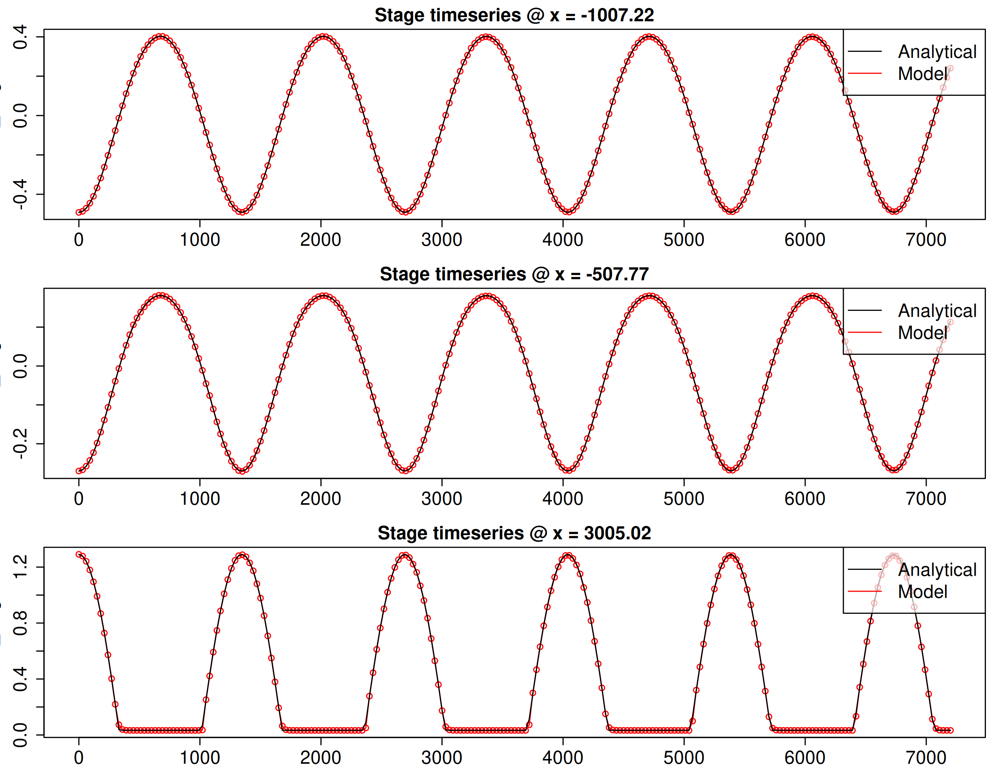
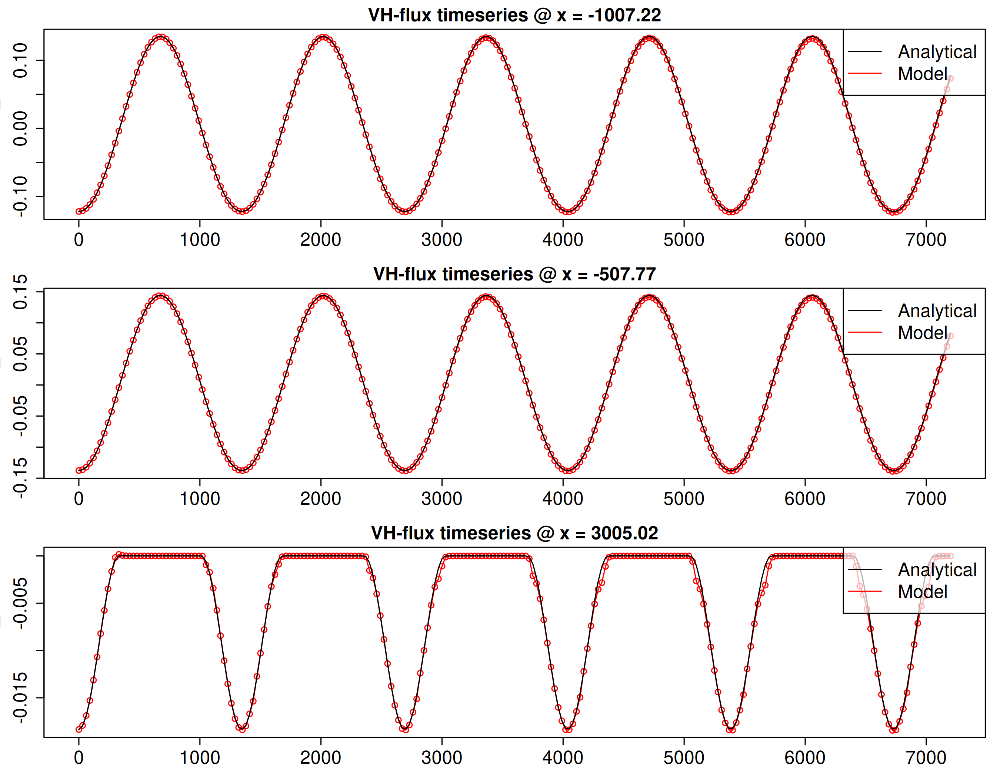

# Frictionless flow oscillations in a parabolic canal, including wetting and drying and a Coriolis term

Periodic flow is simulated in a canal having a parabolic elevation profile (east-west oriented) and an infinite north-south extent. An analytical solution to this problem is known when the flow is governed by the frictionless nonlinear shallow water equations with a Coriolis term. This solution is due to [Thacker (1981)](https://doi.org/10.1017/S0022112081001882), and reviewed in [Sampson et al. (2006)](https://journal.austms.org.au/V47EMAC2005/Sampson/Sampson.pdf). The solution features periodic oscillations of the free surface and the U and V velocities. The amplitude of the latter scales with the Coriolis force. The east-west edges of the domain undergo periodic wetting and drying.

The analytical solution is formulated in Cartesian coordinates, assuming a constant Coriolis forcing. However the solvers in SWALS only includes a Coriolis term if spherical coordinates are used. Therefore the [SWALS model](parabolic_canal.f90) uses spherical coordinates to model a 10km long parabolic canal (east-west oriented) which is 500m wide (north-south oriented) and located at 30 degrees north. Over this small north-south extent, variations in Coriolis force are small, such that the modelled solution should mirror the analytical solution. A periodic north-south boundary condition is employed to emulate a domain with infinite extent in the NS direction. This periodic north-south boundary is non-physical but is adequate for this problem because the domain width is small, so changes in spherical coordinate metric terms have only a minor impact. 

Figures 1 to 3 compare the analytical solution with the model at 3 sites. The third site is situated in the wetting and drying zone. There is very good agreement with the analytical solution for the stage, the east directed flux (UH) and the north directed flux (VH). 

Figures 4 and 5 are similar to the previous figures but consider the velocity component in the east and west directions. In these cases we see some deviations between SWALS and the analytical solution in the wet/dry zone, even though the fluxes were predicted very well. The differences occur when the flow is extremely shallow. While the analytical solution predicts drying, the numerical model is slower to dry, resulting in a very thin layer of flowing water on the domain, when actually the flow should be dry (with zero velocities).

This slow-to-dry behaviour has been observed previously for frictionless flows using the ANUGA hydrodynamic model, which uses a similar numerical scheme as the SWALS `rk2` solver, albeit on an unstructured mesh ([Davies and Roberts, 2015](https://www.mssanz.org.au/modsim2015/L5/davies.pdf)). The issue is also reported by [Kesserwania and Wang (2014)]( https://doi.org/10.1002/2013WR014906) using another finite-volume numerical scheme. [Xia et al. 2017](https://doi.org/10.1002/2016WR020055) analyse the underlying causes of these issues. This issue is common for cases involving frictionless flow with wetting and drying, but has little impact on the modelled stage or flux time-series. 
