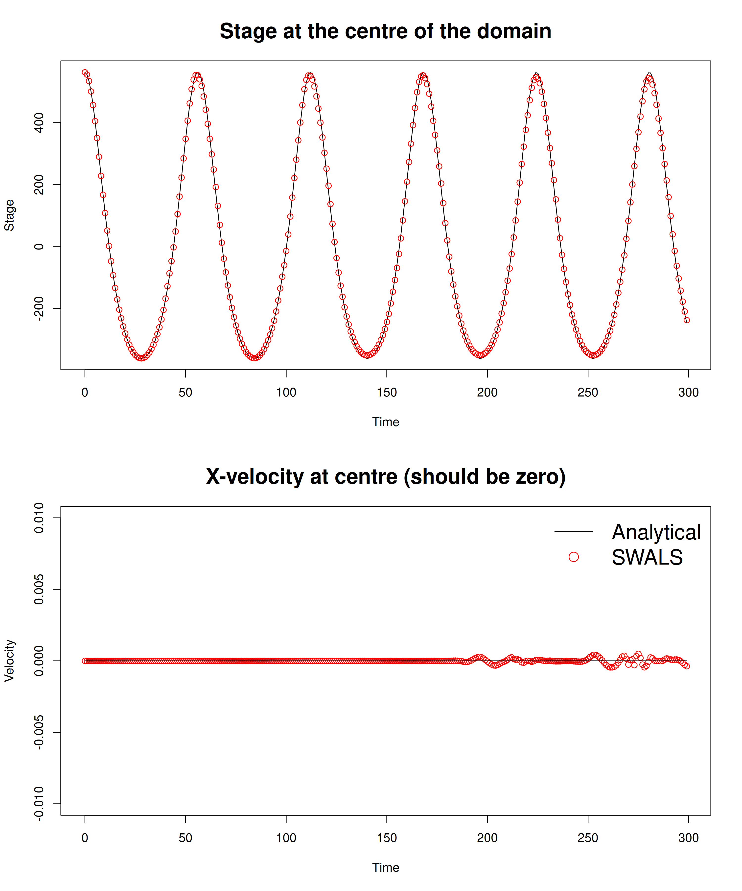
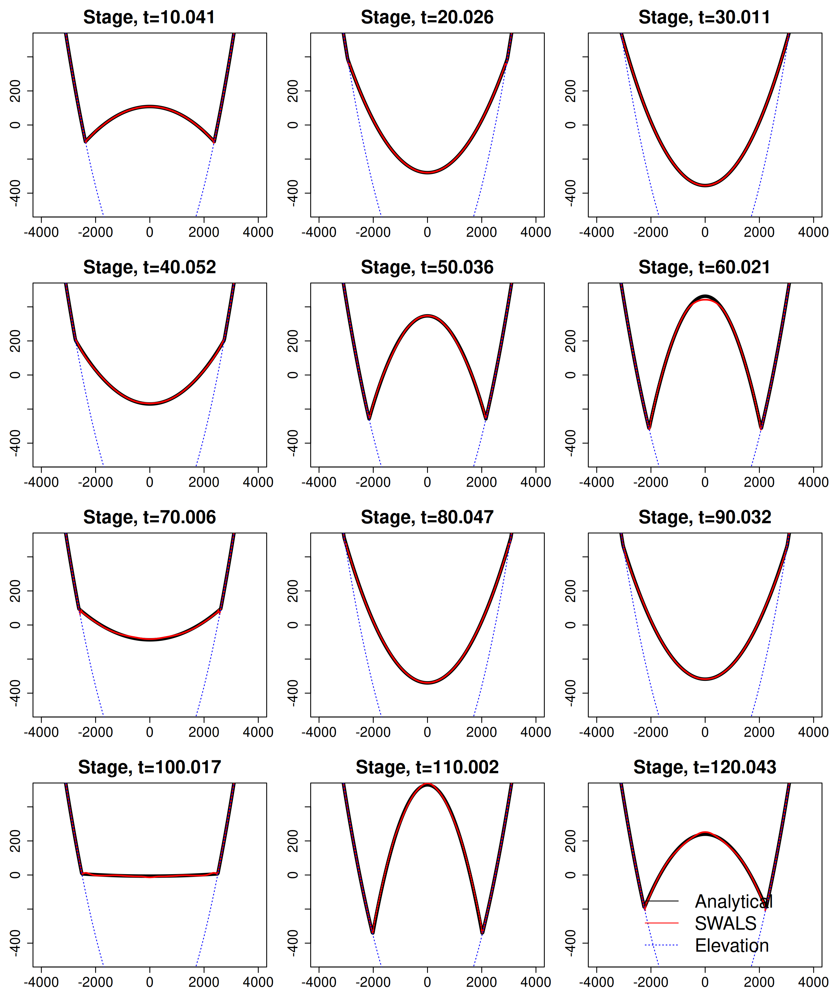
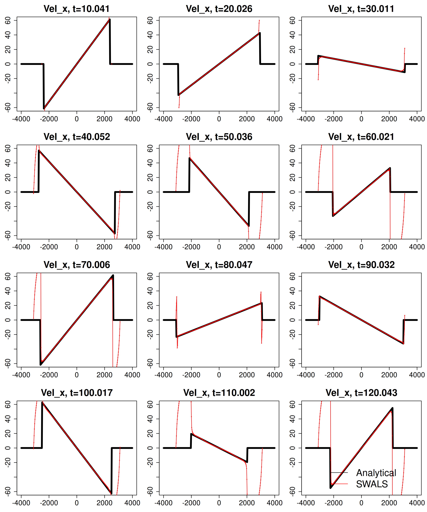

# Frictionless flow oscillations in a 2D paraboliod bowl, including wetting and drying.

Periodic, radially symmetric flow is simulated in a bowl of paraboloid shape. An analytical solution to this problem is known when the flow is governed by the frictionless nonlinear shallow water equations. This solution is due to [Thacker (1981)](https://doi.org/10.1017/S0022112081001882), and features periodic oscillations of the free surface and the U and V velocities. The edges of the domain undergo periodic wetting and drying.

The [SWALS model](paraboloid_bowl.f90) simulates this problem for 300s of time, enough for 5 cycles of the periodic solution. The `rk2` finite-volume scheme is used. 

Due to the radial symmetry of this problem, the flow speed in the centre is analytically zero for all time, while the water surface oscillates. Figure 1 shows the model captures this aspect of the analytical solution. Small non-zero velocities (a few millimeters per second) develop toward the end of the simulation. 

Figure 2 shows the computed free-surface elevation along a transect at y==0 for times of 10, 20, ... 120 seconds. The modelled and analytical stage agree well.

Figure 3 is like Figure 2 but compares the flux (speed x depth) in the x-direction along the transect y==0. The modelled and analytical flux agree well.

Figure 4 is like Figures 2 and 3, but compares the speed in the x-direction along the transect y==0. The modelled and analytical speeds agree well in the wetted portion of the domain, but the model produces large speeds along the edges of the domain in areas that should be dry (analytically). The numerical model is slow to dry in these regions, and predicts a spurious shallow layer of water flowing down-slope, which can develop high speeds in the absence of friction. 

The spurious velocities in the drying zone in Figure 4 have little impact on the computed stage or flux because the flow is so shallow. This slow-to-dry behaviour has been observed previously for frictionless flows using the ANUGA hydrodynamic model, which uses a similar numerical scheme as the SWALS `rk2` solver on an unstructured mesh ([Davies and Roberts, 2015](https://www.mssanz.org.au/modsim2015/L5/davies.pdf)). Similar issues are also reported by [Kesserwania and Wang (2014)]( https://doi.org/10.1002/2013WR014906) using another finite-volume numerical scheme, and [Vater et al. (2019)](https://doi.org/10.1002/fld.4762) using a finite-element scheme. [Xia et al. 2017](https://doi.org/10.1002/2016WR020055) analyse the underlying causes of these issues in finite volume schemes that are similar to those in SWALS. 
