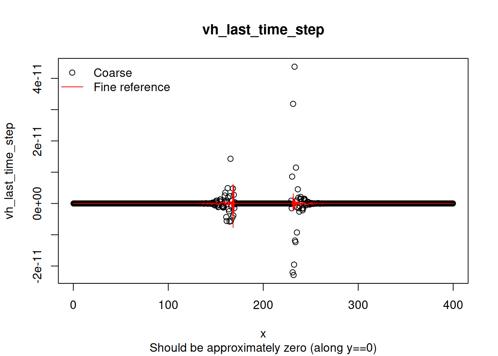

# Radial dam break regression test

The code to setup the radial dam-break problem is in [radial_dam_break.f90](./radial_dam_break.f90).

Run the model and compare against the reference solution using:

    source run_model.sh

As this problem does not have an analytical solution, the reference solution was created using a model with grid-size about 8x finer than the default case. See comments and code in [make_highres_outputs.R](make_highres_outputs.R) for details on how this was done. The [test code](plot_results.R) checks that the coarse-grid solution is close to the fine grid solution, with variable-specific tolerances.

The figures below compare the coarse/fine grid solutions, and show excellent agreement.

