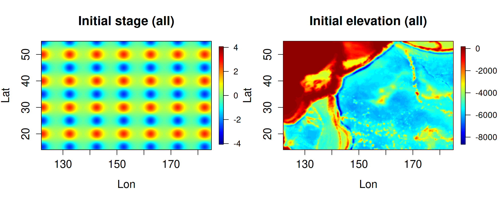
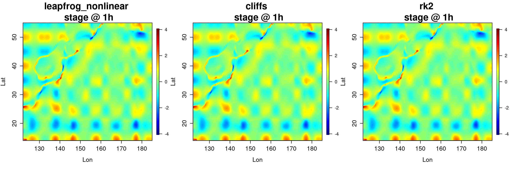
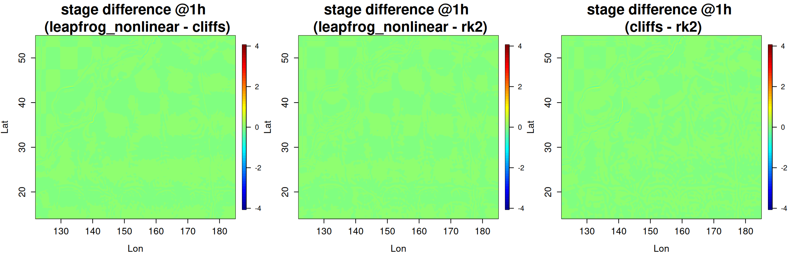

# Comparison of 3 algorithms in spherical coordinates over quasi-realistic topography

Three flow algorithms (`leapfrog_nonlinear`, `cliffs` and `rk2`) are compared for a large-area domain with spherical coordinates and quasi-realistic topography. The flow algorithms use very different numerical methods and implementations, but should nonetheless give similar results when the flow is well resolved (i.e. using sufficiently fine grids). Below we check that this holds for a test problem featuring "low Froude number" gravity wave propagation.

The [SWALS model](model.f90) is setup to take the flow algorithm as a command-line argument. Because the `cliffs` solver in SWALS does not include the Coriolis force, the Coriolis terms are removed for all cases by compiling with `-DNOCORIOLIS` (see the [makefile](make_model) ). If this is not done then the `cliffs` results differ more significantly from the other solvers. 

Figure 1 shows the initial stage and topography. The stage is initialised with long-period bumps. The topography is initialised using a DEM from the Japan region (from [../generic_example](../generic_example)), but is then smoothed and clipped to a maximum elevation of -100m. This was done to reduce the influence of short-wavelength flows on the test problem, which could otherwise occur due to wetting and drying, shallow topography, or poorly resolved elevation. By enforcing long wavelengths in the solution we can expect the numerical models to give accurate results on coarse grids, which makes the test efficient to run. We also add walls to the elevation around the model boundaries, to prevent any influence of solver-dependent boundary conditions. 

Figure 2 shows the modelled stage after 1 hour of propagation with each flow algorithm. It is difficult to notice differences in the results. This is consistent with our expectations if the algorithms are correctly implemented. 

Figure 3 shows difference between the modelled stage results at 1 hour, computed with each flow algorithm. It is difficult to see any differences in the 3 results when using the same vertical scale as in the previous figure. The test code checks that the average absolute difference is less than 1cm in all cases. 

