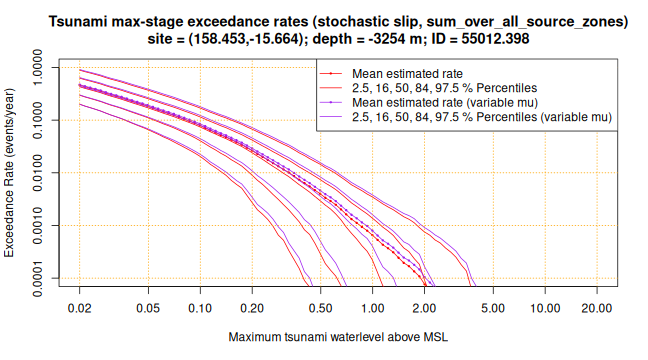
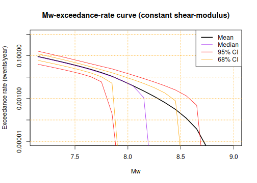
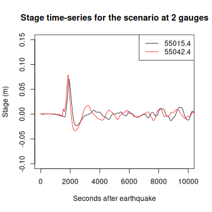
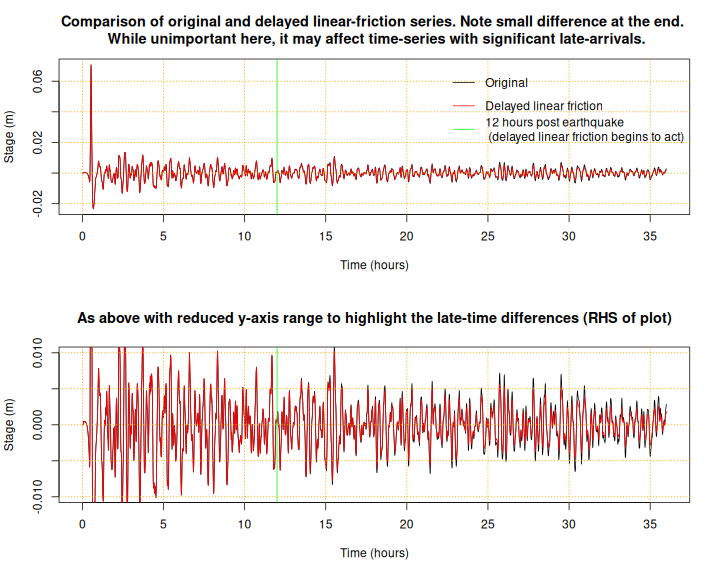

# **Obtaining detailed information on earthquake scenarios, tsunami initial conditions, and tsunami time-series**

For every PTHA18 scenario we provide earthquake information, tsunami
initial conditions, and tsunami time-series at every hazard point. Combined with
the exceedance-rate modelling, such inputs can be used to drive local scale
tsunami inundation models for hazard and risk assessments.

To access the detailed information, the user needs to interact with our files
via the NCI THREDDS server. We provide R scripts to facilitate this, and the
process is described below. A range of software must be installed to run these
codes, [as described here](INSTALL.md).

Unfortunately the installation and data extraction process may be challenging
for users with limited experience in scientific programming and Linux. Although
we cannot provide one-on-one support in every situation, users doing tsunami
hazard studies **in Australia** are encouraged to contact Geoscience Australia
directly for support if they have difficulty with any of these steps, or simply
to discuss how to best use the results for their study (please email Gareth
Davies at gareth.davies@ga.gov.au). 

The study results are provided under a [Creative Commons 4.0 International
Licence](http://creativecommons.org/licenses/by/4.0/legalcode), while the
source-code is provided under a [BSD3 license](../LICENSE). 

Geoscience Australia has tried to make the information in this product as
accurate as possible. However, it does not guarantee that the information is
totally accurate or complete. Therefore, you should not solely rely on this
information when making a commercial decision.

Results may be updated if problems are identified. Please report any problems
via the github issues page, or send an email to the maintainer
(gareth.davies@ga.gov.au) or to hazards@ga.gov.au. See [UPDATES.md](./UPDATES.md) for
notes regarding updates since the 2018 report release.

## Before you start

Before working with the outputs, make sure you've [read the project
report](http://dx.doi.org/10.11636/Record.2018.041) to understand what they
are, how they were made, and how they have been tested. Users are strongly
encouraged to independently test the results at their site of interest as part
of any application. In particular note that:
* The PTHA18 tsunami scenarios are tested against offshore DART buoy data observed 
  during 18 tsunamis, for the period 2006-2016 (actually tests against a few additional
  events are provided in the PTHA18 report). The time-series comparison usually only last
  a few hours per site (corresponding to high-sampling-frequency measurements in the
  DART buoy data we used). Although this is a significant amount of testing relative to typical
  PTHA studies in 2018, it is most relevant to the behaviour of tsunamis in the
  deep ocean for relatively short times following arrival.  We would like to
  see further testing of the scenarios when propagated into the nearshore and
  onshore, and for longer times. This would also increase the number of tsunami
  observations available to test the model. Such testing might lead to further
  insights about the tsunami scenario performance, model biases, etc. See
  further discussion in the [GJI paper](https://doi.org/10.1093/gji/ggz260).
  **If you are working at a site where tsunamis have been observed, you are
  strongly encouraged to test the results using site-specific data.**
* The earthquake magnitude-vs-exceedance-rate models are constrained by combining
  tectonic-plate convergence rates with earthquakes observed since 1976 having
  magnitude > 7.15. Longer-term historical/paleo seismic information is often available,
  but not tightly integrated into the current PTHA18 methodology. 
  Longer-term data *is* used to constrain the PTHA18 maximum-magnitudes, and has
  some influence the statistical model priors. However, longer-term data *does not* influence
  the PTHA18 logic-tree weight update. We have tested the model at 7 sites with longer-term
  data, and the result seems reasonable ([see Section 3.4 of the PAGEOPH paper](https://link.springer.com/article/10.1007/s00024-019-02299-w)).
  **But if you are working at a site with significant longer-term data, you are
  strongly encouraged to test the rate models and double-check
  their performance**. 
* The PTHA18 results are dependent on the fault-source geometry (dips / maximum
  depths / etc). This affects the tsunami scenarios as well as the maximum-magnitude
  and earthquake rate models, which are linked to the size of the source-zone in the PTHA18
  methodology. The quality of the geometric information is often uncertain and likely varies from
  site-to-site. However the PTHA18 does not include a formal treatment of this
  fault-geometry uncertainty. 
* The modelled wave time-series are derived using a frictionless linear model
  with a 1 arcmin cell-size (around 1.8 x 1.8 km2 at the equator). This model
  can simulate many aspects of tsunami propagation in the deep ocean, and the
  linear approximation enables many scenarios to be considered via
  superposition. However it is too coarse to reliably simulate waves nearshore.
  Furthermore, it does not capture the slow dissipation of real tsunamis at the
  global scale (although a transformation of the frictionless solutions may enable this, 
  [see Equation 16 in this paper](https://www.frontiersin.org/articles/10.3389/feart.2020.598235/full)). 
  If these limitations are important for your application (e.g. according to your own
  site-specific testing), you may re-simulate the tsunami from source using a
  more complex hydrodynamic model with appropriate resolution and/or
  dissipation. We provide tsunami initial conditions to facilitate this. If
  you're working on hazards in Australia and need some support with this,
  please contact the maintainer (described above).

## **Usage**

Make sure you have successfully installed the software [as described
here](INSTALL.md).  Please confirm that everything installed correctly by
running the [test_all.R](test_all.R) script.  You need to start R in the
directory that contains that script and this README file (i.e. the directory
name will end in `/ptha/ptha_access/`).

```r
# This should print 'PASS' a few times. If not, something is wrong with your
# install (or perhaps your internet connection is slow -- give it a few tries).
source('test_all.R')
```

```
## [1] "PASS"
## [1] "PASS"
## [1] "PASS"
## [1] "PASS"
## [1] "PASS"
## [1] "PASS"
## [1] "PASS"
## [1] "PASS"
## [1] "PASS"
## [1] "PASS"
## [1] "PASS"
## [1] "PASS"
## [1] "PASS"
## [1] "PASS"
## [1] "PASS"
## [1] "PASS"
```
**If the above script fails even after repeated trials, you need to troubleshoot
your installation before proceeding**. [See here](INSTALL.md).

If your internet is not working perfectly, or the NCI server is down, you will see an
message like this:

```r
#    Error in Rsx_nc4_get_vara_double: NetCDF: DAP failure
#    Var: gaugeID  Ndims: 1   Start: 0 Count: 20185
#    Error in ncvar_get_inner(ncid2use, varid2use, nc$var[[li]]$missval, addOffset,  : 
#      C function R_nc4_get_vara_double returned error
```
In this case, just try again -- after a few attempts it usually works. If not,
then check if your internet is working. Also check whether the NCI THREDDS
server is running (occasionally it goes down for maintenance or technical
problems).

If you see fewer 'PASS' statements than above, but without obvious failures,
then most likely there is no problem, but you probably never sourced the script
[get_detailed_PTHA18_source_zone_info.R](get_detailed_PTHA18_source_zone_info.R).
That script needs to do a one-off large download of some data to your
machine. Here we only run the tests for that script if the data is found on your
machine. Althought it is not necessary, in case you want to force that you can
open R in this directory and do `source('get_detailed_PTHA18_source_zone_info.R')` 
which will download the data. Then the associated tests can be run.


### ***Obtaining hazard curves at a particular hazard point***

To get maximum-stage exceedance-rate information at a particular hazard point, consider
that you can directly download plots of the information as described in [README.md](README.md)
under the heading *Obtaining site-specific hazard information (including source deaggregation)*.

However, suppose you actually want the numerical value. They can be obtained like so (for
heterogeneous slip with both constant and variable shear modulus):

```r
# Import the functions
source('get_PTHA_results.R')
# This example point is near DART 55012
hazard_point = c(158.45, -15.66)
# Get the exceedance-rate info
er_info = get_stage_exceedance_rate_curve_at_hazard_point(
    target_point=hazard_point, 
    make_plot=TRUE)
```

```
## Warning in xy.coords(x, y, xlabel, ylabel, log): 17 y values <= 0 omitted from
## logarithmic plot
```



The object `er_info` is a list with the exceedance-rate information at a range
of stage values, for a range of percentiles and shear-modulus types.

```r
# Look at the variables in er_info
names(er_info)
```

```
##  [1] "stage"                                    
##  [2] "stochastic_slip_rate"                     
##  [3] "stochastic_slip_rate_upper_ci"            
##  [4] "stochastic_slip_rate_lower_ci"            
##  [5] "stochastic_slip_rate_median"              
##  [6] "stochastic_slip_rate_16pc"                
##  [7] "stochastic_slip_rate_84pc"                
##  [8] "variable_mu_stochastic_slip_rate"         
##  [9] "variable_mu_stochastic_slip_rate_upper_ci"
## [10] "variable_mu_stochastic_slip_rate_lower_ci"
## [11] "variable_mu_stochastic_slip_rate_median"  
## [12] "variable_mu_stochastic_slip_rate_16pc"    
## [13] "variable_mu_stochastic_slip_rate_84pc"    
## [14] "lon"                                      
## [15] "lat"                                      
## [16] "elev"                                     
## [17] "gaugeID"                                  
## [18] "target_index"                             
## [19] "source_name"                              
## [20] "stage_exceedance_rate_curves_file"
```
You can print each of those values individually to get a closer look (just type
`er_info` and press enter after executing the above code). We do not do this
here because it would take up a lot of space.

The key variables are:
* `stage` - vector of stage values at which we store exceedance rates. They
  vary logarithmically from 2 cm to 20 m. 
* `stochastic_slip_rate` - exceedance rates (epistemic mean) for heterogeneous slip models with constant shear modulus
* `stochastic_slip_rate_upper_ci` - exceedance rates (epistemic 97.5 percentile) for heterogeneous slip models with constant shear modulus
* `stochastic_slip_rate_lower_ci` - exceedance rates (epistemic 2.5 percentile) for heterogeneous slip models with constant shear modulus          
* `stochastic_slip_rate_median` - exceedance rates (epistemic 50th percentile) for heterogeneous slip models with constant shear modulus 
* `stochastic_slip_rate_16pc` - exceedance rates (epistemic 16th percentile) for heterogeneous slip models with constant shear modulus               
* `stochastic_slip_rate_84pc` - exceedance rates (epistemic 84th percentile) for heterogeneous slip models with constant shear modulus               
* `variable_mu_stochastic_slip_rate` - exceedance rates (epistemic mean) for heterogeneous slip models with variable shear modulus  
* `variable_mu_stochastic_slip_rate_upper_ci` - exceedance rates (epistemic 97.5 percentile) for heterogeneous slip models with variable shear modulus 
* `variable_mu_stochastic_slip_rate_lower_ci` - exceedance rates (epistemic 2.5 percentile) for heterogeneous slip models with variable shear modulus 
* `variable_mu_stochastic_slip_rate_median` - exceedance rates (epistemic 50th percentile) for heterogeneous slip models with variable shear modulus   
* `variable_mu_stochastic_slip_rate_16pc` - exceedance rates (epistemic 16th percentile) for heterogeneous slip models with variable shear modulus     
* `variable_mu_stochastic_slip_rate_84pc`  - exceedance rates (epistemic 84th percentile) for heterogeneous slip models with variable shear modulus    
* `lon` - hazard point longitude 
* `lat` - hazard point latitude
* `elev` - hazard point ocean elevation (m above MSL)                             
* `gaugeID` - a numerical ID for the hazard point                                 
* `target_index` - an index for the hazard point                             
* `source_name` - if the function is used to get results for a specific source-zone, then this gives its name. In the current case it just says `"sum_over_all_source_zones"`                             
* `stage_exceedance_rate_curves_file` - path to the file where the information was read

For example, to get the median exceedance-rate at a stage of 0.4 m, assuming
heterogeneous-slip scenarios with variable shear modulus, we could do:

```r
# Use linear interpolation of the stage and rate 
approx(er_info$stage, er_info$variable_mu_stochastic_slip_rate_median, xout=0.4)$y
```

```
## [1] 0.006171845
```

**Note regarding updated exceedance-rate percentiles:** In [this paper](https://doi.org/10.1007/s00024-019-02299-w) we developed a
new method to compute exceedance-rate percentiles, which is more rigorous than
in the [original PTHA18 report](http://dx.doi.org/10.11636/Record.2018.041). 
By default the above code uses the newer exceedance-rate percentile results. Although
not recommended, you can force it to use the older results by setting
`percentile_version="DG18"` (the default is "DG19" which gives the newer
results).:

```r
# Get the exceedance-rate info as in Davies and Grifin (2018)
# This has all the same data as 'er_info' above, but with slightly different
# percentile curves. 
er_info_old = get_stage_exceedance_rate_curve_at_hazard_point(
    target_point=hazard_point, percentile_version='DG18')
# Compare this calculation with the one above -- similar but not identical.
approx(er_info_old$stage, er_info_old$variable_mu_stochastic_slip_rate_median, xout=0.4)$y
```

```
## [1] 0.005430505
```
Mathematically the mean exceedance-rate curve should be unaffected by these
changes. In practice this is almost true, but our implementation choices led to
small changes at higher decimal places. For efficiency we used
`drop_small_events=TRUE` in the function
`rptha::convert_Mw_exceedance_rates_2_stage_exceedance_rates`. This is valid
and can greatly speed-up calculations, but slightly changes an interpolation at
one point in the calculation. See the help page of that function for further
discussion. Any changes should be unimportant - for example:

```r
# New results (mean)
approx(er_info$stage, er_info$variable_mu_stochastic_slip_rate, xout=0.4)$y
```

```
## [1] 0.007428284
```

```r
# Old results (mean)
approx(er_info_old$stage, er_info_old$variable_mu_stochastic_slip_rate, xout=0.4)$y
```

```
## [1] 0.0074266
```


### ***Obtaining metadata on the earthquake scenarios on each source-zone***

Earthquake scenario metadata is accessed on a per-source-zone basis. In a typical
application you would use site-specific hazard information (including source deaggregation) 
discussed in [README.md](README.md) to identify the main source-zones of
interest for a particular site, and then study scenarios for the given
source-zone of interest. Below we use the `puysegur` source-zone as an
example, which is located just south of New Zealand and to the north of Macquarie
Island.

To download metadata from the NCI describing the earthquake scenarios on a
particular source-zone, start R in the current directory, and do:

```r
# Import the functions
source('get_PTHA_results.R')

# Find the possible names of the source-zones
get_source_zone_events_data()
```

```
## [1] "You did not pass a valid source_zone to get_source_zone_events_data. The allowed source_zone values are:"
##  [1] "   alaskaaleutians"         "   arutrough"              
##  [3] "   banda_detachment"        "   cascadia"               
##  [5] "   floreswetar"             "   hjort"                  
##  [7] "   izumariana"              "   kermadectonga2"         
##  [9] "   kurilsjapan"             "   macquarieislandnorth"   
## [11] "   makran2"                 "   manokwari"              
## [13] "   manus"                   "   mexico"                 
## [15] "   moresby_trough"          "   mussau"                 
## [17] "   newguinea2"              "   newhebrides2"           
## [19] "   north_sulawesi"          "   outer_rise_timor"       
## [21] "   outerrise_kermadectonga" "   outerrise_puysegur"     
## [23] "   outerrisenewhebrides"    "   outerrisesolomon"       
## [25] "   outerrisesunda"          "   philippine"             
## [27] "   puysegur2"               "   ryuku"                  
## [29] "   sandwich"                "   sangihe"                
## [31] "   sangihe_backthrust"      "   se_sulawesi"            
## [33] "   seram_thrust"            "   seramsouth"             
## [35] "   solomon2"                "   southamerica"           
## [37] "   sunda2"                  "   tanimbar"               
## [39] "   timortrough"             "   tolo_thrust"            
## [41] "   trobriand"              
## [1] "Please pass one of the above source_zone names to this function to get its metadata"
```

Above we called the function `get_source_zone_events_data` that is typically
used to get metadata on all scenarios on a particular source-zone. However, if
no arguments are passed, then by default it prints the valid `source_zone` names
and exits. That can help you learn what the source-zone names are. They can
also be found by clicking on source-zones in the interactive hazard map
(discussed below).

Suppose we are interested in the Puysegur source-zone. From the above list and/or the 
interactive map, we could infer that it was named `puysegur2`. We can then get the
scenario metadata as follows:

```r
# Example: get metadata for the puysegur source_zone
puysegur = get_source_zone_events_data('puysegur2')
```

This variable `puysegur` is now an R `list`, which contains two `data.frame`'s
summarising the source-zone geometry and the earthquake secnarios, and a character
vector giving the associated tide-gauge files (where tsunami time-series are
stored)

```r
names(puysegur)
```

```
## [1] "events"                 "unit_source_statistics" "gauge_netcdf_files"    
## [4] "events_file"            "unit_source_file"       "tsunami_events_file"
```

```r
lapply(puysegur, class) # Get class of each entry in the list 'puysegur'
```

```
## $events
## [1] "data.frame"
## 
## $unit_source_statistics
## [1] "data.frame"
## 
## $gauge_netcdf_files
## [1] "character"
## 
## $events_file
## [1] "character"
## 
## $unit_source_file
## [1] "character"
## 
## $tsunami_events_file
## [1] "character"
```

We now describe the unit-source-statistics table.
`puysegur$unit_source_statistics` contains summary statistics about the
unit-sources. For each unit source this gives the centroid `lon` and `lat` and
`depth`; the unit source dimensions `length` and `width`; the rupture source
mechanism (`strike`, `dip`, `rake`); and indices `downdip_number`,
`alongstrike_number`, and `subfault_number` which give information of the
placement of the unit source on the grid of all unit sources.

```r
# Get the names of all summary statistics
names(puysegur$unit_source_statistics)
```

```
##  [1] "lon_c"                  "lat_c"                  "depth"                 
##  [4] "strike"                 "dip"                    "rake"                  
##  [7] "slip"                   "length"                 "width"                 
## [10] "downdip_number"         "alongstrike_number"     "subfault_number"       
## [13] "max_depth"              "initial_condition_file" "tide_gauge_file"
```
Here we determine the dimensions of the table, and look at a few rows

```r
# Get the table dimensions
dim(puysegur$unit_source_statistics)
```

```
## [1] 28 15
```

```r
# Print rows 1 and 2
puysegur$unit_source_statistics[1:2,]
```

```
##      lon_c     lat_c     depth   strike      dip rake slip   length    width
## 1 163.6647 -49.88909  6.364741 20.39946 18.67347   90    1 45.92458 39.80127
## 2 164.1119 -49.96848 26.364741 14.18287 43.24057   90    1 45.54654 39.98489
##   downdip_number alongstrike_number subfault_number max_depth
## 1              1                  1               1  12.83707
## 2              2                  1               2  40.00000
##                                                                                        initial_condition_file
## 1 /g/data1a/fj6/PTHA/AustPTHA_1/SOURCE_ZONES/puysegur2/EQ_SOURCE/Unit_source_data/puysegur2/puysegur2_1_1.tif
## 2 /g/data1a/fj6/PTHA/AustPTHA_1/SOURCE_ZONES/puysegur2/EQ_SOURCE/Unit_source_data/puysegur2/puysegur2_2_1.tif
##                                                                                                                                                                         tide_gauge_file
## 1 /g/data/fj6/PTHA/AustPTHA_1/SOURCE_ZONES/puysegur2/TSUNAMI_UNIT_SOURCES/unit_source_tsunami/RUN_20180815145902_puysegur2_1_1/RUN_ID100001_20180816_044751.819/Gauges_data_ID100001.nc
## 2 /g/data/fj6/PTHA/AustPTHA_1/SOURCE_ZONES/puysegur2/TSUNAMI_UNIT_SOURCES/unit_source_tsunami/RUN_20180815145906_puysegur2_2_1/RUN_ID100001_20180816_050648.956/Gauges_data_ID100001.nc
```
In addition, the `initial_condition_file` and `tide_gauge_file` variables
provide a link to the vertical deformation and tsunami model run respectively,
for each unit source. Note that the file path names sometimes differ slightly
from the location on the NCI Thredds server (although in a fairly obvious way,
e.g. sometimes we see /g/data replaced with /g/data1a). The scripts provided
here will translate the file paths as required for remote access.

Next we consider the scenario metadata table. `puysegur$events` contains summary
statistics about the earthquake scenarios. 

```r
# Print the names of all scenario summary statistics
names(puysegur$events)
```

```
##  [1] "event_index_string"                  
##  [2] "event_slip_string"                   
##  [3] "Mw"                                  
##  [4] "target_lon"                          
##  [5] "target_lat"                          
##  [6] "peak_slip_downdip_ind"               
##  [7] "peak_slip_alongstrike_ind"           
##  [8] "physical_corner_wavenumber_x"        
##  [9] "physical_corner_wavenumber_y"        
## [10] "sourcename"                          
## [11] "uniform_event_row"                   
## [12] "rate_annual"                         
## [13] "rate_annual_lower_ci"                
## [14] "rate_annual_upper_ci"                
## [15] "variable_mu_Mw"                      
## [16] "variable_mu_rate_annual"             
## [17] "variable_mu_rate_annual_lower_ci"    
## [18] "variable_mu_rate_annual_upper_ci"    
## [19] "variable_mu_rate_annual_median"      
## [20] "variable_mu_rate_annual_16pc"        
## [21] "variable_mu_rate_annual_84pc"        
## [22] "variable_mu_weight_with_nonzero_rate"
## [23] "weight_with_nonzero_rate"            
## [24] "rate_annual_16pc"                    
## [25] "rate_annual_84pc"                    
## [26] "rate_annual_median"
```

```r
# Get the table dimensions
dim(puysegur$events)
```

```
## [1] 5881   26
```
While there are many ways to investigate the `events` table, a simple approach is
to just print some rows. In general low row-indices will correspond to low
magnitudes, and high indices to high magnitudes.


```r
# Print some rows (we choose 2050, 2051, 2052)
puysegur$events[2050:2052, ]
```

```
##      event_index_string        event_slip_string  Mw target_lon target_lat
## 2050       21-23-25-27- 5.838_8.941_2.336_1.508_ 7.9   166.7325  -45.56029
## 2051          22-23-24-        4.554_5.927_8.27_ 7.9   166.7325  -45.56029
## 2052       19-20-21-22-   1.42_3.54_2.334_7.838_ 7.9   166.7325  -45.56029
##      peak_slip_downdip_ind peak_slip_alongstrike_ind
## 2050                     1                        12
## 2051                     2                        12
## 2052                     2                        11
##      physical_corner_wavenumber_x physical_corner_wavenumber_y sourcename
## 2050                  0.003639969                  0.004682143  puysegur2
## 2051                  0.009215376                  0.011996502  puysegur2
## 2052                  0.006078464                  0.010341691  puysegur2
##      uniform_event_row   rate_annual rate_annual_lower_ci rate_annual_upper_ci
## 2050               131 0.00002739742       0.000001266245        0.00004482371
## 2051               131 0.00002817468       0.000001302168        0.00004609535
## 2052               131 0.00002995223       0.000001384323        0.00004900353
##      variable_mu_Mw variable_mu_rate_annual variable_mu_rate_annual_lower_ci
## 2050       7.612915           0.00003637125                   0.000001889921
## 2051       7.977218           0.00003508704                   0.000001823191
## 2052       7.980054           0.00003349598                   0.000001740517
##      variable_mu_rate_annual_upper_ci variable_mu_rate_annual_median
## 2050                    0.00006254488                  0.00003163438
## 2051                    0.00006033652                  0.00003051742
## 2052                    0.00005760049                  0.00002913357
##      variable_mu_rate_annual_16pc variable_mu_rate_annual_84pc
## 2050                0.00004400736                0.00004105183
## 2051                0.00004245353                0.00003960236
## 2052                0.00004052843                0.00003780654
##      variable_mu_weight_with_nonzero_rate weight_with_nonzero_rate
## 2050                            0.9956551                0.9952935
## 2051                            0.9956551                0.9952935
## 2052                            0.9956551                0.9952935
##      rate_annual_16pc rate_annual_84pc rate_annual_median
## 2050    0.00003309469    0.00003120997      0.00002463771
## 2051    0.00003403359    0.00003209539      0.00002533668
## 2052    0.00003618078    0.00003412030      0.00002693518
```

The most important variables from a users perspective are the moment magnitude
`Mw`, and the "variable shear modulus" moment magnitude `variable_mu_Mw`.
You may be surprised to see we store two different earthquake magnitudes for
each scenario. The `Mw` column holds the earthquake moment magnitude, derived
under the assumption that the shear modulus (or rigidity, i.e. a material
property of the earth) on the source-zone is constant, with a value of 30 GPa
on thrust sources and 60 GPa on normal sources. These values are quite typical
and produce tsunamis that compare well with our DART buoy test set (20
historical tsunamis). However, on subduction zones there is some evidence that
the shear modulus increases with depth, with particularly low values possible
at shallow depths (which may partially account for so-called 'tsunami
earthquakes', which generate large tsunamis compared to their earthquake
magnitude). To account for this we use a depth varying shear modulus model, and
re-compute the magnitude for each scenario (stored in `variable_mu_Mw`), without
changing any other properties of the earthquake. The effect is that shallow earthquakes
have `variable_mu_Mw` \< `Mw`, while the opposite occurs for deep earthquakes.
Our tsunami scenarios also compare well with the DART buoy dataset using this
redefined magnitude (see the PTHA report). 

Some other important variables are the `event_slip_string` and the
`event_index_string`. These variables can be used to determine which
unit-sources are included in the earthquake, and how much slip they have. Note
they are stored as strings with a separator, to permit efficient storage of
earthquakes with a range of sizes. The integer values in `event_index_string` 
correspond to the `subfault_number` values in the unit-source statistics table
discussed above.

Another useful variable is the `weight_with_nonzero_rate`. This gives the
fraction of the exceedance-rate models in the logic tree that suggest scenarios
with the given `Mw` could possibly occur. Values close to 1.0 indicate "a high
fraction of our rate models suggest scenarios with this `Mw` could occur, given a
long enough time-frame". On the other hand, values close to 0.0 indicate that
"a high fraction of our rate models suggest scenarios with this `Mw` would never
occur", with zero corresponding to an impossible scenario (i.e.  according to the
model).

All of our source-zone `events` tables contain scenarios with `Mw` values
ranging from 7.2 to 9.8. This is done for computational convenience,
irrespective of whether we consider the high magnitude scenarios are possible
on the source-zone.  You will notice that scenarios at very large `Mw` always
have a `weight_with_nonzero_rate` equal to zero.

### ***Understanding the scenario rates***

The scenario metadata also includes a number of variables with names including
`rate_annual`.  For example, `rate_annual_median`,
`variable_mu_rate_annual_16pc`, etc.  **Beware: These do not give the
exceedance rates for the scenarios!**. Instead they represent a (fairly
nominal) scenario-specific portion of the source-zone's
magnitude-vs-exceedance-rate curve, evaluated at the logic-tree mean and
various percentiles. 

Assigning rates to scenarios like this turns out to be very useful to
facilitate other calculations. For instance, by adjusting these rates we can
make scenarios more or less likely on some parts of the source-zone (e.g to
reflect spatial variations in tectonic convergence rates). Furthermore, we can
re-weight the scenarios based on their slip, which is used in the PTHA18 to
adjust for model biases. This is done differently for models for constant and
variable shear modulus. 

Notice that some of the rate variables begin with `variable_mu_`. These are the
variable shear modulus versions. The other rate variables assume constant shear
modulus (30GPa for thrust scenarios, 60GPa for normal scenarios).

To understand the scenario rates, the key idea is that **if you sum all of the
scenario rates above a given magnitude, then the result will correspond to the
magnitude-vs-exceedance-rate curve for the source-zone**. For example, to get
the rate of scenarios above magnitude 7.85 on this source-zone, with various
logic-tree percentiles describing the uncertainty, you could do the following
calculations:

```r
# Rate of events with Mw > 7.85 -- logic-tree mean
sum(puysegur$events$rate_annual * (puysegur$events$Mw > 7.85))
```

```
## [1] 0.01089304
```
You can do a similar calculation to recover the percentile curves. We store 
the 2.5% percentile (`_lower`)

```r
# Rate of events with Mw > 7.85 -- logic-tree 2.5 percentile
sum(puysegur$events$rate_annual_lower_ci * (puysegur$events$Mw > 7.85))
```

```
## [1] 0.0001980731
```
... and the 16th percentile (`_16pc`)

```r
# Rate of events with Mw > 7.85 -- logic-tree 16 percentile
sum(puysegur$events$rate_annual_16pc * (puysegur$events$Mw > 7.85))
```

```
## [1] 0.005176857
```
... and the median (`_median`)

```r
# Rate of events with Mw > 7.85 -- logic-tree median
sum(puysegur$events$rate_annual_median * (puysegur$events$Mw > 7.85))
```

```
## [1] 0.01059198
```
... and the 84th percentile (`_84pc`)

```r
# Rate of events with Mw > 7.85 -- logic-tree 84 percentile
sum(puysegur$events$rate_annual_84pc * (puysegur$events$Mw > 7.85))
```

```
## [1] 0.01599209
```
... and the 97.5 percentile (`_upper`)

```r
# Rate of events with Mw > 7.85 -- logic-tree 97.5 percentile
sum(puysegur$events$rate_annual_upper * (puysegur$events$Mw > 7.85))
```

```
## [1] 0.02427671
```
Notice that these are ordered as expected, i.e. 2.5% <= 16% <= median <= 84% <=
97.5%. Thus we can recover the source-zones magnitude-exceedance rate curve
from these files. Here we illustrate that (assuming constant shear modulus):

```r
# Sequence of magnitude values 7.15, 7.25, ...
# This is the "lower bin boundary" of our scenarios with Mw = 7.2, 7.3, ...
mws = seq(7.15, 9.85, by=1/10)

# Mean exceedance rate curve
mean_rates = sapply(mws, f<-function(x){
    sum(puysegur$events$rate_annual * (puysegur$events$Mw > x))
    })

# 2.5% exceedance rate curve
lower_ci_rates = sapply(mws, f<-function(x){
    sum(puysegur$events$rate_annual_lower_ci * (puysegur$events$Mw > x))
    })

# 97.5% exceedance rate curve
upper_ci_rates = sapply(mws, f<-function(x){
    sum(puysegur$events$rate_annual_upper_ci * (puysegur$events$Mw > x))
    })

# 16% exceedance rate curve
pc16_ci_rates = sapply(mws, f<-function(x){
    sum(puysegur$events$rate_annual_16pc * (puysegur$events$Mw > x))
    })

# 84% exceedance rate curve
pc84_ci_rates = sapply(mws, f<-function(x){
    sum(puysegur$events$rate_annual_84pc * (puysegur$events$Mw > x))
    })

# median exceedance rate curve
median_ci_rates = sapply(mws, f<-function(x){
    sum(puysegur$events$rate_annual_median * (puysegur$events$Mw > x))
    })

# Make a plot. To avoid truncation of the lines (due to the log-y-scale),
# replace zero values with 1e-8 (i.e. below the lower y-limit)
plot(mws, pmax(mean_rates, 1e-8), t='l', log='y', lwd=2, 
    xlim=c(7.15, 9), ylim=c(1.0e-05,1), 
    main='Mw-exceedance-rate curve (constant shear-modulus)', 
    xlab="Mw", ylab="Exceedance rate (events/year)")
# Add percentile curves
points(mws, pmax(upper_ci_rates, 1e-8), t='l', col='red')
points(mws, pmax(lower_ci_rates, 1e-8), t='l', col='red')
points(mws, pmax(pc16_ci_rates, 1e-8), t='l', col='orange')
points(mws, pmax(pc84_ci_rates, 1e-8), t='l', col='orange')
points(mws, pmax(median_ci_rates, 1e-8), t='l', col='purple')

grid(col='orange')
legend('topright', c('Mean', 'Median', '95% CI', '68% CI'), 
    col=c('black', 'purple', 'red', 'orange'), lwd=c(2, 1, 1, 1), bg='white')
```



It is important to understand that there is no ordering constraint on the
individual scenario rates. For instance, the `rate_annual_16pc` value is
sometimes larger than the `rate_annual_median` value for an individual
scenario. This is because the latter variables are related to the *derivatives*
of the Mw-exceedance-rate percentile curves - and the derivatives might not be
ordered in the same way as the exceedance-rate curves themselves. In other
words, **the percentiles refer to the cumulative sum of the individual scenario
rates** - and not directly to the individual scenario rates.

This highlights that the individual scenario rates are not particularly meaningful
unless integrated over many scenarios.

If you do similar calculations using the `variable_mu` versions of these
variables, you will find the results are not identical. This is because shear
modulus variability changes the relationship between earthquake magnitude and
average slip, which in turn affects the relationship between the rate of
earthquakes and the implied tectonic-plate motion rates. See the PTHA18 report
for a full explanation of these issues. 

### ***Obtaining tsunami initial conditions for a single earthquake-tsunami scenario***

Suppose we want to get the tsunami initial conditions (i.e. water surface
deformation) for the earthquake scenario on row 1567 of `puysegur$events`. We
choose this scenario because it produces a tsunami that is broadly similar to a
real earthquake-tsunami that occurred in 2009-07-15 (based on observations at the
nearby DART buoys).

The metadata for scenario 1567 is:

```r
row_index = 1567 # Use this variable to refer to event 1567
puysegur$events[row_index,]
```

```
##      event_index_string   event_slip_string  Mw target_lon target_lat
## 1567          16-17-18- 2.435_0.7238_2.776_ 7.7   165.7626  -46.62072
##      peak_slip_downdip_ind peak_slip_alongstrike_ind
## 1567                     2                         9
##      physical_corner_wavenumber_x physical_corner_wavenumber_y sourcename
## 1567                  0.006060465                   0.01252411  puysegur2
##      uniform_event_row  rate_annual rate_annual_lower_ci rate_annual_upper_ci
## 1567               103 0.0000445935        0.00002923208        0.00006758251
##      variable_mu_Mw variable_mu_rate_annual variable_mu_rate_annual_lower_ci
## 1567       7.803452           0.00003468984                    0.00002256976
##      variable_mu_rate_annual_upper_ci variable_mu_rate_annual_median
## 1567                     0.0000539477                  0.00003371586
##      variable_mu_rate_annual_16pc variable_mu_rate_annual_84pc
## 1567                0.00002696215                0.00004304128
##      variable_mu_weight_with_nonzero_rate weight_with_nonzero_rate
## 1567                                    1                        1
##      rate_annual_16pc rate_annual_84pc rate_annual_median
## 1567    0.00003529042    0.00005484906      0.00004317951
```
To get its initial condition, you pass the earthquake metadata to the function
`get_initial_condition_for_event`:

```r
# Get the initial condition as a geo-referenced raster
initial_condition = get_initial_condition_for_event(puysegur, row_index)

## The raster can be save as a geotif for use in other software, with:
# writeRaster(initial_conditions, 'my_output_filename.tif')

# Make a plot
plot(initial_condition, main='Initial water surface deformation \n for the example scenario, Puysegur')
```


The function `get_initial_condition_for_event` used above will download the
unit-source tsunami deformations included in the scenario and save them in the
folder `SOURCE_ZONES/puysegur/EQ_SOURCE/Unit_source_data/puysegur`. Then it
will sum them, scaled by the unit-source slip, to produce the initial
condition. Next time you call the function, it will check whether the required
files exist in the local folder, and only download those that it needs.
However, you can force the function to download the files (and overwrite any
existing ones) by adding the argument `force_file_download=TRUE` (by default
the latter is `FALSE`). This is useful if the NCI analysis has been updated, or
if you suspect your files have been corrupted somehow (although we have not
seen that).

```r
# Get the initial condition as a geo-referenced raster, forcing download of
# all files from NCI irrespective of whether they exist on the current
# machine
initial_condition = get_initial_condition_for_event(puysegur, row_index, force_file_download=TRUE)
```

### ***Extracting the tsunami time-series for a particular scenario at a particular hazard point***

Here we show how to read a tsunami time-series for a given earthquake scenario, at
a given hazard point. 

Users should note that these time-series are derived by solving the linear
shallow water equations on a global 1-arcmin grid. An important limitation of
this model is that it ignores friction. Friction leads to a slow attenuation of
the tsunami at the global scale. This does not seem important for modelling the
early part of the tsunami time-series in deep water, even at sites far from the
earthquake-source, because the early arrivals are generally dominated by waves
that have travelled through the deep ocean where friction is small. However
late arriving waves are more likely to have interacted with nearshore areas,
where friction is greater. *Hence frictionless simulations are likely to
overestimate the size of late-arriving waves in any location.* To work around
this it is preferable to simulate the tsunami from source using a model that
includes global-scale friction. While always worth doing, it is particularly
encouraged if the most significant waves occur (say) 8 or more hours after the
tsunami arrives at your site of interest. Alternatively, one can apply a delayed-linear-friction
transformation to the frictionless tsunami simulations, 
[as in Equation 16 of this paper](https://www.frontiersin.org/articles/10.3389/feart.2020.598235/full). 

In addition preference should be given to using points in deep waters well away
from the coast. This is because the linear shallow water equations assume that
the wave height is much smaller than the water depth, which is increasingly
violated in shallow waters, and furthermore our 1 arcmin grid is insufficient
to represent the details of coastal topography which substantially affect the tsunami
closer to shore.

To obtain a time-series, you have to know the hazard point `gaugeID`.  This can
be found by examining the maximum-stage vs exceedance-rate datasets (csv and
shapefile). 


```r
# Get stage, uh, vh time-series at DART gauges 55015 and 55042
# To find the ID's, look on the interactive hazard-point map.
model_ts = get_flow_time_series_at_hazard_point(puysegur, 
    event_ID=row_index, 
    hazard_point_ID=c(55015.4, 55042.4))
# Should have a 'time' vector, and 'flow' list, and a 'locations' data.frame, as
# well as the 'events' data
names(model_ts)
```

```
## [1] "time"      "flow"      "locations" "events"
```

```r
# The 'flow' list should have one matrix for each gauge. 
names(model_ts$flow)
```

```
## [1] "55015.4" "55042.4"
```

```r
# Alternatively the user can keep 'flow' as an array with the first dimension
# size equal to the number of gauges, by passing the argument 'unpack_to_list=FALSE'
# The latter option may be more efficient for some computations.

# By default for each gauge, model_ts$flow[["gauge_id"]] is a 3D array. 
# The first dimension is always length 1, the second dimension has length
# equal to the number of time-steps, and the third dimension is of length
# three -- with 1 = Stage, 2 = UH, 3 = VH
dim(model_ts$flow[['55015.4']])
```

```
## [1]    1 4321    3
```

```r
# Example plot of stage
plot(model_ts$time, model_ts$flow[['55015.4']][1,,1], t='l', 
    xlim=c(0,10000), xlab='Seconds after earthquake', ylab='Stage (m)',
    ylim=c(-0.1, 0.15))
points(model_ts$time, model_ts$flow[['55042.4']][1,,1], t='l', 
    col='red')
legend('topright', c('55015.4', '55042.4'), col=c('black', 'red'), lty=c(1,1))

title('Stage time-series for the scenario at 2 gauges')
```



To export the tsunami time-series to a csv, you can do something like this for
the station of interest:

```r
# Name the site
sitename = '55015.4'
# Note you can get a vector with all names using the comment:
#    names(model_ts$flow)
# and this will allow programatically working with the names

# Make a data.frame with the required data
site_flow = data.frame(
    time=model_ts$time, 
    stage = model_ts$flow[[sitename]][1,,1],
    uh = model_ts$flow[[sitename]][1,,2],
    vh = model_ts$flow[[sitename]][1,,3])

# Save it to a csv
output_file = paste0('output_gauge_data_puysegur_event_', row_index, '_station_', 
    sitename, '.csv')
write.csv(site_flow, output_file, row.names=FALSE)
```

For long-time modelling where friction might be important, you may try implementing the 
delayed-linear-friction model presented [in this paper (see Equation 16)](https://www.frontiersin.org/articles/10.3389/feart.2020.598235/full). Essentially this leads to a slow decay of the tsunami following a delay of 12 hours from the earthquake.
Below is an example calculation.

```r
# Given flow variable 'var', and the time (in seconds, with 0 = earthquake time), 
# apply delayed linear friction to var. By default use a delay of 12 hours, and 
# a linear drag coefficient of 1e-05 following Fine et al. (2013)
delayed_linear_friction<-function(time_in_seconds, var, 
    delay_time=12*3600, linear_drag=1e-05){

    var_with_delayed_friction = var*
        exp(-linear_drag/2 * pmax(0, time_in_seconds - delay_time))

    return(var_with_delayed_friction)
}

# Copy the 'site-flow' variable above, then apply delayed-linear-friction
# to the stage, uh, and vh
site_flow_dlf = site_flow
for(var_name in c('stage', 'uh', 'vh')){
    site_flow_dlf[[var_name]] = delayed_linear_friction(
        site_flow[['time']], site_flow[[var_name]])
}

# Make a plot comparing the results
par(mfrow=c(2,1))
plot(site_flow$time/3600, site_flow$stage, t='l', 
     xlab='Time (hours)', ylab='Stage (m)')
points(site_flow_dlf$time/3600, site_flow_dlf$stage, t='l', col='red')
grid(col='orange')
abline(v=12, col='green')
legend('topright', c('Original', 'Delayed linear friction', 
    '12 hours post earthquake \n (delayed linear friction begins to act)'),
    col=c('black', 'red', 'green'), lty=c(1,1,1), bty='n')
title(paste0(
    'Comparison of original and delayed linear-friction series. Note ',
    'small difference at the end. \n While unimportant here, ',
    'it may affect time-series with significant late-arrivals.'))
# As above, zoom on the end
plot(site_flow$time/3600, site_flow$stage, t='l', 
     xlab='Time (hours)', ylab='Stage (m)', ylim=c(-1,1)*0.01)
points(site_flow_dlf$time/3600, site_flow_dlf$stage, t='l', col='red')
grid(col='orange')
abline(v=12, col='green')
title('As above with reduced y-axis range to highlight the late-time differences (RHS of plot)')
```



### ***Finding earthquake scenarios within a particular wave-height range at a particular hazard point***

An approach to doing this is presented below. It's worth keeping in mind that
the events will still be sorted by magnitude. Thus smaller magnitude events
will tend to be *high-extremes* for their magnitude, the middle magnitudes
events will be *typical* for their magnitude, and the higher magnitude events
will be *low-extremes*. If you don't consider this, then there is potential for
bias in event selection (e.g. if you only picked the first event, which will
always have a low magnitude).

The basic idea is:

```r
# Our point of interest
point_id = 54401.4
# Source-zone(s) of interest
source_zone_name = 'kermadectonga2'
# Get the peak-stages 
ps = get_peak_stage_at_point_for_each_event(
    hazard_point_gaugeID=point_id, 
    all_source_names=list(source_zone_name), 
    include_earthquake_data=FALSE)
```

```
## [[1]]
## [1] "kermadectonga2"
```

```r
# Here ps is a list, with one entry for each source-zone in all_source_names,
# containing the peak-stage for every event.

# Suppose we want waves within this range
stage_range = c(0.34, 0.37)
desired_event_rows = which(
          ps[[source_zone_name]]$max_stage >= stage_range[1] &
          ps[[source_zone_name]]$max_stage <= stage_range[2])

# Get the data -- a large chunk_size is probably a good idea unless there are few events
event_subset =  get_source_zone_events_data('kermadectonga2', 
    desired_event_rows=desired_event_rows, chunk_size=99999)

# So now event_subset$events should contain one row for each of "desired_event_rows"
stopifnot(length(desired_event_rows) == dim(event_subset$events)[1])
# It also stores their indices as event_subset$desired_event_rows 
names(event_subset)
```

```
## [1] "events"                 "unit_source_statistics" "gauge_netcdf_files"    
## [4] "desired_event_rows"     "events_file"            "unit_source_file"      
## [7] "tsunami_events_file"
```

```r
# As mentioned above the events are sorted by magnitude -- and you should consider
# this when selecting events.
```

### ***Viewing the locations of hazard points and source zones***

It is possible to view the hazard points from an interactive map in R. Note however
that similar information is provided in the csv and shapefiles above, and **for
most users it will be easier to view those files using GIS and/or a spreadsheet
application**.

To view the source-zones and hazard points on an interactive map in R, start
R in the same directory that the [hazard_points_plot.R](hazard_points_plot.R)
file resides in, and do:

```r
source('hazard_points_plot.R')
```
The should open a map in your web browser, containing all unit sources and
hazard points. 

The first time you run this code it will download several datasets to your
machine for use in the map. These will be placed in the DATA and SOURCE_ZONES
folders. The download might take a minute or more, depending on your internet
connection. Future runs will read the data from your machine, so should be
faster. If you want to download fresh data (e.g. if you think there has been an
update, or your files seem corrupted), then just manually delete the DATA
and SOURCE_ZONES folders.


Initially, most of the hazard points will be aggregated into coloured circles
containing clusters of hazard points. This is done because it is too slow to
render all hazard points at the same time on the one map. In the above figure,
we see green circles (containing less than 10 hazard points), yellow circles
(containing 10-100 hazard points), and red circles (containing more than 100
hazard points). A number on the circle shows how many hazard points they
contain. There are also a few individual hazard points (which are far from
others), and in the above figure they mostly correspond to the locations of DART
buoys.

If you zoom in enough (e.g. below we look at Christmas Island), eventually the circles
containing many points should be replaced by individual hazard points
(circles). They can be queried with a mouse click. For each point, we store
basic stage-vs-exceedance-rate information, as was discussed above. Note stage values
below 2cm or above 20m are reported as NA.


The unit sources appear as a polygonal grid. Individual unit sources can also
be queried (e.g. to learn the name of the source-zone in our analysis) 

The controls on the top left of the map can be expanded as shown in the figure.
These should allow you to change the background layer, and to turn layers on
and off.

