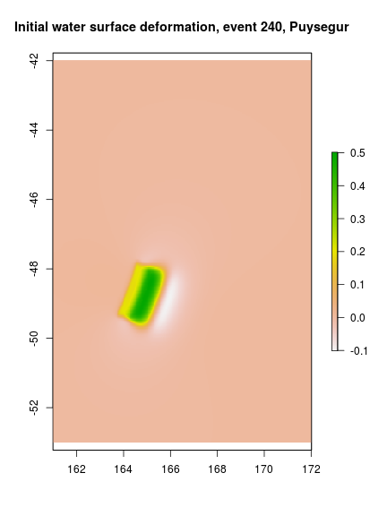

# **Codes to access the 2017 Australian PTHA results**

**Currently these tools are in development, and the study is not complete.** 
* **The data and models referred to below are placeholder examples for internal testing purposes only,
and are not to be used in any real application.**
* **The interfaces are expected to change.**
* **The code should be adjusted to download all data from the NCI [including source-zones + hazard points], to ensure consistency**
* **There is opportunity to extract contiguous hazard points more efficiently**

These codes can be used to access the 2017 Australian PTHA results, developed
by Geoscience Australia.

## **Installation**

You need the program R installed, as well as the packages `raster`, `rgdal`,
and `mapview`. If you have R installed, then the latter can be obtained by
typing the following in R:

```r
install.packages(c('raster', 'rgdal', 'mapview'))
```
You only need to do this once (usually just after installing R).

Then, copy the `ptha_access` folder to your computer. The location should not
matter. To run the code, simply open an R session in the `ptha_access`
directory, and type the required instructions as explained below.


### ***Extra dependencies to extract tsunami time-series***

If you wish to extract modelled tsunami time-series at gauges, then you also
need to have the `rptha` package installed. This must be built from source,
after obtaining the code from Geoscience Australia's the `PTHA` github
repository: https://github.com/GeoscienceAustralia/ptha

Before installing `rptha`, note that for the time-series extraction code to
work, R's `ncdf4` package must be built with OpenDAP support. OpenDAP is what
allows the code to access subsets of netcdf files on the NCI, without
downloading everythng (TB in total). ncdf4 seems to be built with OpenDAP by
default on Linux - but not on Windows - and I'm unsure about Mac. In the
latter cases, you will have to build netcdf yourself before installing `ncdf4` in R. 
*Also, beware there is a bug in netcdf 4.1.3 which can cause the code to hang
if one tries to access the first gauge in a file. This version is the default
netcdf on Ubuntu 14.04, so in that case, it may be necessary to install a newer
netcdf and link the ncdf4 package with this during installation.*


## **Usage**

### ***Viewing the locations of hazard points and source zones***

To view the source-zones and hazard points on an interactive map, start
R in the same directory that this file resides in, and do:

```r
source('hazard_points_plot.R')
```

This should open a map in your web browser, containing all unit sources and
hazard points. The latter include DART buoy locations, and a set of points on
the GA250 national bathymetry grid for Australia (because this is a grid, it
contains some points around neighbouring countries as well). 


Initially, most of the hazard points will be aggregated into coloured circles
containing clusters of hazard points. This is done because it is too slow to
render all hazard points at the same time on the one map. In the above figure,
we see green circles (containing less than 10 hazard points), yellow circles
(containing 10-100 hazard points), and red circles (containing more than 100
hazard points). A number on the circle shows how many hazard points they
contain. The blue dots are individual hazard points, and in the above figure
mostly correspond to the locations of DART buoys.


If you zoom in enough (e.g. below we look at Christmas Island), eventually the circles
containing many points should be replaced by individual hazard points (blue
circles). They can be queried with a mouse click.


The unit sources appear as a polygonal grid. Individual unit sources can also
be queried. 

The controls on the top left of the map can be expanded. These
should allow you to change the background layer, and to turn layers on and off.

### ***Getting metadata on the earthquake events on each source-zone***

To download metadata from the NCI describing the earthquake events on a
particular source-zone, start R in the current directory, and do:

```r
# Import the functions
source('get_PTHA_results.R')

# Example: get metadata for the puysegur source_zone
puysegur = get_source_zone_events_data('puysegur')
```

This variable `puysegur` is now an R `list`, which contains two `data.frame`'s: 
* `puysegur$unit_source_statistics` contains summary statistics about the unit-sources. 
For each unit source this gives the centroid `lon` and `lat` and `depth`; the unit source
dimensions `length` and `width`; the rupture source mechanism (`strike`, `dip`, `rake`);
and indices `downdip_number`, `alongstrike_number`, and `subfault_number` which give
information of the placement of the unit source on the grid of all unit sources. 

```r
# Get the names of all summary statistics
names(puysegur$unit_source_statistics)
```

```
##  [1] "lon_c"                  "lat_c"                 
##  [3] "depth"                  "strike"                
##  [5] "dip"                    "rake"                  
##  [7] "slip"                   "length"                
##  [9] "width"                  "downdip_number"        
## [11] "alongstrike_number"     "subfault_number"       
## [13] "max_depth"              "initial_condition_file"
```

```r
# Get the table dimensions
dim(puysegur$unit_source_statistics)
```

```
## [1] 34 14
```

```r
# Print rows 1 and 2
puysegur$unit_source_statistics[1:2,]
```

```
##      lon_c     lat_c     depth   strike      dip rake slip   length
## 1 163.7432 -49.97156  5.704857 22.37220 11.47151   90    1 41.32763
## 2 164.4056 -50.18472 25.704357 21.20403 29.84733   90    1 46.10036
##      width downdip_number alongstrike_number subfault_number max_depth
## 1 57.26111              1                  1               1  11.42703
## 2 57.15794              2                  1               2  40.00000
##                                                                                          initial_condition_file
## 1 /short/w85/tsunami/MODELS/AustPTHA/SOURCE_ZONES/puysegur/EQ_SOURCE/Unit_source_data/puysegur/puysegur_1_1.tif
## 2 /short/w85/tsunami/MODELS/AustPTHA/SOURCE_ZONES/puysegur/EQ_SOURCE/Unit_source_data/puysegur/puysegur_2_1.tif
```

```r
# File paths in the above table describe the location of key files *at the time
# the model was run*. 
# This may not be the same as the location of the files that the user downloads
# (because in general, we cannot provide download access to our computational
# drives). 
# However, the functions we provide to access the data will translate filenames
# to the web-accessible versions, as required. 
```

* `puysegur$events` contains summary statistics about the earthquake events.
The most important are the moment magnitude `Mw`, the earthquake slip `slip`,
and the `event_index_string`. The latter can be used to determine which
unit-sources are included in the earthquake (the integers in `event_index_string`
correspond to `subfault_number`'s in the `unit_source_statistics`, separated by
a `-` character).


```r
# Print the names of all event summary statistics
names(puysegur$events)
```

```
## [1] "area"               "mean_length"        "mean_width"        
## [4] "slip"               "Mw"                 "mean_depth"        
## [7] "max_depth"          "event_index_string" "sourcename"
```

```r
# Get the table dimensions
dim(puysegur$events)
```

```
## [1] 336   9
```

```r
# Print rows 200 and 201
puysegur$events[200:201, ]
```

```
##         area mean_length mean_width     slip  Mw mean_depth max_depth
## 200 7936.154    138.8982   57.13647 2.361939 7.8  25.680022  40.00000
## 201 7833.379    137.9075   56.80052 2.392928 7.8   5.667626  11.37381
##     event_index_string sourcename
## 200           8-10-12-   puysegur
## 201           9-11-13-   puysegur
```

### ***Getting initial conditions for a single earthquake-tsunami event***

Suppose we want to get the initial conditions for the earthquake event on row
240 of `puysegur$events`.  (By initial conditions, we mean the initial water
surface perturbation -- the velocity is treated as zero). The metadata for event 240 is:

```r
puysegur$events[240,]
```

```
##         area mean_length mean_width     slip Mw mean_depth max_depth
## 240 20867.57    183.2094   113.8963 1.792284  8   15.68675        40
##      event_index_string sourcename
## 240 5-6-7-8-9-10-11-12-   puysegur
```
To get its initial condition, do:

```r
# Get the initial condition as a geo-referenced raster
initial_condition_240 = get_initial_condition_for_event(puysegur, 240)

## The raster can be save as a geotif for use in other software, with:
# writeRaster(initial_conditions, 'my_output_filename.tif')

# Make a plot
plot(initial_condition_240, main='Initial water surface deformation, event 240, Puysegur')
```



The function `get_initial_condition_for_event` used above will download the
required data from the web and save it in the folder
`SOURCE_ZONES/puysegur/EQ_SOURCE/Unit_sources/puysegur`. Subsequently, the
function will check whether the required files exist in that folder, and only
download those that it needs. However, you can force the function to download
the files (and overwrite any existing ones) by adding the argument
`force_file_download=TRUE` (by default the latter is `FALSE`). This is useful
if the NCI analysis has been updated.

```r
# Get the initial condition as a geo-referenced raster, forcing download of
# all files from NCI irrespective of whether they exist on the current
# machine
initial_condition_240 = get_initial_condition_for_event(puysegur, 240, force_file_download=TRUE)
```


### ***Getting hazard curves at a particular hazard point***

FIXME: To do -- I still need to make the data on NCI to facilitate this


### ***Finding earthquake events within a particular wave-height range at a particular hazard point***

FIXME: To do -- I still need to make the data on NCI to facilitate this


### ***Extracting the tsunami time-series for a particular event at a particular hazard point***

Here we show how to read a flow time-series for a given earthquake event, at a
given hazard point. To do this, you have to know the hazard point ID, which can
be found by clicking on the hazard point in the interactive map above (see the
ID number). 

The data is downloaded from the NCI.

*Recall that this requires that ncdf4 and rptha are installed appropriately,
see the installation section above.*


```r
# Get stage, uh, vh time-series at DART gauges 55015 and 55042
# To find the ID's, look on the interactive hazard-point map.
model_240 = get_flow_time_series_at_hazard_point(puysegur, 240, c(55015.4, 55042.4))
```

```
## Warning: changing locked binding for 'antipodal' in 'geosphere' whilst
## loading 'rptha'
```

```r
# Should have a 'time' vector, and 'flow' list
names(model_240)
```

```
## [1] "time" "flow"
```

```r
# The 'flow' list should have one matrix for each gauge
names(model_240$flow)
```

```
## [1] "55015.4" "55042.4"
```

```r
# For each gauge, model_240$flow[["gauge_id"]] is a 3D array. Currently
# the first dimension is always length 1, the second dimension has length
# equal to the number of time-steps, and the third dimension is of length
# three -- with 1 = Stage, 2 = UH, 3 = VH
dim(model_240$flow[['55015.4']])
```

```
## [1]    1 4321    3
```

```r
# Example plot of stage
plot(model_240$time, model_240$flow[['55015.4']][1,,1], t='l', 
    xlim=c(0,10000), xlab='Seconds after earthquake', ylab='Stage (m)')
points(model_240$time, model_240$flow[['55042.4']][1,,1], t='l', 
    col='red')
legend('topright', c('55015.4', '55042.4'), col=c('black', 'red'), lty=c(1,1))

title('Some stage gauges for event 240')
```


