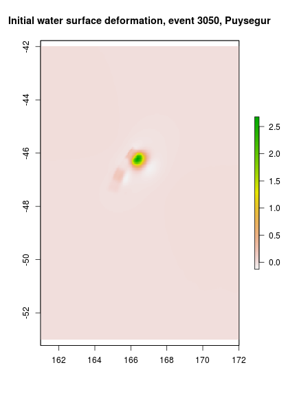

# **Guide to accessing the 2018 Australian Probabilistic Tsunami Hazard Assessment (PTHA) results**

# ***NOTE: Currently the study is incomplete, and results available here may change without warning***

We provide access to basic tsunami hazard information in easy-to-use csv and
shapefile formats. This information is useful to get a high-level overview of
the PTHA results.

We also provide access to details information for every event in our analysis:
earthquake discretization, tsunami initial condition, and wave time-series at
a large set of points in the ocean ('hazard points'). This information is
useful for site-specific tsunami hazard studies (which use it for model
'boundary conditions' and to estimate how often hazardous tsunamis might
occur). To access this information users will need to install a range of
software which allows working with the PTHA data on the NCI THREDDS server. 

# Obtaining basic tsunami hazard information.


## Obtaining tsunami peak-stage exceedance-rates at sites around Australia

The tsunami 'peak-stage' is the maximum water-level that a particular tsunami
attains at a particular location. In the current analysis we ignore tidal
variations and assume a constant mean-sea-level (MSL=0), so the 'peak-stage' is
equivalent to the maximum elevation of the tsunami wave above MSL. This gives an
idea of how 'big' the tsunami is.

In the 2018 PTHA, this information is stored at a set of points in the ocean.
These points are termed 'hazard points' because we provide the hazard
information at these sites. (The wave time-series for every event can also be
obtained at all hazard points using methods described later in this document).

The peak-stage exceedance-rates describe 'how often' tsunami events occur with
peak-stage above a particular threshold value. For example, you could ask how often
peak-stages above 0.5m (or 2.0m) occur, in terms of the average number of events each year
at a particular site. At most locations there would be less than one event each year, so
the exceedance rates are typically small numbers (e.g. an exceedance-rate of
0.002=1/500 would correspond to one event every 500 years on average).
Obviously this kind of information is important for understanding tsunami
hazards. The simplest way to examine the tsunami peak-stage exceedance-rates in
the 2018 PTHA is to [download this csv file](http://dapds00.nci.org.au/thredds/fileServer/fj6/PTHA/AustPTHA_1/EVENT_RATES/tsunami_stages_at_fixed_return_periods.csv).
This csv file contains the following columns:

* `lon`, `lat` give the hazard point location in longitude/latitude (degrees). 

* `elev` is the bathymetry at the hazard point (negative = below MSL)

* `gaugeID` is a real hazard point ID

* multiple columns with names like `STAGE_XXXX` where XXXX is a number, and 1/XXXX is the exceedance-rate. These values corresponds to the tsunami peak-stage which has mean exceedance-rate = 1/XXXX. For example, the column `STAGE_100` gives the tsunami peak-stage that is exceeded once every 100 years on average, according to the mean of all the rate models in our logic-tree.

* multiple columns with names like `STAGE_upper_ci_XXXX`. These values are similar to the above, but describe the upper limit of the 95% credible interval for the stage with the specified exceedance-rate. (i.e. 97.5% quantile)

* multiple columns with names like `STAGE_lower_ci_XXXX`. These are similar to the above, but describe the lower limit of the 95% credible interval for the stage with the specified exceedance-rate. (i.e. 2.5% quantile)

[Similar data is available in shapefile format here](http://dapds00.nci.org.au/thredds/fileServer/fj6/PTHA/AustPTHA_1/EVENT_RATES/tsunami_stages_at_fixed_return_periods.zip). You will need to unzip the file after download.
A shortcoming of the shapefile format is that there is a 10 character limit on
attribute names. Therefore the attributes are renamed in some instances, as
compared with the above csv:

* `lon`, `lat` give the location in longitude/latitude (degrees). 

* `elev` is the bathymetry at the hazard point (negative = below MSL)

* `gaugeID` is a real hazard point ID

* `STG_XXXX` is the same as `STAGE_XXXX` described above

* `STGu_XXXX` is the same as `STAGE_upper_ci_XXXX` described above

* `STGl_XXXX` is the same as `STAGE_lower_ci_XXXX` described above

At most hazard points you will find there is large uncertainty in the peak
tsunami size for a given exceedance-rates. This is mainly due to large
uncertainty in the frequencies of high-magnitude subduction zone earthquakes. A
more detailed discussion of these topics can be found in the 
[Australian Tsunami Hazard Modelling Guidelines](https://knowledge.aidr.org.au/media/5640/tsunami-planning-guidelines.pdf).

## Obtaining more detailed exceedance-rate information for specific sites

FIXME describe where to obtain the pdf files containing the summary information

## Interpreting exceedance-rate information

The stage exceedance-rates vary from site to site, depending on exposure to
earthquake-generated tsunamis. There is a tendency for the tsunami size to
increase in shallower water, which is a well known property of ocean waves
related to energy flux conservation. 

The model results are not expected to be accurate everywhere, but **in general
results far offshore and in deep water are expected to be higher quality than
nearshore results**. The reasons are:

* Our tsunami model has a spatial grid size of 1 arc minute (around 1.8 km), 
and is run on relatively coarse elevation data (a combination of the GA250
product, and GEBCO 2014). While appropriate for modelling oceanic-scale tsunami
propagation, it is not expected to accurately model tsunamis near the coast and
in shallow waters.

* At locations where wave heights become an appreciable fraction of the water depth, 
the modelled waves will violate the assumptions underlying our linear tsunami
model. This is most likely to be a problem in shallow waters where the tsunami
wave height becomes non-negligable compared with the water depth. 

Because of this, **for modelling purposes we strongly encourage the use of
points well offshore in deep water** (preferably with wave heights of interest
not exceeding a few percent of the water depth). Nearshore points should only
be used as a rough guide to possible tsunami wave heights, and should be
refined in future using higher resolution models and data. 

The above points might lead non-specialist to question the point of this PTHA,
given that for risk management purposes the tsunami inundation is of most
interest. The key reason for developing an 'offshore' PTHA is that it provides
essential input input data to support the high-resolution models required
for tsunami risk management. The tsunami scenarios and associated
exceedance-rates provided in this PTHA will be used as 'boundary conditions' to
drive the site-specific high resolution tsunami inundation models. 

# Obtaining detailed information on earthquake events, tsunami initial conditions, and wave time-series

For every event in our analysis we provide earthquake information, tsunami
initial conditions, and wave time-series at every hazard point. Combined
with the exceedance-rate modelling, such inputs can be used to drive local
scale tsunami hazard assessments (i.e. studies which model tsunami inundation).

To access these results the user needs to interact with our files via the NCI
THREDDS server. We provide R script to facilitate this, and the process is
described below.  Unfortunately the process may be challenging for users with
limited experience in scientific programming and linux. Users doing tsunami
hazard studies **in Australia** can alternatively contact Geoscience Australia
directly if they have difficulty with any of these steps (please email Gareth
Davies at gareth.davies@ga.gov.au). 

## **Installation**

You need the program R installed (see <https://www.r-project.org/>).


### **Getting a recent version of netcdf**

You also need to install the R package `ncdf4` with OPeNDAP support.  To my
knowledge this may be difficult unless you are running linux (although you can
do this using a virtual machine). I would suggest non-linux users install
an ubuntu virtual machine (e.g. using virtual box) and follow the steps below.

A further complication is that to work with the PTHA outputs on the NCI THREDDS
server you need to build the package with a reasonably recent version of
netcdf-c.  This is due to a bug in netcdf-c versions prior to 4.6.1 (released
in early 2018) that prevented the remote reading of long character strings
with OPeNDAP. We store some earthquake event data as (potentially) long
character strings, and it is essential to be able to read these remotely.

At the time of writing (mid 2018), most users will have to install netcdf-c
from source to access a suitable version.  Source-code for a recent release of
netcdf-c can be obtained from the netcdf github page:
<https://github.com/Unidata/netcdf-c/releases>. You need to follow their
instructions to get it installed. In the authors experience this is not always
easy, but note there is much online troubleshooting information available, and
you can ask for help on the netcdf mailing list.

Suppose you succeed in getting netcdf installed. Next you need to install R's
`ncdf4` package, and specifically tell it to use the newly installed netcdf.
This can be done by downloading the ncdf4 sources here
<https://cran.r-project.org/web/packages/ncdf4/index.html>, and then running a
command similar to the following, in the directory where you have downloaded
the `ncdf4` source package:

    R CMD INSTALL ncdf4_1.16.tar.gz --configure-args="--with-nc-config=/home/username/LocalInstalls/netcdf_for_ptha/install/bin/nc-config"
On ubuntu you might need to prepend `sudo` to the above command, depending on
where you do the installation.  Note you might need to adjust the numbers in
the `ncdf4_1.16.tar.gz` term above to match those of the package you download.
Furthermore, you will need to change the path to nc-config to match the path to
a version of nc-config > 4.6.1.

To confirm that your `ncdf4` installation is using a suitably recent netcdf-c
library, try running the following code:

```r
library(ncdf4)
# This is a file from the PTHA, describing earthquake events on the Kermadec-Tonga
# source-zone. Note I pre-pend [stringlength=4096], which prevents truncation of
# long character strings. This functionality was broken in older netcdf-c versions
test_file = paste0('[stringlength=4096]http://dapds00.nci.org.au/thredds/dodsC/fj6/',
    'PTHA/AustPTHA_1/SOURCE_ZONES/kermadectonga/TSUNAMI_EVENTS/',
    'all_stochastic_slip_earthquake_events_kermadectonga.nc')
# Open it (this will not read everything)
fid = nc_open(test_file, readunlim=FALSE)
# Try to read the event_index_string. This will be artificially truncated if 
# using an old version of netcdf-c
event_index_string = ncvar_get(fid, 'event_index_string')
if(max(nchar(event_index_string)) == 720){
    print('Success! Your ncdf4 install can read large character strings remotely')
}else{
    print('FAIL. Perhaps ncdf4 is linking to an older netcdf-c version?')
}
```
If the above code leads to the `Success! ...` message, then the install is
working, but otherwise you will have to troubleshoot your netcdf-c install (or
your internet connection, or check for a change to the NCI THREDDS server,
etc).

### **Installing rptha***

Finally, you need to install the `rptha` package. This must be built from
source, after obtaining the code from Geoscience Australia's the `PTHA` github
repository. See instructions at https://github.com/GeoscienceAustralia/ptha/R/README.md

### **Installing mapview***
Finally you should install the `mapview` package (to enable some interactive
plots shown below)

```r
install.packages('mapview')
```

## **Unit tests**
Assuming you have installed all the above dependencies, you can run the unit
tests with:

```r
source('test_all.R')
```
This should print a number of 'PASS' statements, and no 'FAIL' statements.
Some of the tests will fail if you haven't installed the dependencies to read
time-series.

## **Usage**

### ***Viewing the locations of hazard points and source zones***

It is possible to view the hazard points from an interactive map in R.

To view the source-zones and hazard points on an interactive map, start
R in the same directory that the [hazard_points_plot.R](hazard_points_plot.R)
file resides in, and do:

```r
source('hazard_points_plot.R')
```

The should open a map in your web browser, containing all unit sources and
hazard points. The latter include DART buoy locations, and a set of points on
the GA250 national bathymetry grid for Australia (because this is a grid, it
contains some points around neighbouring countries as well). 

The first time you run this code it will download a range of datasets to your
machine. This might take a minute or more, depending on your internet connection.
Future runs will read the data from your machine, so should be faster. 


Initially, most of the hazard points will be aggregated into coloured circles
containing clusters of hazard points. This is done because it is too slow to
render all hazard points at the same time on the one map. In the above figure,
we see green circles (containing less than 10 hazard points), yellow circles
(containing 10-100 hazard points), and red circles (containing more than 100
hazard points). A number on the circle shows how many hazard points they
contain. The blue dots are individual hazard points, and in the above figure
mostly correspond to the locations of DART buoys.


If you zoom in enough (e.g. below we look at Christmas Island), eventually the circles
containing many points should be replaced by individual hazard points (blue
circles). They can be queried with a mouse click. For each point, we store 
basic stage-vs-exceedance-rate information, as was discussed above.


The unit sources appear as a polygonal grid. Individual unit sources can also
be queried (e.g. to learn the name of the source-zone in our analysis) 

The controls on the top left of the map can be expanded as shown in the figure.
These should allow you to change the background layer, and to turn layers on
and off.

### ***Getting metadata on the earthquake events on each source-zone***

To download metadata from the NCI describing the earthquake events on a
particular source-zone, start R in the current directory, and do:

```r
# Import the functions
source('get_PTHA_results.R')

# Example: get metadata for the puysegur source_zone
puysegur = get_source_zone_events_data('puysegur')
```

This variable `puysegur` is now an R `list`, which contains two `data.frame`'s: 
* `puysegur$unit_source_statistics` contains summary statistics about the unit-sources. 
For each unit source this gives the centroid `lon` and `lat` and `depth`; the unit source
dimensions `length` and `width`; the rupture source mechanism (`strike`, `dip`, `rake`);
and indices `downdip_number`, `alongstrike_number`, and `subfault_number` which give
information of the placement of the unit source on the grid of all unit sources.

```r
# Get the names of all summary statistics
names(puysegur$unit_source_statistics)
```

```
##  [1] "lon_c"                  "lat_c"                 
##  [3] "depth"                  "strike"                
##  [5] "dip"                    "rake"                  
##  [7] "slip"                   "length"                
##  [9] "width"                  "downdip_number"        
## [11] "alongstrike_number"     "subfault_number"       
## [13] "max_depth"              "initial_condition_file"
## [15] "tide_gauge_file"
```

```r
# Get the table dimensions
dim(puysegur$unit_source_statistics)
```

```
## [1] 34 15
```

```r
# Print rows 1 and 2
puysegur$unit_source_statistics[1:2,]
```

```
##      lon_c     lat_c     depth   strike      dip rake slip   length
## 1 163.7154 -49.94804  6.591836 22.36646 14.61936   90    1 44.66806
## 2 164.3214 -50.12718 26.591336 21.76445 30.80589   90    1 48.54929
##      width downdip_number alongstrike_number subfault_number max_depth
## 1 52.13089              1                  1               1  13.24538
## 2 52.50416              2                  1               2  40.00000
##                                                                                     initial_condition_file
## 1 /g/data1a/fj6/PTHA/AustPTHA_1/SOURCE_ZONES/puysegur/EQ_SOURCE/Unit_source_data/puysegur/puysegur_1_1.tif
## 2 /g/data1a/fj6/PTHA/AustPTHA_1/SOURCE_ZONES/puysegur/EQ_SOURCE/Unit_source_data/puysegur/puysegur_2_1.tif
##                                                                                                                                                                       tide_gauge_file
## 1 /g/data/fj6/PTHA/AustPTHA_1/SOURCE_ZONES/puysegur/TSUNAMI_UNIT_SOURCES/unit_source_tsunami/RUN_20170904165726_puysegur_1_1/RUN_ID100001_20170904_191226.717/Gauges_data_ID100001.nc
## 2 /g/data/fj6/PTHA/AustPTHA_1/SOURCE_ZONES/puysegur/TSUNAMI_UNIT_SOURCES/unit_source_tsunami/RUN_20170904165729_puysegur_2_1/RUN_ID100001_20170904_191227.920/Gauges_data_ID100001.nc
```

```r
# File paths in the above table describe the location of key files *at the time
# the model was run*. 
# This is not always identical to the of the files that the user downloads
# (because in general, we cannot provide download access to our computational
# drives). However, it will be closely related.
# The functions we provide to access the data automatically translate filenames
# to the web-accessible versions. 
```

* `puysegur$events` contains summary statistics about the earthquake events.
The most important are the moment magnitude `Mw`, the "variable shear modulus"
moment magnitude `variable_mu_Mw`, the `event_slip_string` (a character with
slip values for each unit source separated by an underscore), and the
`event_index_string`. The latter can be used to determine which unit-sources
are included in the earthquake (the integers in `event_index_string` correspond
to `subfault_number`'s in the `unit_source_statistics`, separated by a `-`
character).


```r
# Print the names of all event summary statistics
names(puysegur$events)
```

```
##  [1] "event_index_string"               "event_slip_string"               
##  [3] "Mw"                               "target_lon"                      
##  [5] "target_lat"                       "peak_slip_downdip_ind"           
##  [7] "peak_slip_alongstrike_ind"        "physical_corner_wavenumber_x"    
##  [9] "physical_corner_wavenumber_y"     "sourcename"                      
## [11] "uniform_event_row"                "rate_annual"                     
## [13] "rate_annual_lower_ci"             "rate_annual_upper_ci"            
## [15] "variable_mu_Mw"                   "variable_mu_rate_annual"         
## [17] "variable_mu_rate_annual_lower_ci" "variable_mu_rate_annual_upper_ci"
## [19] "weight_with_nonzero_rate"
```

```r
# Get the table dimensions
dim(puysegur$events)
```

```
## [1] 6978   19
```

```r
# Print some rows (we choose 3050, 3051, 3052)
puysegur$events[3050:3052, ]
```

```
##      event_index_string                       event_slip_string  Mw
## 3050 15-16-17-19-21-22- 0.4106_0.1527_1.235_0.2784_1.775_8.616_ 7.9
## 3051    15-17-18-19-20-          2.316_2.438_1.567_3.424_1.612_ 7.9
## 3052       19-21-23-29-             0.2683_2.484_9.784_0.02503_ 7.9
##      target_lon target_lat peak_slip_downdip_ind peak_slip_alongstrike_ind
## 3050   166.2998  -46.18891                     2                        11
## 3051   166.2998  -46.18891                     1                        10
## 3052   166.2998  -46.18891                     1                        12
##      physical_corner_wavenumber_x physical_corner_wavenumber_y sourcename
## 3050                  0.011009622                  0.016393626   puysegur
## 3051                  0.003014966                  0.007441733   puysegur
## 3052                  0.013070033                  0.013860630   puysegur
##      uniform_event_row  rate_annual rate_annual_lower_ci
## 3050               204 9.758208e-06         6.282499e-07
## 3051               204 1.841717e-05         1.185729e-06
## 3052               204 8.398967e-06         5.407397e-07
##      rate_annual_upper_ci variable_mu_Mw variable_mu_rate_annual
## 3050         1.709385e-05       7.949118            1.501529e-05
## 3051         3.226212e-05       7.777764            1.287362e-05
## 3052         1.471282e-05       7.581915            1.325640e-05
##      variable_mu_rate_annual_lower_ci variable_mu_rate_annual_upper_ci
## 3050                     2.970690e-06                     2.633619e-05
## 3051                     2.546973e-06                     2.257980e-05
## 3052                     2.622704e-06                     2.325118e-05
##      weight_with_nonzero_rate
## 3050                0.9770982
## 3051                0.9770982
## 3052                0.9770982
```


### ***Getting initial conditions for a single earthquake-tsunami event***

Suppose we want to get the initial conditions for the earthquake event on row
3050 of `puysegur$events`.  (By initial conditions, we mean the initial water
surface perturbation -- the velocity is treated as zero). The metadata for event 3050 is:

```r
puysegur$events[3050,]
```

```
##      event_index_string                       event_slip_string  Mw
## 3050 15-16-17-19-21-22- 0.4106_0.1527_1.235_0.2784_1.775_8.616_ 7.9
##      target_lon target_lat peak_slip_downdip_ind peak_slip_alongstrike_ind
## 3050   166.2998  -46.18891                     2                        11
##      physical_corner_wavenumber_x physical_corner_wavenumber_y sourcename
## 3050                   0.01100962                   0.01639363   puysegur
##      uniform_event_row  rate_annual rate_annual_lower_ci
## 3050               204 9.758208e-06         6.282499e-07
##      rate_annual_upper_ci variable_mu_Mw variable_mu_rate_annual
## 3050         1.709385e-05       7.949118            1.501529e-05
##      variable_mu_rate_annual_lower_ci variable_mu_rate_annual_upper_ci
## 3050                      2.97069e-06                     2.633619e-05
##      weight_with_nonzero_rate
## 3050                0.9770982
```
To get its initial condition, do:

```r
# Get the initial condition as a geo-referenced raster
initial_condition_3050 = get_initial_condition_for_event(puysegur, 3050)

## The raster can be save as a geotif for use in other software, with:
# writeRaster(initial_conditions, 'my_output_filename.tif')

# Make a plot
plot(initial_condition_3050, main='Initial water surface deformation, event 3050, Puysegur')
```



The function `get_initial_condition_for_event` used above will download the
required data from the web and save it in the folder
`SOURCE_ZONES/puysegur/EQ_SOURCE/Unit_source_data/puysegur`. Subsequently, the
function will check whether the required files exist in that folder, and only
download those that it needs. However, you can force the function to download
the files (and overwrite any existing ones) by adding the argument
`force_file_download=TRUE` (by default the latter is `FALSE`). This is useful
if the NCI analysis has been updated.

```r
# Get the initial condition as a geo-referenced raster, forcing download of
# all files from NCI irrespective of whether they exist on the current
# machine
initial_condition_3050 = get_initial_condition_for_event(puysegur, 3050, force_file_download=TRUE)
```


### ***Getting hazard curves at a particular hazard point***

FIXME: Integrate with above discussion. Consider showing how to download numeric
curve values for a particular point.


### ***Finding earthquake events within a particular wave-height range at a particular hazard point***

FIXME: 

### ***Extracting the tsunami time-series for a particular event at a particular hazard point***

Here we show how to read a flow time-series for a given earthquake event, at a
given hazard point. To do this, you have to know the hazard point `gaugeID`, which can
be found by clicking on the hazard point in the interactive map above (please do not
confuse this with the Feature ID that is shown by default in the interactive map - I 
would like to remove this field, but do not yet know how/if it can be done!). 

The data is downloaded from the NCI.

*Recall that this requires that ncdf4 and rptha are installed appropriately,
see the installation section above.*


```r
# Get stage, uh, vh time-series at DART gauges 55015 and 55042
# To find the ID's, look on the interactive hazard-point map.
model_3050 = get_flow_time_series_at_hazard_point(puysegur, 
    event_ID=3050, 
    hazard_point_ID=c(55015.4, 55042.4))
# Should have a 'time' vector, and 'flow' list, and a 'locations' data.frame, as
# well as the 'events' data for 3050
names(model_3050)
```

```
## [1] "time"      "flow"      "locations" "events"
```

```r
# The 'flow' list should have one matrix for each gauge. 
names(model_3050$flow)
```

```
## [1] "55015.4" "55042.4"
```

```r
# Alternatively the user can keep 'flow' as an array with the first dimension
# size equal to the number of gauges, by passing the argument 'unpack_to_list=FALSE'
# The latter option may be more efficient for some computations.

# By default for each gauge, model_3050$flow[["gauge_id"]] is a 3D array. 
# The first dimension is always length 1, the second dimension has length
# equal to the number of time-steps, and the third dimension is of length
# three -- with 1 = Stage, 2 = UH, 3 = VH
dim(model_3050$flow[['55015.4']])
```

```
## [1]    1 4321    3
```

```r
# Example plot of stage
plot(model_3050$time, model_3050$flow[['55015.4']][1,,1], t='l', 
    xlim=c(0,10000), xlab='Seconds after earthquake', ylab='Stage (m)',
    ylim=c(-0.1, 0.1))
points(model_3050$time, model_3050$flow[['55042.4']][1,,1], t='l', 
    col='red')
legend('topright', c('55015.4', '55042.4'), col=c('black', 'red'), lty=c(1,1))

title('Stage time-series for event 3050 at 2 gauges')
```


