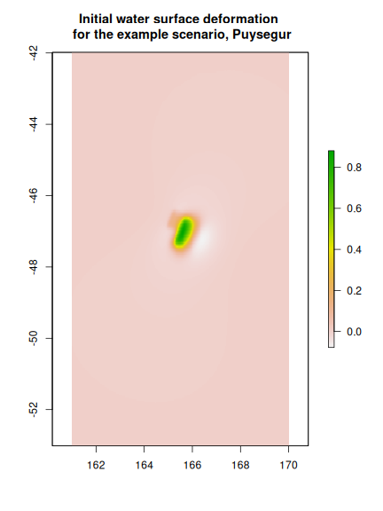

# **Guide to accessing the 2018 Australian Probabilistic Tsunami Hazard Assessment (PTHA) results**

# ***NOTE: Currently the study is incomplete, and results available here may change without warning***

We provide access to basic tsunami hazard information in easy-to-use csv and
shapefile formats. This information is useful to get a high-level overview of
the PTHA results.

We also provide access to detailed information for every tsunami event in our
analysis, including: the earthquake discretization, the tsunami initial
condition, and the resulting wave time-series at a large set of points in the
ocean ('hazard points'). This information is useful for site-specific tsunami
hazard studies (which use it for model 'boundary conditions' and to estimate
how often hazardous tsunamis might occur). To access this information users
will need to install a range of software which allows working with the PTHA
data on the NCI THREDDS server. 

# Obtaining basic tsunami hazard information.


## Obtaining tsunami peak-stage exceedance-rates at sites around Australia

The tsunami 'peak-stage' is the maximum water-level that a particular tsunami
attains at a particular location. This gives an idea of how 'big' the tsunami
is. In the current analysis we ignore tidal variations and assume a constant
mean-sea-level (MSL=0), so the 'peak-stage' is equivalent to the maximum
elevation of the tsunami wave above MSL. 

The peak-stage exceedance-rates describe 'how often' tsunami events occur with
peak-stage above a particular threshold value. For example, you could ask how
often peak-stages above 0.5m (or 2.0m) occur, in terms of the average number of
events each year at a particular site. At most locations there would be less
than one event each year, so the exceedance-rates are typically small numbers
(e.g. an exceedance-rate of 0.002=1/500 would correspond to one event every 500
years on average).

In the 2018 PTHA, this information is stored at a set of points in the ocean.
These points are termed 'hazard points' because we provide the hazard
information at these sites. (The wave time-series for every event can also be
obtained at all hazard points using methods described later in this document).

Most of the hazard points are concentrated around Australia and its
territories. We also store points at the locations of DART buoys (deep-ocean
gauges which measure tsunami wave heights), as these are very useful for
testing the model. In addition we store a 'thin' layer of hazard points
globally at the 100m contour, which is useful for testing our model and
comparing with previous studies. **If using points far from Austraila, consider
that we ignore tsunamigenic source zones that are not considered relevant for
Australia (e.g.  in the Carribbean, the Mediterrean, the Manila trench,
Kaikoura in New Zealand, western Japan). Therefore, outside of Australia, you
should very carefully consider whether the results can be used, noting they may
ignore the most relevant source-zones.**

The simplest way to examine the tsunami peak-stage exceedance-rates in
the 2018 PTHA is to [download this csv file](http://dapds00.nci.org.au/thredds/fileServer/fj6/PTHA/AustPTHA_1/EVENT_RATES/tsunami_stages_at_fixed_return_periods.csv).
This csv file contains the following columns:

* `lon`, `lat` give the hazard point location in longitude/latitude (degrees). 

* `elev` is the bathymetry at the hazard point (negative = below MSL)

* `gaugeID` is a real hazard point ID

* multiple columns with names like `STAGE_XXXX` where XXXX is a number, and 1/XXXX is the exceedance-rate. These values corresponds to the tsunami peak-stage which has mean exceedance-rate = 1/XXXX. For example, the column `STAGE_100` gives the tsunami peak-stage that is exceeded once every 100 years on average, according to the mean of all the rate models in our logic-tree.

* multiple columns with names like `STAGE_upper_ci_XXXX`. These values are similar to the above, but describe the upper limit of the 95% credible interval for the stage with the specified exceedance-rate. (i.e. 97.5% quantile)

* multiple columns with names like `STAGE_lower_ci_XXXX`. These are similar to the above, but describe the lower limit of the 95% credible interval for the stage with the specified exceedance-rate. (i.e. 2.5% quantile)

Note that 'peak stage' values below 2cm (or above 20m) are treated as missing
data in this file. While such values are unlikely to be of interest, if
necessary they can be reconstructed from the detailed information we provide
(later in this document).

[Similar data is available in shapefile format here](http://dapds00.nci.org.au/thredds/fileServer/fj6/PTHA/AustPTHA_1/EVENT_RATES/tsunami_stages_at_fixed_return_periods.zip). You will need to unzip the file after download.
A shortcoming of the shapefile format is that there is a 10 character limit on
attribute names. Therefore the attributes are renamed in some instances, as
compared with the above csv:

* `lon`, `lat` give the location in longitude/latitude (degrees). 

* `elev` is the bathymetry at the hazard point (negative = below MSL)

* `gaugeID` is a real hazard point ID

* `STG_XXXX` is the same as `STAGE_XXXX` described above

* `STGu_XXXX` is the same as `STAGE_upper_ci_XXXX` described above

* `STGl_XXXX` is the same as `STAGE_lower_ci_XXXX` described above

At most hazard points you will find there is large uncertainty in the
peak-stage for a given exceedance-rate. This is mainly due to large uncertainty
in the frequencies of high-magnitude subduction zone earthquakes. A more
detailed discussion of these topics can be found in the 
[Australian Tsunami Hazard Modelling Guidelines](https://knowledge.aidr.org.au/media/5640/tsunami-planning-guidelines.pdf).

## Obtaining more detailed exceedance-rate information for specific sites

FIXME describe where to obtain the pdf files containing the summary information

## Interpreting exceedance-rate information

The peak-stage exceedance-rates vary from site to site, depending on exposure
to earthquake-generated tsunamis. For a given exceedance-rate, there is also a
general tendency for the tsunami size to increase in shallower water. Such
'shoaling' is a well known property of ocean waves. 

The model results are not expected to be accurate everywhere, but **in general
results far offshore and in deep water are expected to be higher quality than
nearshore results**. The reasons are:

* Our tsunami model has a spatial grid size of 1 arc minute (around 1.8 km), 
and is run on relatively coarse elevation data (a combination of the 
[Australian Bathymetry and Topography Grid 2009](http://www.ga.gov.au/metadata-gateway/metadata/record/gcat_67703)
product, and the global [GEBCO
2014](https://www.gebco.net/data_and_products/gridded_bathymetry_data/) bathymetry grid).
While appropriate for modelling oceanic-scale tsunami propagation, it is not
expected to accurately model tsunamis near the coast and in shallow waters.

* At locations where wave heights become an appreciable fraction of the water depth, 
the modelled waves will violate the assumptions underlying our linear tsunami
model. This is most likely to be a problem in shallow waters.

Because of this, **for modelling purposes we strongly encourage the use of
points well offshore in deep water** (preferably with wave heights of interest
not exceeding a few percent of the water depth). Nearshore points should only
be used as a rough guide to possible tsunami wave heights, and should be
refined in future using higher resolution models and data. 

The above statements might lead non-specialist to question the purpose of this
PTHA, given that for risk management purposes the tsunami inundation is of most
interest. The key reason for developing an 'offshore' PTHA is that it provides
essential input data to support the high-resolution inundation models required
for tsunami risk management. The tsunami scenarios and associated
exceedance-rates provided in this PTHA will be used as 'boundary conditions' to
drive the site-specific tsunami inundation models. This helps facilitate
national consistency in tsunami inundation modelling, while reducing the need
for nearshore tsunami modellers to develop expertise in subjects such as
earthquake kinematics and tsunami geneartion, earthquake magnitude-frequency
relations, and quantification of the associated uncertainties. 

# Obtaining detailed information on earthquake events, tsunami initial conditions, and wave time-series

For every event in our analysis we provide earthquake information, tsunami
initial conditions, and wave time-series at every hazard point. Combined with
the exceedance-rate modelling, such inputs can be used to drive local scale
tsunami inundation models for hazard and risk assessments.

To access the detailed information, the user needs to interact with our files
via the NCI THREDDS server. We provide R scripts to facilitate this, and the
process is described below. A range of software must be installed to run these
codes, [as described here](INSTALL.md)

Unfortunately the installation and data extraction process may be challenging
for users with limited experience in scientific programming and Linux. Users
doing tsunami hazard studies **in Australia** can alternatively contact
Geoscience Australia directly if they have difficulty with any of these steps
(please email Gareth Davies at gareth.davies@ga.gov.au). 

## **Usage**

Make sure you have successfully installed the software [as described here](INSTALL.md), 
and that the unit-tests pass.

### ***Viewing the locations of hazard points and source zones***

It is possible to view the hazard points from an interactive map in R. Note however
that similar information is provided in the csv and shapefiles above, and for
many users it will be easier to view those files using GIS and/or a spreadsheet
application.

To view the source-zones and hazard points on an interactive map in R, start
R in the same directory that the [hazard_points_plot.R](hazard_points_plot.R)
file resides in, and do:

```r
source('hazard_points_plot.R')
```
The should open a map in your web browser, containing all unit sources and
hazard points. 

The first time you run this code it will download several datasets to your
machine for use in the map. These will be placed in the DATA and SOURCE_ZONES
folders. The download might take a minute or more, depending on your internet
connection.  Future runs will read the data from your machine, so should be
faster. 


Initially, most of the hazard points will be aggregated into coloured circles
containing clusters of hazard points. This is done because it is too slow to
render all hazard points at the same time on the one map. In the above figure,
we see green circles (containing less than 10 hazard points), yellow circles
(containing 10-100 hazard points), and red circles (containing more than 100
hazard points). A number on the circle shows how many hazard points they
contain. There are also a few individual hazard points (which are far from
others), and in the above figure they mostly correspond to the locations of DART
buoys.

If you zoom in enough (e.g. below we look at Christmas Island), eventually the circles
containing many points should be replaced by individual hazard points
(circles). They can be queried with a mouse click. For each point, we store
basic stage-vs-exceedance-rate information, as was discussed above.


The unit sources appear as a polygonal grid. Individual unit sources can also
be queried (e.g. to learn the name of the source-zone in our analysis) 

The controls on the top left of the map can be expanded as shown in the figure.
These should allow you to change the background layer, and to turn layers on
and off.

### ***Obtaining metadata on the earthquake events on each source-zone***

Earthquake event metadata is accessed on a per-source-zone basis. In a typical
application you would use the detailed exceedance-rate plots discussed above
to identify the main source-zones of interest for a particular site. Below
we show an example using the `puysegur` source-zone, which is located just south
of New Zealand, to the north of Macquarie Island.

To download metadata from the NCI describing the earthquake events on a
particular source-zone, start R in the current directory, and do:

```r
# Import the functions
source('get_PTHA_results.R')

# Example: get metadata for the puysegur source_zone
puysegur = get_source_zone_events_data('puysegur')
```

This variable `puysegur` is now an R `list`, which contains two `data.frame`'s
summarising the source-zone geometry and the earthquake events, and a character
vector giving the associated tide-gauge files (where tsunami time-series are
stored)

```r
names(puysegur)
```

```
## [1] "events"                 "unit_source_statistics"
## [3] "gauge_netcdf_files"
```

```r
lapply(puysegur, class) # Get class of each entry in the list 'puysegur'
```

```
## $events
## [1] "data.frame"
## 
## $unit_source_statistics
## [1] "data.frame"
## 
## $gauge_netcdf_files
## [1] "character"
```

We now describe the unit-source-statistics table.
`puysegur$unit_source_statistics` contains summary statistics about the
unit-sources. For each unit source this gives the centroid `lon` and `lat` and
`depth`; the unit source dimensions `length` and `width`; the rupture source
mechanism (`strike`, `dip`, `rake`); and indices `downdip_number`,
`alongstrike_number`, and `subfault_number` which give information of the
placement of the unit source on the grid of all unit sources.

```r
# Get the names of all summary statistics
names(puysegur$unit_source_statistics)
```

```
##  [1] "lon_c"                  "lat_c"                 
##  [3] "depth"                  "strike"                
##  [5] "dip"                    "rake"                  
##  [7] "slip"                   "length"                
##  [9] "width"                  "downdip_number"        
## [11] "alongstrike_number"     "subfault_number"       
## [13] "max_depth"              "initial_condition_file"
## [15] "tide_gauge_file"
```

```r
# Get the table dimensions
dim(puysegur$unit_source_statistics)
```

```
## [1] 34 15
```

```r
# Print rows 1 and 2
puysegur$unit_source_statistics[1:2,]
```

```
##      lon_c     lat_c     depth   strike      dip rake slip   length
## 1 163.7154 -49.94804  6.591836 22.36646 14.61936   90    1 44.66806
## 2 164.3214 -50.12718 26.591336 21.76445 30.80589   90    1 48.54929
##      width downdip_number alongstrike_number subfault_number max_depth
## 1 52.13089              1                  1               1  13.24538
## 2 52.50416              2                  1               2  40.00000
##                                                                                     initial_condition_file
## 1 /g/data1a/fj6/PTHA/AustPTHA_1/SOURCE_ZONES/puysegur/EQ_SOURCE/Unit_source_data/puysegur/puysegur_1_1.tif
## 2 /g/data1a/fj6/PTHA/AustPTHA_1/SOURCE_ZONES/puysegur/EQ_SOURCE/Unit_source_data/puysegur/puysegur_2_1.tif
##                                                                                                                                                                       tide_gauge_file
## 1 /g/data/fj6/PTHA/AustPTHA_1/SOURCE_ZONES/puysegur/TSUNAMI_UNIT_SOURCES/unit_source_tsunami/RUN_20170904165726_puysegur_1_1/RUN_ID100001_20170904_191226.717/Gauges_data_ID100001.nc
## 2 /g/data/fj6/PTHA/AustPTHA_1/SOURCE_ZONES/puysegur/TSUNAMI_UNIT_SOURCES/unit_source_tsunami/RUN_20170904165729_puysegur_2_1/RUN_ID100001_20170904_191227.920/Gauges_data_ID100001.nc
```

```r
# File paths in the above table describe the location of key files *at the time
# the model was run*. 
# This is not always identical to the of the files that the user downloads
# (because in general, we cannot provide download access to our computational
# drives). However, it will be closely related.
# The functions we provide to access the data automatically translate filenames
# to the web-accessible versions. 
```
In addition, the `initial_condition_file` and `tide_gauge_file` variables
provide a link to the vertical deformation and tsunami model run respectively,
for each unit source. Note that the file path names sometimes differ slightly
from the location on the NCI Thredds server (although in a fairly obvious way,
e.g. sometimes we see /g/data replaced with /g/data1a). The scripts provided
here will translate the file paths as required for remote access.

Next we consider the event metadata table. `puysegur$events` contains summary
statistics about the earthquake events. 

```r
# Print the names of all event summary statistics
names(puysegur$events)
```

```
##  [1] "event_index_string"               "event_slip_string"               
##  [3] "Mw"                               "target_lon"                      
##  [5] "target_lat"                       "peak_slip_downdip_ind"           
##  [7] "peak_slip_alongstrike_ind"        "physical_corner_wavenumber_x"    
##  [9] "physical_corner_wavenumber_y"     "sourcename"                      
## [11] "uniform_event_row"                "rate_annual"                     
## [13] "rate_annual_lower_ci"             "rate_annual_upper_ci"            
## [15] "variable_mu_Mw"                   "variable_mu_rate_annual"         
## [17] "variable_mu_rate_annual_lower_ci" "variable_mu_rate_annual_upper_ci"
## [19] "weight_with_nonzero_rate"
```

```r
# Get the table dimensions
dim(puysegur$events)
```

```
## [1] 6978   19
```
While there are many ways to investigate the event table, a simple approach is
to just print some rows. In general low row-indices will correspond to low
magnitudes, and high indices to high magnitudes.


```r
# Print some rows (we choose 3050, 3051, 3052)
puysegur$events[3050:3052, ]
```

```
##      event_index_string                       event_slip_string  Mw
## 3050 15-16-17-19-21-22- 0.4106_0.1527_1.235_0.2784_1.775_8.616_ 7.9
## 3051    15-17-18-19-20-          2.316_2.438_1.567_3.424_1.612_ 7.9
## 3052       19-21-23-29-             0.2683_2.484_9.784_0.02503_ 7.9
##      target_lon target_lat peak_slip_downdip_ind peak_slip_alongstrike_ind
## 3050   166.2998  -46.18891                     2                        11
## 3051   166.2998  -46.18891                     1                        10
## 3052   166.2998  -46.18891                     1                        12
##      physical_corner_wavenumber_x physical_corner_wavenumber_y sourcename
## 3050                  0.011009622                  0.016393626   puysegur
## 3051                  0.003014966                  0.007441733   puysegur
## 3052                  0.013070033                  0.013860630   puysegur
##      uniform_event_row  rate_annual rate_annual_lower_ci
## 3050               204 9.758208e-06         6.282499e-07
## 3051               204 1.841717e-05         1.185729e-06
## 3052               204 8.398967e-06         5.407397e-07
##      rate_annual_upper_ci variable_mu_Mw variable_mu_rate_annual
## 3050         1.709385e-05       7.949118            1.501529e-05
## 3051         3.226212e-05       7.777764            1.287362e-05
## 3052         1.471282e-05       7.581915            1.325640e-05
##      variable_mu_rate_annual_lower_ci variable_mu_rate_annual_upper_ci
## 3050                     2.970690e-06                     2.633619e-05
## 3051                     2.546973e-06                     2.257980e-05
## 3052                     2.622704e-06                     2.325118e-05
##      weight_with_nonzero_rate
## 3050                0.9770982
## 3051                0.9770982
## 3052                0.9770982
```

The most important variables from a users perspective are the moment magnitude
`Mw`, and the "variable shear modulus" moment magnitude `variable_mu_Mw`.
You may be surprised to see we store two different earthquake magnitudes for
each event. The `Mw` column holds the earthquake moment magnitude, derived
under the assumption that the shear modulus (or rigidity) on the source-zone is
constant, with a value of 30 GPa on thrust sources and 60 GPa on normal
sources. These values are quite typical and compare well in our comparisons
with DART buoys.  However, on subduction zones there is some evidence that the
shear modulus increases with depth, with particularly low values possible at
shallow depths (which may partially account for so-called 'tsunami
earthquakes', which generate large tsunamis compared to their earthquake
magnitude). To account for this we use a depth varying shear modulus model, and
re-compute the magnitude for each event. Our events also compare well with the
DART buoy dataset using this redefined magnitude. However, the literature suggests
that in order to simulate some historical tsunami-earthquakes, it is necessary
to account for shear modulus variations, which is enabled in the current study
using the `variable_mu_Mw`.

Some othe important variables are the `event_slip_string` and the
`event_index_string`. These variables can be used to determine which
unit-sources are included in the earthquake, and how much slip they have (note
they are stored as strings with a separator, to permit efficient storage of
earthquakes with a range of sizes). 

Another useful event-table variable is the `weight_with_nonzero_rate`. This
gives the fraction of the exceedance-rate models in the logic tree that suggest
the event could possibly occur, according to the event magnitude. Values close
to 1.0 indicate "a high fraction of our rate models suggest the event could
occur, given a long enough time-frame". On the other hand, values close to 0.0
indicate that "a high fraction of our rate models suggest the event would never
occur", with zero corresponding to an impossible event (i.e. according to the
model).


All of our source-zone event tables contain events with magnitudes ranging from
7.2 to 9.8. This is done for computational convenience, irrespective of whether
we consider the high magnitude events are possible on the source-zone. You will
notice that events at very large magnitudes always have a
`weight_with_nonzero_rate` equal to zero.

### ***Obtaining initial conditions for a single earthquake-tsunami event***

Suppose we want to get the initial conditions for the earthquake event on row
3051 of `puysegur$events`.  (By initial conditions, we mean the initial water
surface perturbation -- the velocity is treated as zero). The metadata for event 3051 is:

```r
row_index = 3051 # Use this variable to refer to event 3051
puysegur$events[row_index,]
```

```
##      event_index_string              event_slip_string  Mw target_lon
## 3051    15-17-18-19-20- 2.316_2.438_1.567_3.424_1.612_ 7.9   166.2998
##      target_lat peak_slip_downdip_ind peak_slip_alongstrike_ind
## 3051  -46.18891                     1                        10
##      physical_corner_wavenumber_x physical_corner_wavenumber_y sourcename
## 3051                  0.003014966                  0.007441733   puysegur
##      uniform_event_row  rate_annual rate_annual_lower_ci
## 3051               204 1.841717e-05         1.185729e-06
##      rate_annual_upper_ci variable_mu_Mw variable_mu_rate_annual
## 3051         3.226212e-05       7.777764            1.287362e-05
##      variable_mu_rate_annual_lower_ci variable_mu_rate_annual_upper_ci
## 3051                     2.546973e-06                      2.25798e-05
##      weight_with_nonzero_rate
## 3051                0.9770982
```
To get its initial condition, do:

```r
# Get the initial condition as a geo-referenced raster
initial_condition = get_initial_condition_for_event(puysegur, row_index)

## The raster can be save as a geotif for use in other software, with:
# writeRaster(initial_conditions, 'my_output_filename.tif')

# Make a plot
plot(initial_condition, main='Initial water surface deformation \n for the example event, Puysegur')
```



The function `get_initial_condition_for_event` used above will download the
required data from the web and save it in the folder
`SOURCE_ZONES/puysegur/EQ_SOURCE/Unit_source_data/puysegur`. Subsequently, the
function will check whether the required files exist in that folder, and only
download those that it needs. However, you can force the function to download
the files (and overwrite any existing ones) by adding the argument
`force_file_download=TRUE` (by default the latter is `FALSE`). This is useful
if the NCI analysis has been updated.

```r
# Get the initial condition as a geo-referenced raster, forcing download of
# all files from NCI irrespective of whether they exist on the current
# machine
initial_condition = get_initial_condition_for_event(puysegur, row_index, force_file_download=TRUE)
```


### ***Obtaining hazard curves at a particular hazard point***

FIXME: Integrate with above discussion. Consider showing how to download numeric
curve values for a particular point.


### ***Finding earthquake events within a particular wave-height range at a particular hazard point***

FIXME: 

### ***Extracting the tsunami time-series for a particular event at a particular hazard point***

Here we show how to read a flow time-series for a given earthquake event, at a
given hazard point. To do this, you have to know the hazard point `gaugeID`,
which can be found by examining the peak-stage vs exceedance-rate datasets (csv
and shapefile), or by using the interactive hazard point viewer above. (***In the
latter case, please do not confuse this with the Feature ID that is shown by
default in the interactive map - I would like to remove this field, but do not
yet know how/if it can be done!***). 


```r
# Get stage, uh, vh time-series at DART gauges 55015 and 55042
# To find the ID's, look on the interactive hazard-point map.
model_ts = get_flow_time_series_at_hazard_point(puysegur, 
    event_ID=row_index, 
    hazard_point_ID=c(55015.4, 55042.4))
# Should have a 'time' vector, and 'flow' list, and a 'locations' data.frame, as
# well as the 'events' data
names(model_ts)
```

```
## [1] "time"      "flow"      "locations" "events"
```

```r
# The 'flow' list should have one matrix for each gauge. 
names(model_ts$flow)
```

```
## [1] "55015.4" "55042.4"
```

```r
# Alternatively the user can keep 'flow' as an array with the first dimension
# size equal to the number of gauges, by passing the argument 'unpack_to_list=FALSE'
# The latter option may be more efficient for some computations.

# By default for each gauge, model_ts$flow[["gauge_id"]] is a 3D array. 
# The first dimension is always length 1, the second dimension has length
# equal to the number of time-steps, and the third dimension is of length
# three -- with 1 = Stage, 2 = UH, 3 = VH
dim(model_ts$flow[['55015.4']])
```

```
## [1]    1 4321    3
```

```r
# Example plot of stage
plot(model_ts$time, model_ts$flow[['55015.4']][1,,1], t='l', 
    xlim=c(0,10000), xlab='Seconds after earthquake', ylab='Stage (m)',
    ylim=c(-0.1, 0.15))
points(model_ts$time, model_ts$flow[['55042.4']][1,,1], t='l', 
    col='red')
legend('topright', c('55015.4', '55042.4'), col=c('black', 'red'), lty=c(1,1))

title('Stage time-series for the event at 2 gauges')
```


To export the flow time-series to a csv, you can do something like this for
the station of interest:

```r
# Name the site
sitename = '55015.4'
# Note you can get a vector with all names using the comment:
#    names(model_ts$flow)
# and this will allow programatically working with the names

# Make a data.frame with the required data
site_flow = data.frame(
    time=model_ts$time, 
    stage = model_ts$flow[[sitename]][1,,1],
    uh = model_ts$flow[[sitename]][1,,2],
    vh = model_ts$flow[[sitename]][1,,3])

# Save it to a csv
output_file = paste0('output_gauge_data_puysegur_event_', row_index, '_station_', 
    sitename, '.csv')
write.csv(site_flow, output_file, row.names=FALSE)
```
