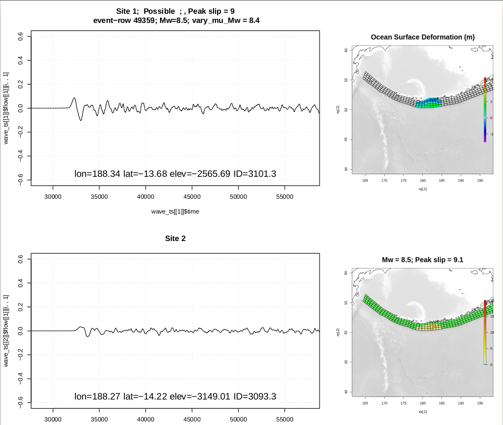

This code can plot surface deformation and a few point time-series, like in the plot below, for a reasonably large set of selected events on a chosen source-zone.

To use it, do the following:

1. Edit the [plot_parameters.R](plot_parameters.R). You'll have to specify the source-zone of interest, and a bunch of parameters affecting the plots. In addition you need to provide the source-zone's event files and unit-source geometry files. At the moment these all have to be downloaded to your local machine -- see the comments in the code for locations. You will also provide a DEM covering the area where the earthquake will be plotted, and a zero contour shapefile.

2. Run source the [earthquake_types_plot.R](earthquake_types_plot.R), e.g.

    Rscript earthquake_types_plot.R

3. Source the [plot_stage_time_series.R](plot_stage_time_series.R) script.

    Rscript plot_stage_time_series.R

For further details, see the inline comments in [plot_parameters.R](plot_parameters.R).
