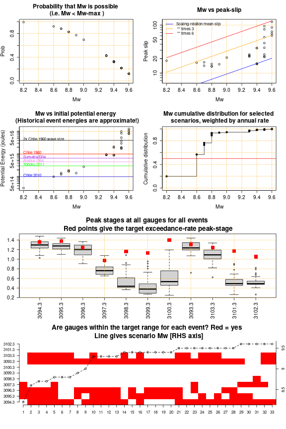
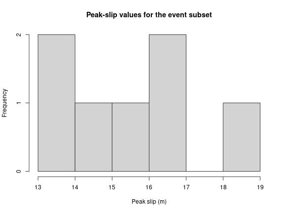
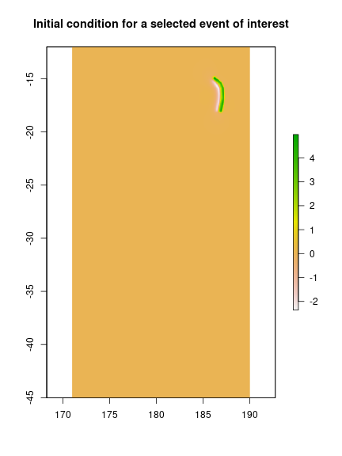
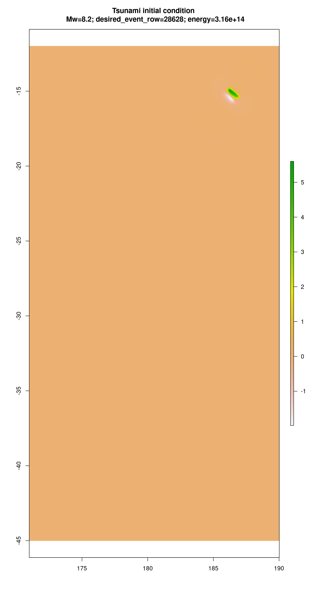
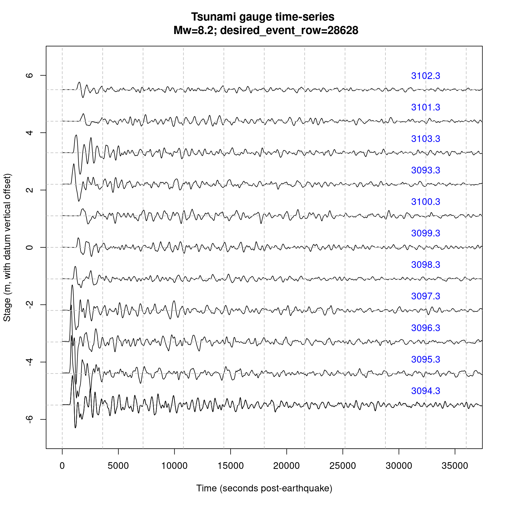

# An approach for multi-gauge-based scenario selection

The code in [select_scenarios.R](./select_scenarios.R) can be used to identify
a set of earthquake-tsunami scenarios from a given source-zone, which satisfy
some max-stage exceedance-rate criteria at multiple gauges simultaneously. At gauges
where the exceedance-rate criteria is not satisfied, the maximum-stage is
always smaller than the target maximum-stage.

Why do this? For hazard applications we might want to select a suite of
scenarios (perhaps from multiple source-zones) that collectively meet some
exceedance-rate criteria at multiple gauges of interest. 

For example, suppose we are interested in tsunami hazards throughout the the
island of Samoa. According to the PTHA18, large waves offshore of Samoa may
occur from multiple sources: on the southern side the Kermadec-Tonga trench
domanates, whereas on the northern side a number of other Pacific source-zones
are also significant. To make a whole-island hazard map, one approach is to
select a set of scenarios that *in combination* have maximum-stage meeting a
given exceedance-rate criteria at all gauges around the island. If we run all these
scenarios and take the maxima, then we might consider this to give an
island-wide representation of the tsunami at the given exceedance-rate. The
scripts in this directory can help with that.

The code usage is illustrated below, using the example of the Kermadec-Tonga
source-zone (only). In practice one would repeat this for multiple
source-zones, and apply some subjectivity to determine the final set of
scenarios.

## Step 0: Source the functions into R

The [select_scenarios.R](select_scenarios.R) script contains the main functions
we use. Beware it contains a hard-coded path to the [get_PTHA_results.R](../../get_PTHA_results.R)
script - and if you are working in a different directory that path will have to be changed.


```r
# If this throws an error, edit the line
#     ptha_access_script_location = '../../get_PTHA_results.R'
# to point to the correct path of that script.
source('select_scenarios.R')    
```

## Step 1: Get the gauges of interest, and remove any repeated points

Below we select a set of gauges around Samoa. It turns out that in our initially
selected set of gauges, one gauge is repeated twice (with a different `gaugeID`
each time). Such repetition is not unusual in the PTHA18, due to the automated
method used to create the gauges. But for this particular application the
repetition would be a problem - because we will count the number of gauges that
satisfy the exceedance-rate criteria - and so repetition would make 1 gauge count as 2. Hence
below we remove repeated gauges using a distance-matrix based technique.


```r
#
# Define the gauge indices of interest -- you need to make BOTH "site_gauge_inds" and "site_gauges"
#
all_gauges = ptha18$get_all_gauges()
site_gauge_inds = which(all_gauges$lon > 186 & all_gauges$lon < 188.9 &
                        all_gauges$lat > -15 & all_gauges$lat < -12)
site_gauges = all_gauges[site_gauge_inds,]
# In this case we have a double-up of one gauge. This is not unusual in
# PTHA18. For the analysis here we don't want that because it will make 1
# site count as 2. 
# Let's remove it by computing a distance matrix, and removing points that
# have '0' IN THE UPPER TRIANGLE of the distance matrix. Restriction to the
# upper triangle will mean we don't remove both points
site_gauges_distm = distm(cbind(site_gauges$lon, site_gauges$lat)) # Distance matrix
# Identify indices in the distance matrix upper triangle with a distance of 0.0. These
# should be removed. Notice we could change 0.0 to some other distance if we wanted to
# get rid of 'nearby but non-zero distance' points.
to_remove = which((upper.tri(site_gauges_distm) & (site_gauges_distm == 0.0)), arr.ind=TRUE)
if(length(to_remove) > 0){
    # There are repeated gauges
    inds_to_remove = unique(to_remove[,1])
    site_gauge_inds = site_gauge_inds[-inds_to_remove]
    site_gauges = site_gauges[-inds_to_remove,]
}

# Now print the gauges (should not be any repetition)
site_gauges
```

```
##            lon       lat      elev gaugeID
## 17572 187.8983 -14.08921 -1733.979  3094.3
## 17573 187.5532 -13.97140 -2896.962  3095.3
## 17574 187.2116 -13.78782 -2585.938  3096.3
## 17575 187.0293 -13.46005 -3599.159  3097.3
## 17576 187.3538 -13.31722 -3581.931  3098.3
## 17577 187.7456 -13.26375 -1153.971  3099.3
## 17578 187.9896 -13.58007 -1622.927  3100.3
## 17613 188.2745 -14.22114 -3149.007  3093.3
## 17614 188.6583 -14.20533 -2318.083  3103.3
## 17621 188.3408 -13.67743 -2565.686  3101.3
## 17622 188.6983 -13.85281 -3599.461  3102.3
```

## Step 2: Choose the source-zone and the earthquake-slip-type

In this example we search among earthquake scenarios on the `kermadectonga2`
source-zone that have variable-area-uniform-slip (`variable_uniform` below). In
practice one may consider other source-zones and slip types.


```r
# Slip type -- either 'stochastic' or 'variable_uniform'
slip_type = 'variable_uniform'
# Name of a source-zone in PTHA18
source_zone = 'kermadectonga2'

# Download the hazard curves at gauges, and the peak-stage values for all
# gauges at the source-zone. This takes a minute or so on my machine.
kermadec_source_data = get_hazard_curves_and_peak_stages(
    site_gauge_inds, site_gauges, source_zone, slip_type)
```

```
## [1] "kermadectonga2"
## [1] "kermadectonga2"
## [1] "kermadectonga2"
## [1] "kermadectonga2"
## [1] "kermadectonga2"
## [1] "kermadectonga2"
## [1] "kermadectonga2"
## [1] "kermadectonga2"
## [1] "kermadectonga2"
## [1] "kermadectonga2"
## [1] "kermadectonga2"
```

## Step 3: Define the properties of scenarios of interest

Next we specify properties of the scenarios of interest. The rough idea is that
we pick an exceedance-rate `exrate` for the scenarios of interest, given the
`hazard_curve_type` and rigidity model `mu_type`. Then we search for scenarios
which approximately satisfy this exceedance-rate at a number of the gauges simultaneously.
By *approximately*, I mean the max-stage is within some window near the target
value, defined by a fractional `target_stage_tolerance` (e.g. 0.1 = within
10%). The number of gauges that should simultaneously satisfy this is
user-defined `number_matching_gauges`. By trying to meet the exceedance-rate
criteria at multiple gauges at once, we may be able to run fewer scenarios. 

An important aspect of this algorithm is that it *excludes scenarios
that produce max-stage greater than the desired max-stage-window at any
gauge*. Thus for the selected scenarios, if gauges do not have stage values
inside the target window, then they must be smaller, but are never larger.

The idea is that by doing this over (potentially) multiple source-zones, we should be able
to make a relatively small set of scenarios with these properties:

* For every gauge, at least one scenario has a max-stage that approximately matches the desired exceedance-rate. 

* No scenarios create tsunamis exceeding the desired max-stage exceedance-rate by very much, at any gauge.

Imagine we took that set of scenarios and computed inundation for all cases.
Then, if we merged the results by taking the 'max' of all scenarios, the result
should have exceedance-rate similar to the desired exceedance-rate in most
places. At least, this should certainly be true at the offshore gauges, and we
hope they are broadly representative of the inundation exceedance-rates. In the
absence of a fully probabilistic approach, it seems tentatively reasonable to
consider this merged result as a nominal inundation map with the desired
exceedance-rate.


```r
#
# Set the criteria for picking scenarios. 
scenario_match = list()
# Desired exceedance_rate
scenario_match$exrate = 1/2500
# Hazard curve mean or percentile type -- a string identifying the stage-vs-exceedance-rate curve
# type. Either 'rate' (mean) or 'rate_84pc' (84th percentile) or 'rate_16pc'
# (16th percentile), 'rate_median' (50th percentile), 'rate_lower_ci' (2.5th
# percentile), 'rate_upper_ci' (97.5 percentile)
scenario_match$hazard_curve_type = 'rate_median' # 'rate_84pc' # 'rate_84pc'
# Rigidity type used for hazard calculations -- either an empty string ''
# (constant rigidity) or 'variable_mu' (depth varying rigidity). If you use
# variable_mu, be sure to use the variable_mu_Mw from the event table
scenario_match$mu_type = '' # 'variable_mu'
# The 'allowed fractional deviation of the peak-stage from the target value'
# that is still regarded as a match, e.g. 0.1 = 10%
scenario_match$target_stage_tolerance = 0.1 #
# The minimum number of gauges that should satisfy the allowed tolerance, for the
# scenario to be stored. At all other gauges, the peak-stage must be
# less than or equal the exceedance-rate-derived value
scenario_match$number_matching_gauges = 3
```

## Step 4: Find the scenarios matching the above criteria

Here we define an object `kermadectonga_events_2500` which contains information
on scenarios matching the criteria above. Most of these variables are similar to
those used to describe scenarios in our [DETAILED_README.md](../../DETAILED_README.md).


```r
# Find scenarios which match the above criteria at the previously downloaded gauge+"source-zone"
kermadectonga_events_2500 = get_matching_scenarios(kermadec_source_data, scenario_match)
names(kermadectonga_events_2500)    
```

```
##  [1] "events"                 "unit_source_statistics" "gauge_netcdf_files"    
##  [4] "desired_event_rows"     "events_file"            "unit_source_file"      
##  [7] "tsunami_events_file"    "peak_stages"            "peak_stages_within_tol"
## [10] "peak_slip"              "slip_from_Mw_function"  "peak_slip_ratio"       
## [13] "max_stage_at_exrate"
```

The function `summarise_scenarios` can be used to plot summary information on
the scenarios. 

```r
# Plot summary information
summarise_scenarios(kermadectonga_events_2500)
```



Here we explain the above plot:

* The top-left panel shows the scenario magnitude vs the probability that the scenario is possible according to the PTHA18. Because the maximum magnitude on any particular source-zone is uncertain, in general we do not know whether large magnitude scenarios are even possible. The PTHA's rate-modelling method gives a quantitative description of this, which is depicted in plot. In this case we can see that scenarios with magnitude below 9 are considered quite plausible (> 50%), whereas scenarios with magnitude of 9.6 are considered relatively unlikely to ever occur (< 20%). This reflects the relatively narrow width of the Kermadec-Tonga source-zone, which affects maximum magnitude estimation in the PTHA18 methodology. This information is provided to reduce the chance of accidently selecting scenarios that are *probably impossible* according to the PTHA18. For instance, we may want to avoid scenarios that have a very low chance of being possible. Although there are no hard-and-fast rules about this, the author suggests that you might prefer scenarios that are likely to be possible, unless you have a good reason to do otherwise. 

* The top-right panel shows the scenario's peak-slip and magnitude. For comparison purposes the blue line shows the *average* slip for a hypothetical uniform-slip earthquake with rigidity of 30 GPA, and length and width following the median scaling relation used in the PTHA18 (from Strasser et al. 2010). The orange and red-lines show the latter values multipled by 3 and 6 respectively. For variable-area-uniform-slip earthquakes, high peak-slip values correspond to compact earthquakes and vice-versa. For heterogeneous-slip earthquakes, high peak-slip values are also often associated with compact earthquakes, but more generally indicate that slip is concentrated on an asperity. In the PTHA18 peak-slip values greater than 7.5 times the blue-line are not permitted; however there is much uncertainty around this threshold. Some users may prefer to choose scenarios with lower slip-maxima, and this plot can help.

* The second-row-left panel shows the potential energy in the scenario's initial condition, vs the magnitude. The potential energy provides an alternative measure of tsunami size, and can be estimated for historical tsunamis. In this plot we include very rough estimates of the potential energies of some historical events, based on the literature and our own work. We also include a hypothetical example with double the slip of our Chile 1960 estimate (and thus 4x the energy), which in principle should have a tsunami twice as large. *While this is useful for comparison, please note the historical event energies could easily be wrong by a factor of 2 or more. Here are a few papers that estimate tsunami energies and can be consulted for more information:* [Nosov et al., 2014](https://doi.org/10.1007/s00024-013-0730-6), [Titov et al. 2016](http://dx.doi.org/10.1007/s00024-016-1312-1), [Davies et al., 2020](https://www.frontiersin.org/articles/10.3389/feart.2020.598235/abstract).

* The second-row-right panel shows the cumulative sum of the selected scenario rates when sorted by magnitude, normalised to [0-1]. Magnitudes corresponding to a value of 0.5 can be considered as `typical` (i.e. it is equally likely to have a higher or lower magnitude scenario that matches the criteria). Typically lower magnitude events are more likely than higher magnitude events, and this plot tries to emphasise those relative likelihoods.

* The third-row panel shows the distribution of maximum-stage values for each of the selected scenarios using [box-plots](https://en.wikipedia.org/wiki/Box_plot), along with the target maximum-stage values. As expected the target value is never exceeded by much. Also, not all gauges achieve the target value. That's because some gauges are less affected by the Kermadec-Tonga source-zone, as compared with other sources. Scenarios that produced high maximum-stage values at these gauges would likely produce excessively high maximum-stage values at the other gauges, and so are disallowed in the current methodology. We should search other source-zones to find scenarios that are appropriate for those gauges.

* The bottom panel shows, for each scenario, which gauges attained maximum-stage values within the target window. This can help with manually selecting some subset of scenarios for further analysis. The gauge labels are on the LHS axis, the scenario magnitude is on the RHS axis and is shown on the line.

# Identifying subsets of the above scenarios

Based on the above plot, we might decide to look further at some subset of scenarios. For example, suppose we want to look at the events with magnitude ranging from 8.2-8.8 having peak-slip between 10 and 20m (this is subjective, and other decisions are certainly possible - but it serves as an example). Below we show how to find their event numbers, and make a plot of their peak-slip values to check it worked:


```r
# Find events with Mw >8.15 and Mw < 8.85 -- this will include all events
# with Mw 8.2-8.8, and the offsets by 0.05 protect us against tiny floating point
# rounding. Also only take events with peak-slip between 10 and 20 m.
k = which((kermadectonga_events_2500$events$Mw > 8.15) &
          (kermadectonga_events_2500$events$Mw < 8.85) &
          (kermadectonga_events_2500$peak_slip > 10) & 
          (kermadectonga_events_2500$peak_slip < 20)  
          )
# Here are the row-indices of those scenarios 
row_indices_of_subset = kermadectonga_events_2500$desired_event_rows[k]
row_indices_of_subset # These could be used to get the initial condition or gauge time-series -- see below
```

```
## [1] 28628 36690 37651 37732 38611 38655 38729
```

```r
# Here is a histogram of their peak-slip values
hist(kermadectonga_events_2500$peak_slip[k], main='Peak-slip values for the event subset',
     xlab='Peak slip (m)')
```



# Suggestions on usage

* If you obtain too few events, try decreasing the `number_matching_gauges`, or increasing the `target_stage_tolerance`. 
* The opposite holds if you have too many events.
* In practice you probably want to select just a few of the identified events using the plots above (and also subsequent plots of the uplift and/or wave-time-series). To find particular events, note the row-indices of the events in the original table are stored in `kermedectonga_events_2500$desired_event_rows`. Below we provide an example of checking the uplift. Please do these kinds of checks to make sure you're happy with the selected scenarios.


```r
# This can be used to get some subset of the events
kermadectonga_events_2500$desired_event_rows
```

```
##  [1] 28628 36690 37651 37732 38611 38655 38729 39614 40509 42728 42735 42847
## [13] 42899 43320 43338 43344 43381 43387 43490 43716 43865 43926 43932 43934
## [25] 43943 43979 44059 44073 44115 44138 44192 44196 44253
```

```r
# For instance if we wanted the earthquake data the 2nd event, in a format
# easily compatable with our the PTHA18 DETAILED_README, we could do:
event_id = kermadectonga_events_2500$desired_event_rows[2]
event_id # This is the row-index of the second event in the PTHA database
```

```
## [1] 36690
```

```r
# Get the event data directly from the PTHA database (easier than hacking it
# out of the above objects).
event_of_interest = ptha18$get_source_zone_events_data(
    source_zone, slip_type=slip_type, desired_event_rows=event_id)

# Get the initial deformation, using the regular approach.
event_raster = ptha18$get_initial_condition_for_event(event_of_interest, event_ID=1)
plot(event_raster, main='Initial condition for a selected event of interest')
```



# Quickly plotting initial conditions and wave time-series for several events

The code below plots the initial condition and wave time-series for all
selected events, as files in a specified output directory. For other source
zones one might need to modify it (e.g. different figure dimensions or axes
limits, etc).


```r
# Name of the output directory for the plots. Here we insert some variables into the name
plot_outdir = paste0('batch_plots', 
                     '_SRC_', source_zone, 
                     '_SLP_', slip_type, 
                     '_CRV_', scenario_match$hazard_curve_type, 
                     '_EXRATE_', as.character(scenario_match$exrate), 
                     '_STGTOL_', as.character(scenario_match$target_stage_tolerance), 
                     '_NGAUGE_', as.character(scenario_match$number_matching_gauges))

# Use this to control the gauges plot xlimits, ylimits, and label position
gauge_plot_xlim = c(0, 10*3600) # Plot the first 10 hours
gauge_plot_vertical_spacing = 1.0 # Plot all gauge time-series on one figure, using this vertical spacing.
gauge_plot_ylim_extra = c(-1, 1) # Add this to the plot y-range implied by the gauge_plot_vertical_spacing
gauge_plot_gaugeID_offset = c(0, 0.5) # Offset for the gaugeID text that is added to the plot.

# Make the output directory
dir.create(plot_outdir, showWarnings=FALSE)

# Get all the events in a format that the ptha_access codes will work with
events_of_interest = ptha18$get_source_zone_events_data(source_zone, 
    slip_type=slip_type, 
    desired_event_rows=kermadectonga_events_2500$desired_event_rows,
    include_potential_energy=TRUE)

# Get the wave time-series for all events at all 'site_gauges'
all_tsunamis_at_gauges = ptha18$get_flow_time_series_at_hazard_point(
    events_of_interest,
    event_ID = 1:nrow(events_of_interest$events),  # Check all "events_of_interest"
    target_points = site_gauges)

# Plot everything
for(i in 1:length(events_of_interest$desired_event_rows)){
    # This is the index of the event AMONG ALL EVENTS IN THE DATABASE
    event_row_index = events_of_interest$desired_event_rows[i]

    # Read the initial condition raster
    event_raster = ptha18$get_initial_condition_for_event(events_of_interest, event_ID=i)
    # Save the initial condition raster
    output_raster_file = paste0(plot_outdir, '/initial_condition_DESIRED_EVENT_ROW_', 
                                event_row_index, '.tif')
    writeRaster(event_raster, filename = output_raster_file, options=c('COMPRESS=DEFLATE'), 
                overwrite=TRUE)

    # Make a PNG of the initial condition raster 
    raster_extent = extent(event_raster)
    raster_asp = (raster_extent@ymax - raster_extent@ymin)/(raster_extent@xmax - raster_extent@xmin)
    output_png_file = paste0(plot_outdir, '/initial_condition_DESIRED_EVENT_ROW_', 
                                event_row_index, '.png')
    png(output_png_file, width=9, height=max(4, raster_asp*9 + 1), res=200, units='in')
    plot(event_raster) 
    title(main=paste0("Tsunami initial condition \n Mw=", events_of_interest$events$Mw[i], 
                      "; desired_event_row=", event_row_index, "; energy=", 
                      format(events_of_interest$events$initial_potential_energy[i], digits=3))
         )
    dev.off() # Finish plot

    # Make a PNG of the gauges
    ngauges = length(all_tsunamis_at_gauges$flow)
    gauge_offset = seq(-ngauges/2, ngauges/2, length=ngauges)*gauge_plot_vertical_spacing

    output_png_file = paste0(plot_outdir, '/tsunami_gauges_DESIRED_EVENT_ROW_', 
                                event_row_index, '.png')
    png(output_png_file, width=9, height=9, units='in', res=200)
    plot(all_tsunamis_at_gauges$time, all_tsunamis_at_gauges$flow[[1]][i,,1] + gauge_offset[1], t='l', 
         xlim=gauge_plot_xlim, ylim=range(gauge_offset)+gauge_plot_ylim_extra,
         xlab='Time (seconds post-earthquake)', ylab='Stage (m, with datum vertical offset)')
    for(j in 1:ngauges){
        points(all_tsunamis_at_gauges$time, 
               all_tsunamis_at_gauges$flow[[j]][i,,1] + gauge_offset[j], 
               t='l')
    }
    abline(v=seq(0, 36)*3600, col='grey', lty='dashed')
    abline(h=gauge_offset, col='grey', lty='dashed')
    text(gauge_plot_xlim[2] - 0.1*diff(gauge_plot_xlim) + gauge_plot_gaugeID_offset[1], 
         gauge_offset + gauge_plot_gaugeID_offset[2],
         names(all_tsunamis_at_gauges$flow), col='blue')
    title(main=paste0("Tsunami gauge time-series \n Mw=", events_of_interest$events$Mw[i], 
                 "; desired_event_row=", event_row_index))
    dev.off()
    
}
```

The code above produces some figures showing the initial condition in the output directory named batch_plots_SRC_kermadectonga2_SLP_variable_uniform_CRV_rate_median_EXRATE_4e-04_STGTOL_0.1_NGAUGE_3. An example is below.



It also produces some plots of the gauge time-series. Notice the script includes parameters that can be used to control the vertical spacing of the gauges, as well as the plot x-and-y limits, and the gaugeID label placement.


