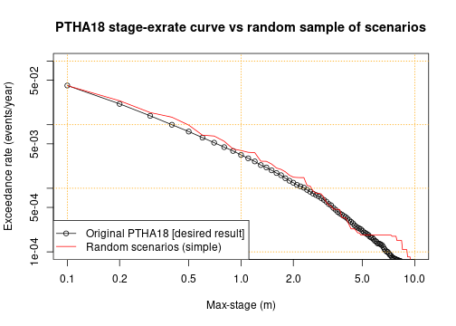
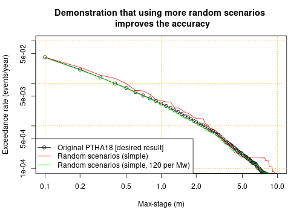
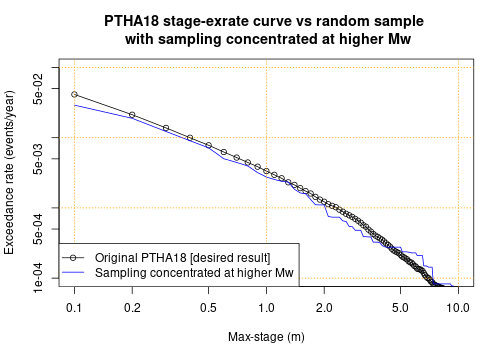
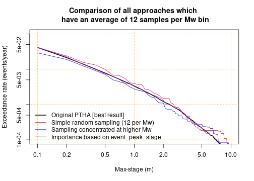

# Randomly sample PTHA18 scenarios on a source-zone
---------------------------------------------------

The PTHA18 often includes thousands or tens-of-thousands of scenarios on a
source-zone. For some applications it is impractical to work with all
scenarios, but may be practical to work with a random sample of scenarios that
have similar statistical properties. 

For example, suppose we wish to conduct a probabilistic tsunami inundation
hazard assessment, which will require running computationally expensive
inundation models for every scenario. It may be impractical to do this for
every PTHA18 scenario, but feasible with a random sample containing hundreds or
thousands of scenarios. 

This tutorial shows how to randomly sample scenarios from a given source-zone
in a manner that is statistically consistent with the PTHA18. This means that
one can derive quantities of interest (such as the maximum-stage
exceedance-rate at a hazard point) from the random scenarios, and the result
will be arbitrarily close to the PTHA18 values IF the random sample is
sufficiently large. 

## Get the source-zone event data, and some maximum-stage data.
---------------------------------------------------------------

The first step is to get the scenario data for the source-zone of interest.
Here we choose to work with heterogeneous-slip scenarios from the
`kermadectonga2` source-zone. 

```r
# Get the scripts to access the PTHA18
ptha18 = new.env()
source('../../get_PTHA_results.R', local=ptha18, chdir=TRUE)
# Read all heterogeneous-slip scenario metadata (slip_type='stochastic' in PTHA18)
source_zone = 'kermadectonga2'
kt2_scenarios = ptha18$get_source_zone_events_data(source_zone,  slip_type='stochastic')
```

To illustrate how we can use the random scenarios, it is useful to have the corresponding
tsunami maximum-stage data at a point of interest. Herein we choose a point just east of Tonga,
which is over the `kermadectonga2` source-zone.


```r
event_peak_stage_at_refpoint = ptha18$get_peak_stage_at_point_for_each_event(
    target_point = c(185.1239, -21.0888), # Known location of PTHA18 hazard point
    slip_type='stochastic',
    all_source_names=source_zone)
```

```
## [1] "kermadectonga2"
```

```r
# Convenient shorthand
event_peak_stage = event_peak_stage_at_refpoint$kermadectonga2$max_stage
```

## Random scenario sampling, stratified by magnitude
----------------------------------------------------

Our simplest random scenario sampling algorithm proceeds as follows
* Group the scenarios by magnitude
* For each magnitude, sample a given number of scenarios with replacement, with the chance of sampling each scenario proportional to its conditional probability.

The function which does this only requires knowledge of the scenario magnitudes, and the scenario rates. From these variables the function will internally compute scenario conditional probability for each unique magnitude value (which ranges from 7.2, 7.3, ... 9.6, 9.7, 9.8 in PTHA18). 

We also need to specify the number of scenarios to sample for each magnitude - herein a constant (12) is used, although in general it can vary with magnitude.


```r
# Convenient shorthand for the magnitudes and rates in the event table
event_Mw = kt2_scenarios$events$Mw
event_rates = kt2_scenarios$events$rate_annual

# Make a reproducible random seed to make the code reproducible (this is
# optional)
set.seed(123)

# Make the random scenarios
random_scenarios_simple = ptha18$randomly_sample_scenarios_by_Mw_and_rate(
    event_rates=event_rates,
    event_Mw=event_Mw,
    samples_per_Mw=function(Mw){ 12 }, # Number of samples for each Mw
    mw_limits=c(7.15, 9.85) # Optionally limit the mw range of random samples
    )
```

The result is a `data.frame` containing the indices of the random scenarios `inds`,
their magnitudes, `mw`, as well as information on the scenario rates that will be discussed
further below.


```r
# Look at the first few rows
head(random_scenarios_simple)
```

```
##   inds  mw rate_with_this_mw importance_sampling_scenario_rates
## 1  550 7.2        0.05704921                        0.004754101
## 2 1088 7.2        0.05704921                        0.004754101
## 3  195 7.2        0.05704921                        0.004754101
## 4 1302 7.2        0.05704921                        0.004754101
## 5   28 7.2        0.05704921                        0.004754101
## 6 1038 7.2        0.05704921                        0.004754101
##   importance_sampling_scenario_rates_self_normalised
## 1                                        0.004754101
## 2                                        0.004754101
## 3                                        0.004754101
## 4                                        0.004754101
## 5                                        0.004754101
## 6                                        0.004754101
##   importance_sampling_scenario_weights
## 1                           0.08333333
## 2                           0.08333333
## 3                           0.08333333
## 4                           0.08333333
## 5                           0.08333333
## 6                           0.08333333
##   importance_sampling_scenario_weights_self_normalised
## 1                                           0.08333333
## 2                                           0.08333333
## 3                                           0.08333333
## 4                                           0.08333333
## 5                                           0.08333333
## 6                                           0.08333333
```
The columns are
* `inds` is the indices of the randomly selected scenarios. This corresponds to indices in the `event_Mw` and `event_rates` variables. Because herein these are simply columns of the event table, `inds` also also correspond to rows in `kt2_scenarios$events`.
* `mw` is the scenario magnitude. This is the same as `event_Mw[random_scenarios_simple$inds]`
* `rate_with_this_mw` is the rate of ANY scenario with the same magnitude. This is the sum of `event_rates` for scenarios with the corresponding magnitude. Note THIS IS NOT THE RATE OF THE INDIVIDUAL SCENARIO!
* `importance_sampling_scenario_rates` is a nominal rate for each scenario, defined so as to retain statistical consistency with the PTHA18. In this particular case it is equal to the `rate_with_this_mw` divided by the number of scenarios with that same magnitude (12 in this case). In more complex applications we can specify an `event_importance` to bias the sampling toward scenarios of interest, and in that case its definition is more complicated, but the interpretation is similar.
* `importance_sampling_scenario_rates_self_normalised` is another nominal rate for each scenario. In this case it is identical to the previous variable. However later we will consider more complex sampling methods, using importance sampling, where it may be somewhat different (basically it can be considered as an alternative statistical estimator of the same thing).
* `importance_sampling_scenario_weights` is equal to `importance_sampling_scenario_rates` divided by `rate_with_this_mw`. Later when we do importance sampling, this corresponds to the regular importance sampling weights. 
* `importance_sampling_scenario_weights_self_normalised` is equal to `importance_sampling_scenario_rates_self_normalised` divided by `rate_with_this_mw`. Later when we do importance sampling, this corresponds to the self-normalised importance sampling weights. 

In PTHA18 some earthquake magnitudes are impossible. In this case the scenario index will
take an `NA` value, as will various other variables. We see this at the end of the current
table, for magnitudes `9.7` and `9.8`.


```r
# Look at the last few rows
tail(random_scenarios_simple)
```

```
##      inds  mw rate_with_this_mw importance_sampling_scenario_rates
## 297 44088 9.6      5.323646e-05                       4.436371e-06
## 298 44208 9.6      5.323646e-05                       4.436371e-06
## 299 44261 9.6      5.323646e-05                       4.436371e-06
## 300 44171 9.6      5.323646e-05                       4.436371e-06
## 301    NA 9.7      0.000000e+00                                 NA
## 302    NA 9.8      0.000000e+00                                 NA
##     importance_sampling_scenario_rates_self_normalised
## 297                                       4.436371e-06
## 298                                       4.436371e-06
## 299                                       4.436371e-06
## 300                                       4.436371e-06
## 301                                                 NA
## 302                                                 NA
##     importance_sampling_scenario_weights
## 297                           0.08333333
## 298                           0.08333333
## 299                           0.08333333
## 300                           0.08333333
## 301                                   NA
## 302                                   NA
##     importance_sampling_scenario_weights_self_normalised
## 297                                           0.08333333
## 298                                           0.08333333
## 299                                           0.08333333
## 300                                           0.08333333
## 301                                                   NA
## 302                                                   NA
```

Aside from the impossible magnitudes, we can confirm that we have 12 scenarios per magnitude, as requested.

```r
table(random_scenarios_simple$mw)
```

```
## 
## 7.2 7.3 7.4 7.5 7.6 7.7 7.8 7.9   8 8.1 8.2 8.3 8.4 8.5 8.6 8.7 8.8 8.9   9 9.1 
##  12  12  12  12  12  12  12  12  12  12  12  12  12  12  12  12  12  12  12  12 
## 9.2 9.3 9.4 9.5 9.6 9.7 9.8 
##  12  12  12  12  12   1   1
```

## Inferring tsunami exceedance-rates from the random scenario subset
----------------------------------------------------------------------

What do we mean by saying the random scenarios are statistically consistent
with the PTHA18? To demonstrate this we considering the tsunami max-stage
exceedance-rates at the point offshore of Tonga (any other location could
similarly be chosen).

In the full PTHA, we can compute the max-stage exceedance rates at this point as:

```r
stage_seq = seq(0.1, 20, by=0.1)
stage_exrates_ptha18 = sapply(stage_seq, f<-function(x) sum(event_rates*(event_peak_stage > x)))
```

The analogous calculation using only the random sample is:

```r
stage_exrates_rs_simple = sapply(stage_seq, 
    f<-function(x){
        sum(random_scenarios_simple$importance_sampling_scenario_rates * 
            (event_peak_stage[random_scenarios_simple$inds] > x), na.rm=TRUE)
    })
```

The max-stage exceedance-rate curve derived from the random scenarios is
similar to the PTHA18 result, but there is some error due to the limited number
of samples. As we increase the number of random scenarios per magnitude, the
accuracy will improve (on average) until the difference is negligible. In this
sense the random sample is statistically consistent with the PTHA18.

```r
# Plot it
plot(stage_seq, stage_exrates_ptha18, log='xy', t='o', xlim=c(0.1, 10), ylim=c(1e-04, 1e-01),
     xlab='Max-stage (m)', ylab='Exceedance rate (events/year)', 
     main='PTHA18 stage-exrate curve vs random sample of scenarios')
```

```
## Warning in xy.coords(x, y, xlabel, ylabel, log): 4 y values <= 0 omitted from
## logarithmic plot
```

```r
points(stage_seq, stage_exrates_rs_simple, t='l', col='red')
grid(col='orange')
legend('bottomleft', c('Original PTHA18 [desired result]', 'Random scenarios (simple)'),
       col=c('black', 'red'), lty=c(1, 1), pch=c(1, NA))
```



Below we demonstrate that with more samples, the agreement between the curves
improves. 

```r
# Make the random scenarios -- use 120 per magnitude, instead of 12
random_scenarios_simple_many = ptha18$randomly_sample_scenarios_by_Mw_and_rate(
    event_rates=event_rates,
    event_Mw=event_Mw,
    samples_per_Mw=function(Mw){ 120 }, # Number of samples for each Mw
    mw_limits=c(7.15, 9.85) # Optionally limit the mw range of random samples
    )

# Compute the max-stage exceedance-rates and make a plot
stage_exrates_rs_simple_many = sapply(stage_seq, 
    f<-function(x){
        sum(random_scenarios_simple_many$importance_sampling_scenario_rates * 
            (event_peak_stage[random_scenarios_simple_many$inds] > x), na.rm=TRUE)
    })

plot(stage_seq, stage_exrates_ptha18, log='xy', t='o', xlim=c(0.1, 10), ylim=c(1e-04, 1e-01),
     xlab='Max-stage (m)', ylab='Exceedance rate (events/year)',
     main='Demonstration that using more random scenarios improves the accuracy')
```

```
## Warning in xy.coords(x, y, xlabel, ylabel, log): 4 y values <= 0 omitted from
## logarithmic plot
```

```r
points(stage_seq, stage_exrates_rs_simple, t='l', col='red')
points(stage_seq, stage_exrates_rs_simple_many, t='l', col='green')
grid(col='orange')
legend('bottomleft', c('Original PTHA18 [desired result]', 'Random scenarios (simple)',
       'Random scenarios (simple, 120 per Mw)'),
       col=c('black', 'red', 'green'), lty=c(1, 1, 1), pch=c(1, NA, NA))
```



Here we are considering the max-stage exceedance-rates at a hazard point, and
can easily use the full PTHA18 results, so there is no reason to use random
sampling of scenarios. However in other situations we might be interested in
the tsunami behaviour away from PTHA18 output points. For instance we might
have an onshore site of interest, so we need to re-simulate the tsunami for
every scenario with a relatively costly inundation model. While this is likely
computationally prohibitive for the full set of PTHA18 scenarios, it may be
feasible for a random subset of scenarios (so long as sufficiently many
scenarios are sampled).


## Random scenario sampling, with more scenarios at magnitudes of interest
--------------------------------------------------------------------------

The simple random sample has many scenario with low maximum-stage values, which
are not of particular interest for this study. (DEMONSTRATE WITH A HIST)


```r
# Make the random scenarios
random_scenarios_mw_weighted = ptha18$randomly_sample_scenarios_by_Mw_and_rate(
    event_rates=event_rates,
    event_Mw=event_Mw,
    samples_per_Mw=function(Mw){ round( 6 + 12 * (Mw - 7.15)/(9.65 - 7.15) ) }, # Number of samples for each Mw
    mw_limits=c(7.15, 9.85) # Optionally limit the mw range of random samples
    )

# Compute the max-stage exceedance-rates
stage_exrates_rs_mw_weighted = sapply(stage_seq, 
    f<-function(x){
        sum(random_scenarios_mw_weighted$importance_sampling_scenario_rates * 
            (event_peak_stage[random_scenarios_mw_weighted$inds] > x), na.rm=TRUE)
    })
```

This one is not that much better in terms of the concentration at higher max-stage
values.


```r
# Plot it
plot(stage_seq, stage_exrates_ptha18, log='xy', t='o', xlim=c(0.1, 10), ylim=c(1e-04, 1e-01),
     xlab='Max-stage (m)', ylab='Exceedance rate (events/year)',
     main='PTHA18 stage-exrate curve vs random sample with more scenarios at higher magnitudes')
```

```
## Warning in xy.coords(x, y, xlabel, ylabel, log): 4 y values <= 0 omitted from
## logarithmic plot
```

```r
points(stage_seq, stage_exrates_rs_mw_weighted, t='l', col='blue')
grid(col='orange')
legend('bottomleft', c('Original PTHA18 [desired result]', 'More scenarios at higher Mw'),
       col=c('black', 'blue'), lty=c(1, 1), pch=c(1, NA))
```



## Random scenario sampling, using importance sampling to emphasise higher max-stages
-------------------------------------------------------------------------------------


```r
# Make the random scenarios
POW = 1 # Optional power-law transformation to event_peak_stage
random_scenarios_stage_mw_weighted = ptha18$randomly_sample_scenarios_by_Mw_and_rate(
    event_rates=event_rates,
    event_Mw=event_Mw,
    event_importance = event_peak_stage**POW,
    samples_per_Mw=function(Mw){ round( 6 + 12 * (Mw - 7.15)/(9.65 - 7.15) ) },
    mw_limits=c(7.15, 9.85) # Optionally limit the mw range of random samples
    )

# Compute the max-stage exceedance-rates
stage_exrates_rs_stage_mw_weighted = sapply(stage_seq, 
    f<-function(x){
        sum(random_scenarios_stage_mw_weighted$importance_sampling_scenario_rates * 
            (event_peak_stage[random_scenarios_stage_mw_weighted$inds] > x), na.rm=TRUE)
    })
```


```r
# Plot it
plot(stage_seq, stage_exrates_ptha18, log='xy', t='o', xlim=c(0.1, 10), ylim=c(1e-04, 1e-01),
     xlab='Max-stage (m)', ylab='Exceedance rate (events/year)',
     main='PTHA18 stage-exrate curve vs random sample with max-stage importance-sampling')
```

```
## Warning in xy.coords(x, y, xlabel, ylabel, log): 4 y values <= 0 omitted from
## logarithmic plot
```

```r
points(stage_seq, stage_exrates_rs_stage_mw_weighted, t='l', col='purple')
grid(col='orange')
legend('bottomleft', c('Original PTHA18 [desired result]', 'Importance based on event_peak_stage'),
       col=c('black', 'purple'), lty=c(1, 1), pch=c(1, NA))
```


## Comparison of all approaches
-------------------------------

Emphasise that increasing the sample size is a good idea. Also tests, like
checking generality at nearby points, and splitting scenarios into groups (more complex?), 
and randomisation tests.


```r
# Plot it
plot(stage_seq, stage_exrates_ptha18, log='xy', t='l', lwd=2, xlim=c(0.1, 10), ylim=c(1e-04, 1e-01),
     xlab='Max-stage (m)', ylab='Exceedance rate (events/year)',
     main='Comparison of all approaches above')
```

```
## Warning in xy.coords(x, y, xlabel, ylabel, log): 4 y values <= 0 omitted from
## logarithmic plot
```

```r
points(stage_seq, stage_exrates_rs_simple, t='l', col='red')
points(stage_seq, stage_exrates_rs_mw_weighted, t='l', col='blue')
points(stage_seq, stage_exrates_rs_stage_mw_weighted, t='l', col='purple')
grid(col='orange')
legend('bottomleft', c('Original PTHA [best result]', 'Simple random sampling (12 per Mw)', 
    'More scenarios at higher Mw', 'Importance based on event_peak_stage'), 
    bty='n',  col=c('black', 'red', 'blue', 'purple'), lwd = c(2, 1, 1, 1))
```


