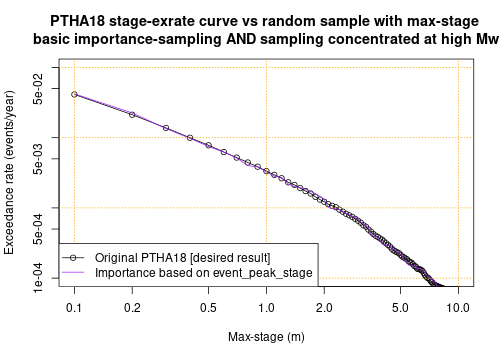

# Randomly sample PTHA18 scenarios on a source-zone
---------------------------------------------------

The PTHA18 often includes thousands or tens-of-thousands of scenarios on a
source-zone. For some applications it is impractical to work with all
scenarios, but may be practical to work with a random sample of scenarios that
have similar statistical properties. 

For example, suppose we wish to conduct a probabilistic tsunami inundation
hazard assessment, which will require running computationally expensive
inundation models for every scenario. It may be impractical to do this for
every PTHA18 scenario, but feasible with a random sample containing hundreds or
thousands of scenarios. 

This tutorial examines a few approaches to randomly sample scenarios from a
given source-zone in a manner that is statistically consistent with the PTHA18.
This means that one can derive quantities of interest (such as the
maximum-stage exceedance-rate at a hazard point) from the random scenarios, and
the result will be arbitrarily close to the PTHA18 values IF the random sample
is sufficiently large. In all cases it is the users reponsibility to determine
a sample size sufficient for accurate results, and that the sampling strategy
gives stable results for their application. In general the adequacy of
different methods and sample-sizes will vary case-by-case.

## Get the source-zone event data, and some maximum-stage data.
---------------------------------------------------------------

The first step is to get the scenario data for the source-zone of interest.
Here we choose to work with heterogeneous-slip scenarios from the
`kermadectonga2` source-zone. 

```r
# Get the scripts to access the PTHA18
ptha18 = new.env()
source('../../get_PTHA_results.R', local=ptha18, chdir=TRUE)
# Read all heterogeneous-slip scenario metadata (slip_type='stochastic' in PTHA18)
source_zone = 'kermadectonga2'
kt2_scenarios = ptha18$get_source_zone_events_data(source_zone,  slip_type='stochastic')
```

To illustrate how we can use the random scenarios, it is useful to have the
corresponding tsunami maximum-stage data at a point of interest. Herein we
choose a point just east of Tonga, which is over the `kermadectonga2`
source-zone (the calculations below could be equally applied to any other
point).


```r
event_peak_stage_at_refpoint = ptha18$get_peak_stage_at_point_for_each_event(
    target_point = c(185.1239, -21.0888), # Known location of PTHA18 hazard point
    slip_type='stochastic',
    all_source_names=source_zone)
```

```
## [1] "kermadectonga2"
```

```r
# Convenient shorthand
event_peak_stage = event_peak_stage_at_refpoint$kermadectonga2$max_stage
```

## Random scenario sampling, stratified by magnitude
----------------------------------------------------

Our simplest random scenario sampling algorithm proceeds as follows
* Group the scenarios by magnitude
* For each magnitude, sample a given number of scenarios with replacement, with the chance of sampling each scenario proportional to its conditional probability.

The function which does this only requires knowledge of the scenario magnitudes, and the scenario rates. From these variables the function will internally compute the scenario conditional probability for each unique magnitude value (which ranges from 7.2, 7.3, ... 9.6, 9.7, 9.8 in PTHA18). 

We also need to specify the number of scenarios to sample for each magnitude - herein a constant (12) is used, although in general it can vary with magnitude.


```r
# Convenient shorthand for the magnitudes and rates in the event table
event_Mw = kt2_scenarios$events$Mw
event_rates = kt2_scenarios$events$rate_annual

# Make a reproducible random seed to make the code reproducible (this is optional)
set.seed(123)

# Make the random scenarios
random_scenarios_simple = ptha18$randomly_sample_scenarios_by_Mw_and_rate(
    event_rates=event_rates,
    event_Mw=event_Mw,
    samples_per_Mw=function(Mw){ 12 }, # Number of samples for each Mw
    mw_limits=c(7.15, 9.85) # Optionally limit the mw range of random samples
    )
```

The result is a `data.frame` containing the indices of the random scenarios `inds`,
their magnitudes, `mw`, as well as information on the scenario rates that will be discussed
further below.


```r
# Look at the first few rows
head(random_scenarios_simple)
```

```
##   inds  mw rate_with_this_mw importance_sampling_scenario_rates
## 1  550 7.2        0.05704921                        0.004754101
## 2 1088 7.2        0.05704921                        0.004754101
## 3  195 7.2        0.05704921                        0.004754101
## 4 1302 7.2        0.05704921                        0.004754101
## 5   28 7.2        0.05704921                        0.004754101
## 6 1038 7.2        0.05704921                        0.004754101
##   importance_sampling_scenario_rates_self_normalised
## 1                                        0.004754101
## 2                                        0.004754101
## 3                                        0.004754101
## 4                                        0.004754101
## 5                                        0.004754101
## 6                                        0.004754101
##   importance_sampling_scenario_weights
## 1                           0.08333333
## 2                           0.08333333
## 3                           0.08333333
## 4                           0.08333333
## 5                           0.08333333
## 6                           0.08333333
##   importance_sampling_scenario_weights_self_normalised
## 1                                           0.08333333
## 2                                           0.08333333
## 3                                           0.08333333
## 4                                           0.08333333
## 5                                           0.08333333
## 6                                           0.08333333
```
The columns are
* `inds` is the indices of the randomly selected scenarios. This corresponds to indices in the `event_Mw` and `event_rates` variables. Because herein these are simply columns of the event table, `inds` also also correspond to rows in `kt2_scenarios$events`.
* `mw` is the scenario magnitude. This is the same as `event_Mw[random_scenarios_simple$inds]`
* `rate_with_this_mw` is the rate of ANY scenario with the same magnitude. This is the sum of `event_rates` for scenarios with the corresponding magnitude. Note THIS IS NOT THE RATE OF THE INDIVIDUAL SCENARIO!
* `importance_sampling_scenario_rates` is a nominal rate for each scenario, defined so as to retain statistical consistency with the PTHA18. In this particular case it is equal to the `rate_with_this_mw` divided by the number of scenarios with that same magnitude (12 in this case). In more complex applications we can specify an `event_importance` to bias the sampling toward scenarios of interest, and in that case its definition is more complicated, but the interpretation is similar.
* `importance_sampling_scenario_rates_self_normalised` is another nominal rate for each scenario. In this case it is identical to the previous variable. However later we will consider more complex sampling methods, using importance sampling, where it may be somewhat different (basically it can be considered as an alternative statistical estimator of the same thing).
* `importance_sampling_scenario_weights` is equal to `importance_sampling_scenario_rates` divided by `rate_with_this_mw`. Later when we do importance sampling, this corresponds to the regular importance sampling weights. 
* `importance_sampling_scenario_weights_self_normalised` is equal to `importance_sampling_scenario_rates_self_normalised` divided by `rate_with_this_mw`. Later when we do importance sampling, this corresponds to the self-normalised importance sampling weights. 

In PTHA18 some earthquake magnitudes are impossible. In this case the scenario index will
take an `NA` value, as will various other variables. We see this at the end of the current
table, for magnitudes `9.7` and `9.8`.


```r
# Look at the last few rows - NA values for magnitudes that are "impossible" according to PTHA18 (rate_annual=0)
tail(random_scenarios_simple)
```

```
##      inds  mw rate_with_this_mw importance_sampling_scenario_rates
## 297 44088 9.6      5.323646e-05                       4.436371e-06
## 298 44208 9.6      5.323646e-05                       4.436371e-06
## 299 44261 9.6      5.323646e-05                       4.436371e-06
## 300 44171 9.6      5.323646e-05                       4.436371e-06
## 301    NA 9.7      0.000000e+00                                 NA
## 302    NA 9.8      0.000000e+00                                 NA
##     importance_sampling_scenario_rates_self_normalised
## 297                                       4.436371e-06
## 298                                       4.436371e-06
## 299                                       4.436371e-06
## 300                                       4.436371e-06
## 301                                                 NA
## 302                                                 NA
##     importance_sampling_scenario_weights
## 297                           0.08333333
## 298                           0.08333333
## 299                           0.08333333
## 300                           0.08333333
## 301                                   NA
## 302                                   NA
##     importance_sampling_scenario_weights_self_normalised
## 297                                           0.08333333
## 298                                           0.08333333
## 299                                           0.08333333
## 300                                           0.08333333
## 301                                                   NA
## 302                                                   NA
```

Aside from the impossible magnitudes, we can confirm that we have 12 scenarios per magnitude, as requested.

```r
table(random_scenarios_simple$mw)
```

```
## 
## 7.2 7.3 7.4 7.5 7.6 7.7 7.8 7.9   8 8.1 8.2 8.3 8.4 8.5 8.6 8.7 8.8 8.9   9 9.1 
##  12  12  12  12  12  12  12  12  12  12  12  12  12  12  12  12  12  12  12  12 
## 9.2 9.3 9.4 9.5 9.6 9.7 9.8 
##  12  12  12  12  12   1   1
```

Some of the scenarios may be repeated - because we need to use random sampling
with replacement to get results that are statistically consistent with the
PTHA18.

## Approximating PTHA18 max-stage exceedance-rates with the random scenario subset
----------------------------------------------------------------------------------

What do we mean by saying the random scenarios are statistically consistent
with the PTHA18? The key point is that we can approximate the PTHA18
results using a randomly chosen subset scenarios, which in some cases may
contain many fewer scenarios that the full PTHA18. This can be advantageous,
for example if we need to run new tsunami simulations for all the scenarios to get
information at our site of interest.

To demonstrate this we consider the tsunami max-stage exceedance-rates at the
aforementioned point offshore of Tonga. Any other location could similarly be
chosen. 

In the full PTHA, we can compute the max-stage exceedance rates at this point as:

```r
stage_seq = seq(0.1, 20, by=0.1)
stage_exrates_ptha18 = sapply(stage_seq, f<-function(x) sum(event_rates*(event_peak_stage > x)))
```

The analogous calculation using only the random sample is:

```r
stage_exrates_rs_simple = sapply(stage_seq, 
    f<-function(x){
        sum(random_scenarios_simple$importance_sampling_scenario_rates * 
            (event_peak_stage[random_scenarios_simple$inds] > x), na.rm=TRUE)
    })
```

The max-stage exceedance-rate curve derived from the random scenarios is
similar to the PTHA18 result, but there is some error due to the limited number
of samples (see figure below). As we increase the number of random scenarios
per magnitude, the accuracy will improve (on average) until the difference is
negligible. In this sense the random sample is statistically consistent with
the PTHA18.


*Note: Here and below we suppress the plotting code for readability. It can be found in the file
random_scenario_sampling.Rmd that was used to create this document.*

Below we do the same computation, but with more random scenario samples (120
per Mw, instead of 12). The figure shows this leads to improved agreement with
the PTHA18 exceedance-rates, as expected. On average the accuracy will improve
as the sample size is increased.

```r
# Make the random scenarios -- use 120 per magnitude, instead of 12
random_scenarios_simple_many = ptha18$randomly_sample_scenarios_by_Mw_and_rate(
    event_rates=event_rates,
    event_Mw=event_Mw,
    samples_per_Mw=function(Mw){ 120 }, # Number of samples for each Mw
    mw_limits=c(7.15, 9.85) # Optionally limit the mw range of random samples
    )

# Compute the max-stage exceedance-rates
stage_exrates_rs_simple_many = sapply(stage_seq, 
    f<-function(x){
        sum(random_scenarios_simple_many$importance_sampling_scenario_rates * 
            (event_peak_stage[random_scenarios_simple_many$inds] > x), na.rm=TRUE)
    })
```


In this example we are considering the max-stage exceedance-rates at a hazard
point, where we can easily use the full PTHA18 results. So for this example
there is no reason to use random sampling of scenarios. Why might we want to
use random scenarios? Suppose we were interested in the tsunami
inundation-depth exceedance rates at a nearby point. The PTHA18 does not
simulate inundation, and so we would need to run an inundation model for every
scenario. This is likely computationally prohibitive for the full set of PTHA18
scenarios, but it may be feasible for a random subset of scenarios. So long as
sufficiently many scenarios are sampled, it will also be accurate. 

There are also other techniques that may improve the accuracy of the results in
particular cases, without increasing the number of random scenarios used. The
idea is to use case-specific knowledge to bias the sampling toward scenarios of
interest, while accounting for this in the scenario rate calculation (to retain
consistency with PTHA18). Some of these techniques are explored below. Beware
their use requires judgement, and poor decisions may increase the error. In
contrast, simply increasing the number of scenarios will always lead to an
accuracy improvement on-average.


## Random scenario sampling, with more scenarios at magnitudes of interest
--------------------------------------------------------------------------

The simple random sample that was defined above has many scenario with low maximum-stage values, which
are not of particular interest for this study. For instance half of all the scenarios
have max-stage less than 0.157 m, 
which seems too small to be of much interest in most tsunami hazard studies. 

```r
quantile(event_peak_stage[random_scenarios_simple$inds], seq(0, 1, len=5), na.rm=TRUE)
```

```
##           0%          25%          50%          75%         100% 
## 8.779819e-04 3.515445e-02 1.572768e-01 8.922567e-01 1.611099e+01
```
In practice we will be interested in larger waves. A potentially improved
strategy is to sample more scenarios at higher magnitudes, which are more
likely to generate larger waves. We can do this by adjusting `samples_per_Mw`.
Many approaches could be tried - here we chose to linearly vary the number of
scenarios from 6 at Mw 7.2, up to 18 at Mw 9.6. On average this leads to the
same number of scenarios as the previous approach.

```r
# Make the random scenarios
random_scenarios_mw_weighted = ptha18$randomly_sample_scenarios_by_Mw_and_rate(
    event_rates=event_rates,
    event_Mw=event_Mw,
    samples_per_Mw=function(Mw){ round( 6 + 12 * (Mw - 7.15)/(9.65 - 7.15) ) }, # Number of samples for each Mw
    mw_limits=c(7.15, 9.85) # Optionally limit the mw range of random samples
    )

# Compute the max-stage exceedance-rates
stage_exrates_rs_mw_weighted = sapply(stage_seq, 
    f<-function(x){
        sum(random_scenarios_mw_weighted$importance_sampling_scenario_rates * 
            (event_peak_stage[random_scenarios_mw_weighted$inds] > x), na.rm=TRUE)
    })
```

In this particular case we do not really see improved agreement with the
max-stage vs exceedance-rate curve (compared with using 12 scenarios for each
magnitude bin). This could reflect that our magnitude-sampling method is not very
beneficial for this problem (at the end of this tutorial we check this). The
benefit of putting more sampling effort into higher magnitudes will vary
case-by-case; it is most useful when you have strong reason to think that low
magnitudes are unimportant for your study. A poor decision could decrease the
accuracy - for instance if lower magnitudes were actually important to the
hazard and were insufficiently sampled.


By concentrating sampling at higher magnitudes we sample larger max-stage
scenarios more often, as compared with the previous approach. However the
effect is not particularly strong, and there are still many scenarios with low
max-stage values.

```r
quantile(event_peak_stage[random_scenarios_mw_weighted$inds], seq(0, 1, len=5), na.rm=TRUE)
```

```
##           0%          25%          50%          75%         100% 
## 5.102007e-04 5.528670e-02 2.542621e-01 1.005511e+00 1.402381e+01
```

The reason we still have many small max-stage scenarios is that the
`kermadectonga2` source-zone is very large, and the particular site of interest
(offshore of Tonga) is mainly affected by a small part of the source-zone. If
we are mostly interested in larger waves, then this seems like an inefficient
sampling approach for our site.

## Random scenario sampling, using importance sampling to emphasise higher max-stages
-------------------------------------------------------------------------------------

Here we show how the theory of importance-sampling can be used to more strongly
concentrate our random sample on scenarios that have higher maximum-stage
values. The sampling algorithm is:
* Group the scenarios by magnitude
* For each magnitude, sample a given number of scenarios with replacement, with the chance of sampling each scenario proportional to its conditional probability **multiplied by a user-defined positive event-importance factor**. The latter step is where this method differs from regular sampling.
* The theory of importance sampling provides a means to adjust the random scenario weights to correct for this preferential sampling. There are many statistical texts which cover importance sampling, [for instance see Chapter 9 of this freely available draft book by Art Owen](https://statweb.stanford.edu/~owen/mc/). 

In the example below we set the `event_importance` equal to the scenario's maximum-stage at our site offshore of Tonga. This means we prefer scenarios with higher max-stage at that site, all else being equal. This might be a a good choice if were studying tsunami hazards nearby (e.g. in Tonga), but probably not if we were studying the hazard far away (e.g. New Zealand). Many other choices could be made depending on what is known about scenarios that are likely to be important for your application. In this particular case we get much better agreement with the PTHA18 max-stage exceedance-rate curve at our site, while still only using an average of 12 samples per magnitude bin.


```r
# Make the random scenarios
POW = 1 # Optional power-law transformation to convert event_peak_stage to event_importance
random_scenarios_stage_mw_weighted = ptha18$randomly_sample_scenarios_by_Mw_and_rate(
    event_rates=event_rates,
    event_Mw=event_Mw,
    event_importance = event_peak_stage**POW,
    samples_per_Mw=function(Mw){ round( 6 + 12 * (Mw - 7.15)/(9.65 - 7.15) ) },
    mw_limits=c(7.15, 9.85) # Optionally limit the mw range of random samples
    )

# Compute the max-stage exceedance-rates
stage_exrates_rs_stage_mw_weighted = sapply(stage_seq, 
    f<-function(x){
        sum(random_scenarios_stage_mw_weighted$importance_sampling_scenario_rates * 
            (event_peak_stage[random_scenarios_stage_mw_weighted$inds] > x), na.rm=TRUE)
    })
```



In comparison to the previous approaches, we have more scenarios with high max-stage values at our Tonga site, as expected because the latter was used to define the `event_importance`.

```r
quantile(event_peak_stage[random_scenarios_stage_mw_weighted$inds], seq(0, 1, len=5), na.rm=TRUE)
```

```
##           0%          25%          50%          75%         100% 
##  0.004781944  0.189168606  0.792112708  3.175440550 19.648012161
```

Beware importance sampling can backfire if the choice of `event_importance` is poor. We do not have a foolproof method to set it. We suggest that users study the performance of their choice under repeated sampling (at PTHA18 points) - a poor choice will lead to erratic behaviour, as compared to simpler approaches.

## Comparison of all approaches
-------------------------------

Here we overplot all the curves above (ignoring the one with 120 random
scenarios per Mw bin).  The curves are affected by randomness, so if we ran the
code again with a different random seed, the results would change. 


```r
# Plot it
plot(stage_seq, stage_exrates_ptha18, log='xy', t='l', lwd=2, xlim=c(0.1, 10), ylim=c(1e-04, 1e-01),
     xlab='Max-stage (m)', ylab='Exceedance rate (events/year)',
     main='Comparison of all approaches which \n have an average of 12 samples per Mw bin')
points(stage_seq, stage_exrates_rs_simple, t='l', col='red')
points(stage_seq, stage_exrates_rs_mw_weighted, t='l', col='blue')
points(stage_seq, stage_exrates_rs_stage_mw_weighted, t='l', col='purple')
grid(col='orange')
legend('bottomleft', c('Original PTHA [best result]', 'Simple random sampling (12 per Mw)', 
    'Sampling concentrated at higher Mw', 'Importance based on event_peak_stage'), 
    bty='n',  col=c('black', 'red', 'blue', 'purple'), lwd = c(2, 1, 1, 1))
```


Because the results are affected by random variations, some of our results
might be fortuitousy good, or fortuitously bad. To better understand the
performance of different methods, one can study their variability under
repeated sampling. This is explored in the next section.


## Performance of each method under repeated sampling
-----------------------------------------------------

The results above are affected by randomness (i.e. the curves would vary with
different random seed values). To understand the robustness of the sampling
techniques it is useful study their performance over many random samples. While
all techniques will show variability compared with the PTHA18 values, good
techniques will show less variability, and little bias.

As an example of the kind of testing that can be undertaken, below we consider
how the max-stage with a 1/1000 exceedance-rate would vary under repeated
sampling with each of the sampling schemes above.


```r
target_exrate = 1/1000 # Look at the max-stage at this exceedance-rate
Nrep = 500 # Repeat the sampling this many times to study the variation

# Get the PTHA18 max-stage at the target_exrate
stage_at_target_exrate_ptha18 = approx(stage_exrates_ptha18, stage_seq, 
    xout=target_exrate, ties='min')$y

# Create vectors to store the results for each random sample of scenarios
stage_at_target_exrate_simple = rep(NA, length=Nrep)
stage_at_target_exrate_mw_weighted = rep(NA, length=Nrep)
stage_at_target_exrate_stage_mw_weighted = rep(NA, length=Nrep)
# For the importance sampling case, also store the self-normalised variant
stage_at_target_exrate_stage_mw_weighted_self_normalised = rep(NA, length=Nrep)

# Generate random datasets Nrep times, and store the max-stage at the targer
# exrate in each case
for(i in 1:Nrep){
    #
    # Simple random sampling -- generate samples
    #
    random_scenarios_simple = ptha18$randomly_sample_scenarios_by_Mw_and_rate(
        event_rates=event_rates,
        event_Mw=event_Mw,
        samples_per_Mw=function(Mw){ 12 }, 
        mw_limits=c(7.15, 9.85) 
        )
    # Simple random sampling -- compute the stage-vs-exrate curve 
    stage_exrates_rs_simple = sapply(stage_seq, 
        f<-function(x){
            sum(random_scenarios_simple$importance_sampling_scenario_rates * 
                (event_peak_stage[random_scenarios_simple$inds] > x), na.rm=TRUE)
        })
    stage_at_target_exrate_simple[i] = 
        approx(stage_exrates_rs_simple, stage_seq, xout=target_exrate, ties='min')$y

    #
    # More scenarios at higher magnitudes -- generate random samples
    #
    random_scenarios_mw_weighted = ptha18$randomly_sample_scenarios_by_Mw_and_rate(
        event_rates=event_rates,
        event_Mw=event_Mw,
        samples_per_Mw=function(Mw){ round( 6 + 12 * (Mw - 7.15)/(9.65 - 7.15) ) }, 
        mw_limits=c(7.15, 9.85) 
        )
    # More scenarios at higher magnitudes -- compute the stage-vs-exrate curve 
    stage_exrates_rs_mw_weighted = sapply(stage_seq, 
        f<-function(x){
            sum(random_scenarios_mw_weighted$importance_sampling_scenario_rates * 
                (event_peak_stage[random_scenarios_mw_weighted$inds] > x), na.rm=TRUE)
        })
    stage_at_target_exrate_mw_weighted[i] = 
        approx(stage_exrates_rs_mw_weighted, stage_seq, xout=target_exrate, ties='min')$y

    #
    # Importance sampling according to the peak-stage at our site -- generate random samples
    #
    random_scenarios_stage_mw_weighted = ptha18$randomly_sample_scenarios_by_Mw_and_rate(
        event_rates=event_rates,
        event_Mw=event_Mw,
        event_importance = event_peak_stage,
        samples_per_Mw=function(Mw){ round( 6 + 12 * (Mw - 7.15)/(9.65 - 7.15) ) },
        mw_limits=c(7.15, 9.85) # Optionally limit the mw range of random samples
        )
    # Importance sampling -- compute the stage-vs-exrate curve 
    stage_exrates_rs_stage_mw_weighted = sapply(stage_seq, 
        f<-function(x){
            sum(random_scenarios_stage_mw_weighted$importance_sampling_scenario_rates * 
                (event_peak_stage[random_scenarios_stage_mw_weighted$inds] > x), na.rm=TRUE)
        })
    stage_at_target_exrate_stage_mw_weighted[i] = 
        approx(stage_exrates_rs_stage_mw_weighted, stage_seq, xout=target_exrate, ties='min')$y

    # Here we do the importance-sampling computation using the self-normalised
    # importance sampling weights
    stage_exrates_rs_stage_mw_weighted_self_normalised = sapply(stage_seq, 
        f<-function(x){
            sum(random_scenarios_stage_mw_weighted$importance_sampling_scenario_rates_self_normalised * 
                (event_peak_stage[random_scenarios_stage_mw_weighted$inds] > x), na.rm=TRUE)
        })
    stage_at_target_exrate_stage_mw_weighted_self_normalised[i] = 
        approx(stage_exrates_rs_stage_mw_weighted_self_normalised, stage_seq, xout=target_exrate, ties='min')$y
}
```

Here we plot the empirical cumulative distribution function (ecdf) of max-stage
values at the 1/1000 exceedance rate for each sampling strategy. The vertical
line shows the full PTHA18 value, which is what we'd like to reproduce (and
what all methods would converge on with a sufficiently large number of
samples). 


It is clear that the importance-sampling method leads to greater concentration
of 1/1000 max-stage values around the PTHA18 value. This indicates that it is
less variable than the other techniques - in other words, it is better, at
least for this exceedance-rate. The results using simple random sampling (12
scenarios per Mw bin) are quite similar to those using more scenarios at higher
magnitudes, which indicates that at this site, there is little benefit to the
latter strategy for this exceedance-rate. We emphasise that at other sites, or
for other exceedance-rates, the same technique may have more benefit - the
important thing is to understand its performance for your application of
interest.

To complement the above results we can look at a basic summary of each
distribution. While the variability of each sampling method is different, in
all cases the mean is quite close to the PTHA18 value
(`stage_at_target_exrate_ptha18=` 2.328).
This is expected if the sampling is approximately unbiased. 


```r
# Simple random sampling
summary(stage_at_target_exrate_simple)
```

```
##    Min. 1st Qu.  Median    Mean 3rd Qu.    Max. 
##   1.382   1.983   2.267   2.313   2.586   3.916
```

```r
# Mw-weighted random sampling
summary(stage_at_target_exrate_mw_weighted)
```

```
##    Min. 1st Qu.  Median    Mean 3rd Qu.    Max. 
##   1.451   1.961   2.216   2.275   2.533   3.857
```

```r
# Importance sampling based on the event_peak_stage 
summary(stage_at_target_exrate_stage_mw_weighted)
```

```
##    Min. 1st Qu.  Median    Mean 3rd Qu.    Max. 
##   1.816   2.174   2.328   2.305   2.427   2.834
```

Keep in mind that the most straightforward way to reduce the variability is to
increase the number of samples. These cases all have an average of 12 per Mw
bin, and as the sample size is increased the results should more closely mimic
the PTHA18.

## Comparing the two different importance-sampling estimators
-------------------------------------------------------------

Earlier we noted that the random scenarios are assigned weights in two ways,
which will differ somewhat when a nontrivial `event_importance` is specified.

The *regular* importance sampling weights, as employed above, can be used to compute
unbiased estimates of the max-stage exceedance-rates. 


```r
summary(stage_at_target_exrate_stage_mw_weighted)
```

```
##    Min. 1st Qu.  Median    Mean 3rd Qu.    Max. 
##   1.816   2.174   2.328   2.305   2.427   2.834
```

```r
# On average the above is very close to the correct value:
stage_at_target_exrate_ptha18
```

```
## [1] 2.327745
```
This unbiasedness is desirable. But a downside of this approach is that for a
given magnitude bin, the weights do not sum to 1 exactly (although they do so
on average). Thus if we add the `importance_sampling_scenario_rates` within a
magnitude bin, the result will not agree exactly with the corresponding
`rate_with_this_mw` (although it will tend to be close). This means care is
required in using the scenario rates for Mw-frequency calculations.


```r
# Summed weights in each Mw-bin are not exactly 1
aggregate(random_scenarios_stage_mw_weighted$importance_sampling_scenario_weights, 
          by=list(random_scenarios_stage_mw_weighted$mw), sum)
```

```
##    Group.1         x
## 1      7.2 0.8806186
## 2      7.3 0.7411052
## 3      7.4 0.3560989
## 4      7.5 0.8228214
## 5      7.6 0.5699723
## 6      7.7 0.7113231
## 7      7.8 0.8659607
## 8      7.9 0.4246285
## 9      8.0 0.4358386
## 10     8.1 1.6797527
## 11     8.2 1.0871237
## 12     8.3 1.3958753
## 13     8.4 0.5599649
## 14     8.5 1.2572148
## 15     8.6 0.5809140
## 16     8.7 0.9863302
## 17     8.8 1.0543017
## 18     8.9 1.2779924
## 19     9.0 1.2562370
## 20     9.1 1.2324092
## 21     9.2 0.8849575
## 22     9.3 0.7939052
## 23     9.4 0.9362269
## 24     9.5 0.6793685
## 25     9.6 1.0712729
## 26     9.7        NA
## 27     9.8        NA
```

Alternatively one may use the *self-normalised* importance sampling weights.
Exceedance-rates estimated with this method are asymptotically unbiased (i.e.
the bias shrinks to zero as we increase the number of samples per magnitude),
but have some bias with finite sample sizes.


```r
summary(stage_at_target_exrate_stage_mw_weighted_self_normalised)
```

```
##    Min. 1st Qu.  Median    Mean 3rd Qu.    Max. 
##   1.742   2.343   2.507   2.517   2.714   3.470
```

```r
# On average the above shows some bias, compared with the correct value:
stage_at_target_exrate_ptha18
```

```
## [1] 2.327745
```

On the other hand, a benefit of the self-normalised approach is that if we add
the `importance_sampling_scenario_rates_self_normalised` within a magnitude
bin, the result will agree exactly with the corresponding `rate_with_this_mw`. 


```r
# Summed weights in each Mw-bin are exactly 1
aggregate(random_scenarios_stage_mw_weighted$importance_sampling_scenario_weights_self_normalised, 
          by=list(random_scenarios_stage_mw_weighted$mw), sum)
```

```
##    Group.1  x
## 1      7.2  1
## 2      7.3  1
## 3      7.4  1
## 4      7.5  1
## 5      7.6  1
## 6      7.7  1
## 7      7.8  1
## 8      7.9  1
## 9      8.0  1
## 10     8.1  1
## 11     8.2  1
## 12     8.3  1
## 13     8.4  1
## 14     8.5  1
## 15     8.6  1
## 16     8.7  1
## 17     8.8  1
## 18     8.9  1
## 19     9.0  1
## 20     9.1  1
## 21     9.2  1
## 22     9.3  1
## 23     9.4  1
## 24     9.5  1
## 25     9.6  1
## 26     9.7 NA
## 27     9.8 NA
```

One may prefer to use one or the other depending on the application, noting the
above strengths and weaknesses of each estimator. In any case the differences
become less important with using larger sample sizes.
