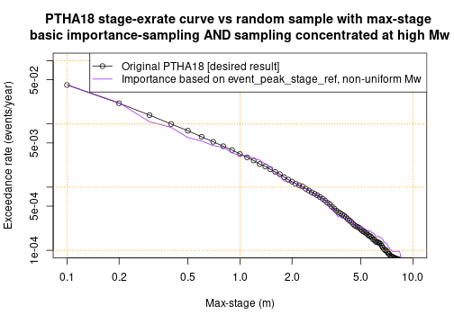

# Randomly sample PTHA18 scenarios on a source-zone
---------------------------------------------------

The PTHA18 often includes thousands or tens-of-thousands of scenarios on a
source-zone. For some applications it is impractical to work with all
scenarios. But it may be practical to work with a random sample of scenarios
that have similar statistical properties. 

For example, suppose we wish to conduct a probabilistic tsunami inundation
hazard assessment that requires running computationally expensive inundation
models. It may be impractical to do this for every PTHA18 scenario, but
feasible with a random sample containing hundreds or thousands of scenarios. 

This tutorial demonstrates some approaches to randomly sample scenarios from a
given source-zone in a manner that is statistically consistent with the PTHA18.
This means that one can estimate quantities of interest (such exceedance-rates
at a hazard point) from the random scenarios. One can also simulate inundation
for the random scenarios, and use those simulations to estimate
exceedance-rates at onshore sites where the PTHA18 does not simulate the tsunami.
The result will be approximate, but will converge to the value that would have been
obtained using all the scenarios, as larger random samples are used.

In all cases it is the users responsibility to determine a sample size
sufficient for accurate results, and that the sampling strategy gives stable
results for their application. In general the adequacy of different methods and
sample-sizes will vary case-by-case.

## Get the source-zone event data, and some maximum-stage data.
---------------------------------------------------------------

The first step is to get the scenario data for the source-zone of interest.
Here we choose to work with heterogeneous-slip scenarios from the
`kermadectonga2` source-zone. One could equally work with `variable_uniform`
scenarios, or other source-zones.


```r
# Get the scripts to access the PTHA18
ptha18 = new.env()
source('../../get_PTHA_results.R', local=ptha18, chdir=TRUE)
# Read all heterogeneous-slip scenario metadata (slip_type='stochastic' in PTHA18)
source_zone = 'kermadectonga2'
source_zone_scenarios = ptha18$get_source_zone_events_data(source_zone,  slip_type='stochastic')
```

To illustrate how we can use the random scenarios, it is useful to have the
corresponding tsunami maximum-stage data at a point of interest. Herein we
choose a point just east of Tongatapu in Tonga, which is over the `kermadectonga2`
source-zone. 


```r
event_peak_stage_at_refpoint = ptha18$get_peak_stage_at_point_for_each_event(
    target_point = c(185.1239, -21.0888), # Known location of PTHA18 hazard point
    slip_type='stochastic', # Matches the slip-type used to create scenarios
    all_source_names=source_zone)

# Convenient shorthand
event_peak_stage = event_peak_stage_at_refpoint[[source_zone]]$max_stage
```

When we use importance-sampling techniques below, the `event_peak_stage` variable
will be used to over-represent scenarios with larger `event_peak_stage` (and thus
scenarios with larger waves in the vicinity of the hazard point, near Tongatapu).

# Approach 1: Stratified-sampling by magnitude
-----------------------------------------------

Our simplest random scenario sampling algorithm is `stratified-sampling` by magnitude. We
* Group the scenarios by magnitude
* For each magnitude, sample a given number of scenarios randomly with
  replacement. The chance of sampling each scenario is proportional to its
  conditional probability (defined using the PTHA18 logic-tree mean model herein).

The function which creates the stratified-sample needs to be informed of the
scenario magnitudes, and the scenario rates. From these variables it will
internally compute the scenario conditional probability for each unique
magnitude value (which ranges from 7.2, 7.3, ... 9.6, 9.7, 9.8 in PTHA18), and 
randomly sample the scenarios. 

We also need to specify the number of scenarios to sample for each magnitude.
Herein a constant (12) is used, although in general it can vary with magnitude
(discussed later). The sample sizes used below will be too small to control
errors well in many realistic applications, but were selected to help make the
errors more obvious. 


```r
# Convenient shorthand for the magnitudes and rates in the event table
event_Mw = source_zone_scenarios$events$Mw 
event_rates = source_zone_scenarios$events$rate_annual # Logic-tree mean model

# Make a reproducible random seed to make the code reproducible (this is optional)
set.seed(12345)

# Make the random scenarios
random_scenarios_stratified = ptha18$randomly_sample_scenarios_by_Mw_and_rate(
    event_rates=event_rates,
    event_Mw=event_Mw,
    samples_per_Mw=function(Mw){ 12*(Mw < 9.65) } # Number of samples for each Mw
    )
```

The result is a `data.frame` containing the indices of the random scenarios
`inds`, their magnitudes, `mw`, as well as information on the scenario rates
that will be discussed further below.


```r
# Look at the first few rows
head(random_scenarios_stratified)
```

```
##   inds  mw rate_with_this_mw importance_sampling_scenario_weights_basic
## 1 1116 7.2        0.05704921                                 0.08333333
## 2 1979 7.2        0.05704921                                 0.08333333
## 3 1244 7.2        0.05704921                                 0.08333333
## 4  826 7.2        0.05704921                                 0.08333333
## 5  428 7.2        0.05704921                                 0.08333333
## 6 2264 7.2        0.05704921                                 0.08333333
##   importance_sampling_scenario_weights_self_normalised
## 1                                           0.08333333
## 2                                           0.08333333
## 3                                           0.08333333
## 4                                           0.08333333
## 5                                           0.08333333
## 6                                           0.08333333
##   importance_sampling_scenario_rates_basic
## 1                              0.004754101
## 2                              0.004754101
## 3                              0.004754101
## 4                              0.004754101
## 5                              0.004754101
## 6                              0.004754101
##   importance_sampling_scenario_rates_self_normalised
## 1                                        0.004754101
## 2                                        0.004754101
## 3                                        0.004754101
## 4                                        0.004754101
## 5                                        0.004754101
## 6                                        0.004754101
```
The columns are
* `inds` is the indices of random scenarios in the stratified-sample. This corresponds to
  indices in the `event_Mw` and `event_rates` variables. Because herein these
  are simply columns of the event table, `inds` also also correspond to rows in
  `source_zone_scenarios$events`.
* `mw` is the scenario magnitude. This is the same as
  `event_Mw[random_scenarios_stratified$inds]`
* `rate_with_this_mw` is the rate of ANY scenario with the same magnitude. This
  is the sum of `event_rates` for scenarios with the corresponding magnitude.
  Note THIS IS NOT THE RATE OF THE INDIVIDUAL SCENARIO!
* `importance_sampling_scenario_weights_basic` gives the scenarios weights
  determined by basic importance sampling. For stratified-sampling they are
  constant in each magnitude bin, but later on when we define the
  `event_importance_weighted_sampling_probs` to bias the sampling toward
  scenarios of interest, the weights will be more complicated.
* `importance_sampling_scenario_weights_self_normalised` gives the scenarios
  weights determined by self-normalised importance sampling, which is an
  alternative to basic importance sampling.
* `importance_sampling_scenario_rates_basic` gives a nominal rate for each
  scenario, and is defined as `rate_with_this_mw` multiplied by
  `importance_sampling_scenario_weights_basic`. 
* `importance_sampling_scenario_rates_self_normalised` is another nominal rate
  for each scenario, defined as `rate_with_this_mw` multiplied by
  `importance_sampling_scenario_weights_self_normalised`.

In PTHA18 some earthquake magnitudes are impossible. In this case the scenario
index will take an `NA` value, as will various other variables. We see this at
the end of the current table, for magnitudes `9.7` and `9.8`.


```r
# Look at the last few rows - NA values for magnitudes that are "impossible" according to PTHA18 (rate_annual=0)
tail(random_scenarios_stratified)
```

```
##      inds  mw rate_with_this_mw importance_sampling_scenario_weights_basic
## 297 44267 9.6      5.323646e-05                                 0.08333333
## 298 44098 9.6      5.323646e-05                                 0.08333333
## 299 44274 9.6      5.323646e-05                                 0.08333333
## 300 44264 9.6      5.323646e-05                                 0.08333333
## 301    NA 9.7      0.000000e+00                                         NA
## 302    NA 9.8      0.000000e+00                                         NA
##     importance_sampling_scenario_weights_self_normalised
## 297                                           0.08333333
## 298                                           0.08333333
## 299                                           0.08333333
## 300                                           0.08333333
## 301                                                   NA
## 302                                                   NA
##     importance_sampling_scenario_rates_basic
## 297                             4.436371e-06
## 298                             4.436371e-06
## 299                             4.436371e-06
## 300                             4.436371e-06
## 301                                       NA
## 302                                       NA
##     importance_sampling_scenario_rates_self_normalised
## 297                                       4.436371e-06
## 298                                       4.436371e-06
## 299                                       4.436371e-06
## 300                                       4.436371e-06
## 301                                                 NA
## 302                                                 NA
```

Aside from the impossible magnitudes, we can confirm that we have 12 scenarios
per magnitude, as requested.

```r
table(random_scenarios_stratified$mw)
```

```
## 
## 7.2 7.3 7.4 7.5 7.6 7.7 7.8 7.9   8 8.1 8.2 8.3 8.4 8.5 8.6 8.7 8.8 8.9   9 9.1 
##  12  12  12  12  12  12  12  12  12  12  12  12  12  12  12  12  12  12  12  12 
## 9.2 9.3 9.4 9.5 9.6 9.7 9.8 
##  12  12  12  12  12   1   1
```

Some of the scenarios may be repeated - because we need to use random sampling
with replacement to get results that are statistically consistent with the
PTHA18.

## Approximating PTHA18 max-stage exceedance-rates with the random scenario subset
----------------------------------------------------------------------------------

To demonstrate how exceedance-rate curves can be approximated from the random
scenarios, consider the tsunami max-stage exceedance-rates at the
aforementioned point offshore of Tongatapu. (Any other location could similarly be
chosen). 

In the full PTHA, the `event_peak_stage` exceedance-rate curve at this point is:

```r
stage_seq = seq(0.1, 20, by=0.1)
stage_exrates_ptha18 = sapply(stage_seq, function(x) sum(event_rates*(event_peak_stage > x)))
```

That can be approximated using only the random sample as follows:

```r
stage_exrates_rs_stratified = sapply(stage_seq, 
    function(x){
        sum(random_scenarios_stratified$importance_sampling_scenario_rates_basic * 
            (event_peak_stage[random_scenarios_stratified$inds] > x), na.rm=TRUE)
    })
```

The exceedance-rate curve derived from the random scenarios is similar to the
PTHA18 result, but there is some error due to the limited number of samples
(see figure below). As we increase the number of random scenarios per
magnitude, the accuracy will improve (on average) until the difference is
negligible. In this sense the random sample is statistically consistent with
the PTHA18.


*Note: Here and below we suppress the plotting code for readability. It can be found in the file
random_scenario_sampling.Rmd that was used to create this document.*

Below we do the same computation, but with more random scenario samples (120
per Mw, instead of 12). This leads to improved agreement with the PTHA18
exceedance-rates, as expected. On average the error scales with the inverse
square-root of the sample-size (although there is random variation from sample to sample).

```r
# Make the random scenarios -- use 120 per magnitude, instead of 12
random_scenarios_stratified_many = ptha18$randomly_sample_scenarios_by_Mw_and_rate(
    event_rates=event_rates,
    event_Mw=event_Mw,
    samples_per_Mw=function(Mw){ 120 } # Number of samples for each Mw
    )

# Compute the max-stage exceedance-rates
stage_exrates_rs_stratified_many = sapply(stage_seq, 
    function(x){
        sum(random_scenarios_stratified_many$importance_sampling_scenario_rates_basic * 
            (event_peak_stage[random_scenarios_stratified_many$inds] > x), na.rm=TRUE)
    })
```


In this example we are considering the exceedance-rate curve at a hazard point
in the deep ocean, where the PTHA18 already provides exceedance-rate curves
based on every scenario in the PTHA. So at this site there is no reason to use
the Monte-Carlo approximation. But comparison with the PTHA18 solution provides
an opportunity to test the approach. 

However, if we have simulated tsunami inundation for the randomly sampled
scenarios, then the Monte-Carlo approximation could also be applied to
approximate exceedance-rate curves onshore (where the PTHA18 does not already
give valid solutions for every scenario). 

While it may be computationally prohibitive to simulate tsunami inundation for
every PTHA scenario, it may be feasible for a random subset of scenarios. So
long as sufficiently many scenarios are sampled, it will also be accurate. That
is the motivation for Monte-Carlo approaches. 

Finally, it is worth noting that the stratified random sample defined above has
many scenario with low `event_peak_stage` values:

```r
quantile(event_peak_stage[random_scenarios_stratified$inds], seq(0, 1, len=5), na.rm=TRUE)
```

```
##           0%          25%          50%          75%         100% 
## 7.280861e-04 3.522491e-02 2.242641e-01 8.319299e-01 1.505336e+01
```
Half of all the scenarios have max-stage less than 
0.224
m. This is too small to be of interest in most tsunami hazard studies, and 
contributes to the Monte-Carlo errors seen in the previous figure.

Alternative Monte-Caro sampling techniques can improve the representation of
larger tsunami scenarios near a site of interest. This can improve the accuracy
of the results, without increasing the number of random scenarios used. Two
techniques are explored below:
* Importance sampling
* Non-uniform sampling of different magnitude bins

They can be used separately or in combination.

Use of the techniques below requires some judgement. Poor decisions may increase
the error. Alternatively, simply increasing the number of random scenarios will
always lead to an accuracy improvement (on-average), but can have a prohibitive
computational cost.

# Improving the Monte-Carlo efficiency: Stratified/importance-sampling to emphasise higher max-stages
-------------------------------------------------------------------------------------

The theory of importance-sampling can be used to more strongly concentrate the
Monte-Carlo sample on scenarios that have higher maximum-stage values. 

Here the sampling algorithm is:
* Group the scenarios by magnitude
* For each magnitude, sample a given number of scenarios with replacement, with
  the chance of sampling each scenario proportional to **a user-specified importance weighted sampling distribution**.
  The latter step is where this method differs from regular stratified-sampling sampling.
* The theory of importance-sampling provides a means to adjust the random
  scenario weights to correct for this preferential sampling. There are many
  statistical texts which cover importance-sampling, 
  [for instance see Chapter 9 of this freely available draft book by Art Owen](https://statweb.stanford.edu/~owen/mc/). 

The examples below set:
```r
event_importance_weighted_sampling_probs = (event_rate * event_peak_stage) # Importance sampling
```
where the `event_peak_stage` is the tsunami maxima at our site offshore of Tongatapu.
Compared to regular stratified-sampling this approach over-represents scenarios
with high `event_peak_stage`. Note regular stratified-sampling would be
equivalent to:
```r
event_importance_weighted_sampling_probs = event_rate # Regular stratified sampling 
```

The stratified/importance-sampling approach is useful for studying tsunami hazards near to the site from which
`event_peak_stage` was extracted (e.g. near Tongatapu in this case). 

The `event_peak_stage` definition used here would not be a good choice for
studying the hazard far from the site at which `event_peak_stage` was extracted
(e.g. in New Zealand, or Australia). In those case a different location should
be used to specify `event_peak-stage`.

Alternative choices of the `event_importance_weighted_sampling_probs` could be
made. Good choices should up-weight scenarios that are likely to be important
for the application (e.g. generate significant inundation), and down-weight
unimportant scenarios (e.g. that cause negligable inundation).

## Stratified/importance-sampling (with uniform sampling of magnitude-bins)

Although Stratified/importance-sampling can be comined with non-uniform
sampling of magnitude-bins, we first illustrate the technique using uniform
sampling.


```r
# Random scenarios -- importance sampling, 12 samples per magnitude-bin.
random_scenarios_stage_weighted = ptha18$randomly_sample_scenarios_by_Mw_and_rate(
    event_rates=event_rates,
    event_Mw=event_Mw,
    event_importance_weighted_sampling_probs = (event_rates * event_peak_stage),
    samples_per_Mw=function(Mw){ 12*(Mw < 9.65) }
    )

# Compute the max-stage exceedance-rates
stage_exrates_rs_stage_weighted = sapply(stage_seq, 
    function(x){
        sum(random_scenarios_stage_weighted$importance_sampling_scenario_rates_basic * 
            (event_peak_stage[random_scenarios_stage_weighted$inds] > x), na.rm=TRUE)
    })
```

With stratified/importance-sampling we get much better agreement with the
PTHA18 max-stage exceedance-rate curve, compared with the earlier Monte-Carlo
results that also used 12 scenarios in each magnitude-bin. 


The improvement occurs because, compared to the regular stratified-sampling,
stratified/importance-sampling better represents scenarios with high max-stage
values at our Tongatapu site. 

```r
quantile(event_peak_stage[random_scenarios_stage_weighted$inds], seq(0, 1, len=5), na.rm=TRUE)
```

```
##           0%          25%          50%          75%         100% 
##  0.002298993  0.112416586  0.581845820  2.162981093 17.066255569
```
This is because of how `event_peak_stage` was included in the definition of the
`event_importance_weighted_sampling_probs`.


# Improving the efficiency: Non-uniform sampling of magnitude-bins
------------------------------------------------------------------

Another approach to improving the Monte-Carlo efficiency is to sample some
magnitude bins more than others. This can be done by adjusting `samples_per_Mw`. 

For both stratified-sampling and stratified/importance-sampling, it is possible
to calculate the theoretically optimal sampling effort in each magnitude bin,
IF we are given the site, scenario-frequency-model, and a threshold stage to
optimize. The optimal solution minimise the variance (over repeated samples) of
the Monte-Carlo exceedance rate at the threshold stage, given the site and
scenario-frequency model. 

We are usually interested in a range of sites and threshold stage values, and so no
single optimal solution is adequate. But the optimal solutions are a useful guide. 

## Optimal non-uniform sampling with stratified-sampling
--------------------------------------------------------

Here the optimal non-uniform sampling effort for a threshold stage of 2m is computed,
assuming that stratified-sampling is used.


```r
# Vector with magnitude values 7.2, 7.3, ... 9.6, 9.7, 9.8
unique_Mws = ptha18$unique_sorted_with_check_for_even_spacing(event_Mw)

# Number of samples used 
TOTAL_SAMPLES = sum(12*(unique_Mws < 9.65))

# stage_threshold = 2 -- assumes stratified-sampling (because we don't specify
# event_importance_weighted_sampling_probs)
non_uniform_samples_2 = ptha18$get_optimal_number_of_samples_per_Mw(
    event_Mw, event_rates, event_peak_stage, stage_threshold=2, 
    total_samples=TOTAL_SAMPLES)

# Look at the data structure
non_uniform_samples_2
```

```
##     Mw  Nsamples variance_numerator
## 1  7.2  0.000000       0.000000e+00
## 2  7.3  0.000000       0.000000e+00
## 3  7.4  0.000000       0.000000e+00
## 4  7.5  0.000000       0.000000e+00
## 5  7.6  0.000000       0.000000e+00
## 6  7.7  0.000000       0.000000e+00
## 7  7.8  0.000000       0.000000e+00
## 8  7.9  0.000000       0.000000e+00
## 9  8.0  0.000000       0.000000e+00
## 10 8.1 18.336778       7.217510e-08
## 11 8.2 21.465236       9.890373e-08
## 12 8.3 25.888189       1.438615e-07
## 13 8.4 26.145636       1.467370e-07
## 14 8.5 22.086874       1.047152e-07
## 15 8.6 28.033770       1.686958e-07
## 16 8.7 26.615053       1.520534e-07
## 17 8.8 27.353898       1.606127e-07
## 18 8.9 25.287520       1.372631e-07
## 19 9.0 23.107168       1.146132e-07
## 20 9.1 19.918403       8.516288e-08
## 21 9.2 14.568243       4.555706e-08
## 22 9.3  9.989909       2.142222e-08
## 23 9.4  6.341408       8.632025e-09
## 24 9.5  3.045113       1.990436e-09
## 25 9.6  1.816802       7.085274e-10
## 26 9.7  0.000000       0.000000e+00
## 27 9.8  0.000000       0.000000e+00
```

In the variable `non_uniform_samples_2`, the optimal sampling effort is
contained in the column `Nsamples`. Although only integer sampling efforts can
be used in practice, the solution gives real numbers because the optimization
technique is continuous. Therefore rounding is required before using these
values.

Below we do the same calculation at a stage-threshold of 5m

```r
# stage_threshold = 5 -- assumes stratified-sampling (because we don't specify
# event_importance_weighted_sampling_probs)
non_uniform_samples_5 = ptha18$get_optimal_number_of_samples_per_Mw(
    event_Mw, event_rates, event_peak_stage, stage_threshold=5, 
    total_samples=TOTAL_SAMPLES)
```

The figure shows that these optimal solutions place most sampling effort on intermediate and high
magnitudes. The details vary depending on the stage threshold (2m or 5m here).


In practical applications, only one non-uniform sampling effort can be selected. It should
perform reasonably with different choices of the stage threshold, different
sites, and even different `event_rates` (if we explore epistemic uncertainties
in the source-frequencies). 

One approach involves a compromise between the optimal solutions and uniform sampling. Here we:
* Use uniform-sampling for 25% of the scenarios, which ensures that all magnitude-bins are represented, and gives some robustness in cases where the non-uniform-sampling efforts might be highly non-optimal (e.g. for other sites or scenario-frequency models)
* Use the average of the non-uniform results for the remaining 75% of scenarios. 

In practice the choice of stage thresholds informing the non-uniform result
should be varied according to the application, to focus on offshore tsunami
wave sizes that are likely to produce hazardous waves at the site of interest.


```r
# Uniform sampling up to magnitude 9.6
uniform_sampling_effort = 12 * (unique_Mws < 9.65) 

# Weight the optimal solutions with different stage-thresholds
average_nonuniform_sampling_effort = 
    0.5*(non_uniform_samples_2$Nsamples + non_uniform_samples_5$Nsamples)

# 25% uniform, 75% weighted non-uniform, rounded to integer values
chosen_sampling_effort_stratified = round(
    0.25*uniform_sampling_effort + 
    0.75*(average_nonuniform_sampling_effort))
```

Below we sample non-uniformly, using this chosen non-uniform sampling effort.


```r
# Make the random scenarios
random_scenarios_mw_weighted = ptha18$randomly_sample_scenarios_by_Mw_and_rate(
    event_rates=event_rates,
    event_Mw=event_Mw,
    samples_per_Mw=approxfun(unique_Mws, chosen_sampling_effort_stratified, method='constant')
    )

# Compute the max-stage exceedance-rates
stage_exrates_rs_mw_weighted = sapply(stage_seq, 
    function(x){
        sum(random_scenarios_mw_weighted$importance_sampling_scenario_rates_basic * 
            (event_peak_stage[random_scenarios_mw_weighted$inds] > x), na.rm=TRUE)
    })
```

The figure below compares the Monte-Carlo result with the exact solution. In
practice we find the combination of stratified-sampling with non-uniform
sampling is somewhat better than pure stratified-sampling (on average), but not
dramatically so.  However in some circumstances it could be very beneficial
(e.g. if most lower magnitude-bins were unimportant to the hazard).


Compared to the case of regular stratified-sampling with uniform sampling, we
can see that the use of non-uniform sampling is leading to slightly better representation
of large tsunamis (although to a lesser extent than stratified/importance-sampling).

```r
quantile(event_peak_stage[random_scenarios_mw_weighted$inds], seq(0, 1, len=5), na.rm=TRUE)
```

```
##         0%        25%        50%        75%       100% 
##  0.0014247  0.1407757  0.4558249  1.1527460 15.9368391
```

## Optimal non-uniform sampling effort with stratified/importance-sampling
--------------------------------------------------------------------------

Below we repeat the optimal sampling-effort calculations for
stratified/importance-sampling. The same stage-threshold values are used (2m
and 5m), and the solutions are combined with uniform-sampling in the same way
to derive the chosen sampling effort. 


```r
TOTAL_SAMPLES = sum(12*(unique_Mws < 9.65)) # Number of samples used

# stage_threshold = 2
non_uniform_samples_IS_2 = ptha18$get_optimal_number_of_samples_per_Mw(
    event_Mw, event_rates, event_peak_stage, stage_threshold=2, 
    event_importance_weighted_sampling_probs = (event_rates*event_peak_stage), # Importance sampling
    total_samples=TOTAL_SAMPLES)

# stage_threshold = 5
non_uniform_samples_IS_5 = ptha18$get_optimal_number_of_samples_per_Mw(
    event_Mw, event_rates, event_peak_stage, stage_threshold=5, 
    event_importance_weighted_sampling_probs = (event_rates*event_peak_stage), # Importance sampling
    total_samples=TOTAL_SAMPLES)
```

The logic to combine the sampling effort alternatives follows the approach used above.


```r
# Uniform sampling up to magnitude 9.6
uniform_sampling_effort = 12 * (unique_Mws < 9.65) 

# Weight the optimal solutions with different stage-thresholds
average_nonuniform_sampling_effort_IS = 
    0.5*(non_uniform_samples_IS_2$Nsamples + non_uniform_samples_IS_5$Nsamples)

# 25% uniform, 75% weighted non-uniform, rounded to integer values
chosen_sampling_effort_IS = round(
    0.25*uniform_sampling_effort + 
    0.75*(average_nonuniform_sampling_effort_IS))
```

Now we generate the random scenarios. 


```r
# Make the random scenarios -- 
random_scenarios_stage_mw_weighted = ptha18$randomly_sample_scenarios_by_Mw_and_rate(
    event_rates=event_rates,
    event_Mw=event_Mw,
    event_importance_weighted_sampling_probs = (event_rates * event_peak_stage),
    samples_per_Mw=approxfun(unique_Mws, chosen_sampling_effort_IS, method='constant')
    )

# Compute the max-stage exceedance-rates
stage_exrates_rs_stage_mw_weighted = sapply(stage_seq, 
    function(x){
        sum(random_scenarios_stage_mw_weighted$importance_sampling_scenario_rates_basic * 
            (event_peak_stage[random_scenarios_stage_mw_weighted$inds] > x), na.rm=TRUE)
    })
```

In practice we have found the combination of stratified/importance-sampling
with non-uniform sampling is somewhat better (on average) than just
stratified/importance-sampling, but not dramatically so. However in some
circumstances it could be very beneficial (e.g. if most low-magnitude-bins are
unimportant to the hazard).



The distribution of `event_peak_stage` values in the random sample is similar to the other case
that used importance-sampling. Note that compared to the samples that did not use importance-sampling,
there is much better representation of large tsunamis.

```r
quantile(event_peak_stage[random_scenarios_stage_mw_weighted$inds], seq(0, 1, len=5), na.rm=TRUE)
```

```
##          0%         25%         50%         75%        100% 
##  0.01279841  0.42490360  1.46761596  3.59824705 19.64801216
```

# Summary

Stratified/importance sampling can give valid Monte-Carlo results while better
representing scenarios that produce large waves near a particular site of
interest. This is useful for site-specific hazard assessments.

Non-uniform sampling of magnitude bins can offer an extra efficiency
improvement for both stratified and stratified/importance sampling.

The accuracy of all of the above techiques can be reliably improved by sampling
more scenarios. For each technique, if we increase the sampling effort by a
factor `X` without changing anything else, then on average the error will reduce
inversely with the square-root of `X`. 

Tthe sampling effort used herein will be too small for many applications. It
was chosen to make the errors more obvious.

<!---

## Summary of non-uniform sampling strategies.

Although non-uniform sampling of magnitude-bins can be useful, in our
experience the improvements tend to be modest, a (compared with other techniques shown below).

Because there is more sampling at higher magnitudes, the techniques sample larger max-stage
scenarios more often, as compared with the previous approach. However the
effect is not particularly strong -- many scenarios with small `event_peak_stage` values are sampled, 
although in hazard applications these scenarios are not so likely to be of interest.

```r
# Ad-hoc choice of non-uniform sampling
quantile(event_peak_stage[random_scenarios_mw_weighted1$inds], seq(0, 1, len=5), na.rm=TRUE)
```

```
## Error in quantile(event_peak_stage[random_scenarios_mw_weighted1$inds], : object 'random_scenarios_mw_weighted1' not found
```

```r
# Semi-optimal choice of non-uniform sampling
quantile(event_peak_stage[random_scenarios_mw_weighted2$inds], seq(0, 1, len=5), na.rm=TRUE)
```

```
##         0%        25%        50%        75%       100% 
##  0.0014247  0.1407757  0.4558249  1.1527460 15.9368391
```
The reason we sample many small max-stage scenarios is that the
`kermadectonga2` source-zone is very large, but the particular site of interest
(offshore of Tongatapu) is mainly affected by a small region on the source-zone. 

If we are mostly interested in larger waves, then this seems like an
inefficient sampling approach for our site.

Much greater improvements can be obtained using the importance-sampling
technique outlined below.

### Summary of importance-sampling

Using importance sampling it becomes much easier to well represent scenarios
that have large waves near a site of interest. In practice we find the improvements
can be very substantial compared with stratified-sampling

Users should beware that importance sampling can backfire if the choice of
`event_importance_weighted_sampling_probs` is poor. We do not have a foolproof
method to set it, but expect the method here will work well in many cases.
Users can check for any problems by studying the performance of their choice
under repeated sampling (at PTHA18 points). A poor choice will lead to erratic
behaviour, as compared to the simpler approaches. 

-->
