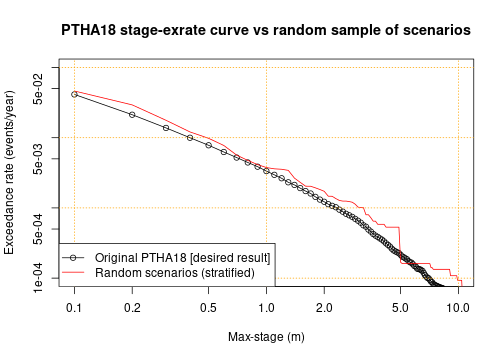

# Randomly sample PTHA18 scenarios on a source-zone
---------------------------------------------------

The PTHA18 often includes thousands or tens-of-thousands of scenarios on a
source-zone. For some applications it is impractical to work with all
scenarios, but may be practical to work with a random sample of scenarios that
have similar statistical properties. 

For example, suppose we wish to conduct a probabilistic tsunami inundation
hazard assessment, which will require running computationally expensive
inundation models for every scenario. It may be impractical to do this for
every PTHA18 scenario, but feasible with a random sample containing hundreds or
thousands of scenarios. 

This tutorial examines a few approaches to randomly sample scenarios from a
given source-zone in a manner that is statistically consistent with the PTHA18.
This means that one can derive quantities of interest (such as the
maximum-stage exceedance-rate at a hazard point) from the random scenarios, and
the result will be arbitrarily close to the PTHA18 values IF the random sample
is sufficiently large. In all cases it is the users responsibility to determine
a sample size sufficient for accurate results, and that the sampling strategy
gives stable results for their application. In general the adequacy of
different methods and sample-sizes will vary case-by-case.

## Get the source-zone event data, and some maximum-stage data.
---------------------------------------------------------------

The first step is to get the scenario data for the source-zone of interest.
Here we choose to work with heterogeneous-slip scenarios from the
`kermadectonga2` source-zone. 

```r
# Get the scripts to access the PTHA18
ptha18 = new.env()
source('../../get_PTHA_results.R', local=ptha18, chdir=TRUE)
# Read all heterogeneous-slip scenario metadata (slip_type='stochastic' in PTHA18)
source_zone = 'kermadectonga2'
kt2_scenarios = ptha18$get_source_zone_events_data(source_zone,  slip_type='stochastic')
```

To illustrate how we can use the random scenarios, it is useful to have the
corresponding tsunami maximum-stage data at a point of interest. Herein we
choose a point just east of Tonga, which is over the `kermadectonga2`
source-zone (the calculations below could be equally applied to any other
point and source-zone).


```r
event_peak_stage_at_refpoint = ptha18$get_peak_stage_at_point_for_each_event(
    target_point = c(185.1239, -21.0888), # Known location of PTHA18 hazard point
    slip_type='stochastic',
    all_source_names=source_zone)

# Convenient shorthand
event_peak_stage = event_peak_stage_at_refpoint$kermadectonga2$max_stage
```

# Approach 1: Random scenario sampling, stratified by magnitude
----------------------------------------------------

Our simplest random scenario sampling algorithm is termed `stratified-sampling` and proceeds as follows
* Group the scenarios by magnitude
* For each magnitude, sample a given number of scenarios with replacement, with
  the chance of sampling each scenario proportional to its conditional
  probability.

The function which does this only requires knowledge of the scenario
magnitudes, and the scenario rates. From these variables the function will
internally compute the scenario conditional probability for each unique
magnitude value (which ranges from 7.2, 7.3, ... 9.6, 9.7, 9.8 in PTHA18). 

We also need to specify the number of scenarios to sample for each magnitude. 
Herein a constant (12) is used, although in general it can vary with magnitude
(discussed later).


```r
# Convenient shorthand for the magnitudes and rates in the event table
event_Mw = kt2_scenarios$events$Mw 
event_rates = kt2_scenarios$events$rate_annual

# Make a reproducible random seed to make the code reproducible (this is optional)
set.seed(12)

# Make the random scenarios
random_scenarios_stratified = ptha18$randomly_sample_scenarios_by_Mw_and_rate(
    event_rates=event_rates,
    event_Mw=event_Mw,
    samples_per_Mw=function(Mw){ 12*(Mw < 9.65) } # Number of samples for each Mw
    )
```

The result is a `data.frame` containing the indices of the random scenarios
`inds`, their magnitudes, `mw`, as well as information on the scenario rates
that will be discussed further below.


```r
# Look at the first few rows
head(random_scenarios_stratified)
```

```
##   inds  mw rate_with_this_mw importance_sampling_scenario_weights_basic
## 1  450 7.2        0.05704921                                 0.08333333
## 2  336 7.2        0.05704921                                 0.08333333
## 3 2907 7.2        0.05704921                                 0.08333333
## 4 1093 7.2        0.05704921                                 0.08333333
## 5  546 7.2        0.05704921                                 0.08333333
## 6   91 7.2        0.05704921                                 0.08333333
##   importance_sampling_scenario_weights_self_normalised
## 1                                           0.08333333
## 2                                           0.08333333
## 3                                           0.08333333
## 4                                           0.08333333
## 5                                           0.08333333
## 6                                           0.08333333
##   importance_sampling_scenario_rates_basic
## 1                              0.004754101
## 2                              0.004754101
## 3                              0.004754101
## 4                              0.004754101
## 5                              0.004754101
## 6                              0.004754101
##   importance_sampling_scenario_rates_self_normalised
## 1                                        0.004754101
## 2                                        0.004754101
## 3                                        0.004754101
## 4                                        0.004754101
## 5                                        0.004754101
## 6                                        0.004754101
```
The columns are
* `inds` is the indices of the randomly selected scenarios. This corresponds to
  indices in the `event_Mw` and `event_rates` variables. Because herein these
  are simply columns of the event table, `inds` also also correspond to rows in
  `kt2_scenarios$events`.
* `mw` is the scenario magnitude. This is the same as
  `event_Mw[random_scenarios_stratified$inds]`
* `rate_with_this_mw` is the rate of ANY scenario with the same magnitude. This
  is the sum of `event_rates` for scenarios with the corresponding magnitude.
  Note THIS IS NOT THE RATE OF THE INDIVIDUAL SCENARIO!
* `importance_sampling_scenario_weights_basic` gives the scenarios weights
  determined by basic importance sampling. In this simple example they are
  constant in each magnitude bin, but later on when we define the
  `event_importance_weighted_sampling_probs` to bias the sampling toward
  scenarios of interest, the weights will be more complicated.
* `importance_sampling_scenario_weights_self_normalised` gives the scenarios
  weights determined by self-normalised importance sampling, which is an
  alternative to basic importance sampling.
* `importance_sampling_scenario_rates_basic` gives a nominal rate for each
  scenario, and is defined as `rate_with_this_mw` multiplied by
  `importance_sampling_scenario_weights_basic`. 
* `importance_sampling_scenario_rates_self_normalised` is another nominal rate
  for each scenario, defined as `rate_with_this_mw` multiplied by
  `importance_sampling_scenario_weights_self_normalised`.

In PTHA18 some earthquake magnitudes are impossible. In this case the scenario index will
take an `NA` value, as will various other variables. We see this at the end of the current
table, for magnitudes `9.7` and `9.8`.


```r
# Look at the last few rows - NA values for magnitudes that are "impossible" according to PTHA18 (rate_annual=0)
tail(random_scenarios_stratified)
```

```
##      inds  mw rate_with_this_mw importance_sampling_scenario_weights_basic
## 297 44105 9.6      5.323646e-05                                 0.08333333
## 298 44105 9.6      5.323646e-05                                 0.08333333
## 299 44151 9.6      5.323646e-05                                 0.08333333
## 300 44102 9.6      5.323646e-05                                 0.08333333
## 301    NA 9.7      0.000000e+00                                         NA
## 302    NA 9.8      0.000000e+00                                         NA
##     importance_sampling_scenario_weights_self_normalised
## 297                                           0.08333333
## 298                                           0.08333333
## 299                                           0.08333333
## 300                                           0.08333333
## 301                                                   NA
## 302                                                   NA
##     importance_sampling_scenario_rates_basic
## 297                             4.436371e-06
## 298                             4.436371e-06
## 299                             4.436371e-06
## 300                             4.436371e-06
## 301                                       NA
## 302                                       NA
##     importance_sampling_scenario_rates_self_normalised
## 297                                       4.436371e-06
## 298                                       4.436371e-06
## 299                                       4.436371e-06
## 300                                       4.436371e-06
## 301                                                 NA
## 302                                                 NA
```

Aside from the impossible magnitudes, we can confirm that we have 12 scenarios
per magnitude, as requested.

```r
table(random_scenarios_stratified$mw)
```

```
## 
## 7.2 7.3 7.4 7.5 7.6 7.7 7.8 7.9   8 8.1 8.2 8.3 8.4 8.5 8.6 8.7 8.8 8.9   9 9.1 
##  12  12  12  12  12  12  12  12  12  12  12  12  12  12  12  12  12  12  12  12 
## 9.2 9.3 9.4 9.5 9.6 9.7 9.8 
##  12  12  12  12  12   1   1
```

Some of the scenarios may be repeated - because we need to use random sampling
with replacement to get results that are statistically consistent with the
PTHA18.

## Approximating PTHA18 max-stage exceedance-rates with the random scenario subset
----------------------------------------------------------------------------------

What do we mean by saying the random scenarios are statistically consistent
with the PTHA18? The key point is that we can approximate the PTHA18 results
using a randomly chosen subset scenarios, which in some cases may contain many
fewer scenarios that the full PTHA18. This can be advantageous, for example if
we need to run new tsunami simulations for all the scenarios to get information
at our site of interest.

To demonstrate this we consider the tsunami max-stage exceedance-rates at the
aforementioned point offshore of Tonga. Any other location could similarly be
chosen. 

In the full PTHA, we can compute the max-stage exceedance rates at this point as:

```r
stage_seq = seq(0.1, 20, by=0.1)
stage_exrates_ptha18 = sapply(stage_seq, function(x) sum(event_rates*(event_peak_stage > x)))
```

The analogous calculation using only the random sample is:

```r
stage_exrates_rs_stratified = sapply(stage_seq, 
    function(x){
        sum(random_scenarios_stratified$importance_sampling_scenario_rates_basic * 
            (event_peak_stage[random_scenarios_stratified$inds] > x), na.rm=TRUE)
    })
```

The max-stage exceedance-rate curve derived from the random scenarios is
similar to the PTHA18 result, but there is some error due to the limited number
of samples (see figure below). As we increase the number of random scenarios
per magnitude, the accuracy will improve (on average) until the difference is
negligible. In this sense the random sample is statistically consistent with
the PTHA18.


*Note: Here and below we suppress the plotting code for readability. It can be found in the file
random_scenario_sampling.Rmd that was used to create this document.*

Below we do the same computation, but with more random scenario samples (120
per Mw, instead of 12). The figure shows this leads to improved agreement with
the PTHA18 exceedance-rates, as expected. On average the accuracy will improve
as the sample size is increased.

```r
# Make the random scenarios -- use 120 per magnitude, instead of 12
random_scenarios_stratified_many = ptha18$randomly_sample_scenarios_by_Mw_and_rate(
    event_rates=event_rates,
    event_Mw=event_Mw,
    samples_per_Mw=function(Mw){ 120 } # Number of samples for each Mw
    )

# Compute the max-stage exceedance-rates
stage_exrates_rs_stratified_many = sapply(stage_seq, 
    function(x){
        sum(random_scenarios_stratified_many$importance_sampling_scenario_rates_basic * 
            (event_peak_stage[random_scenarios_stratified_many$inds] > x), na.rm=TRUE)
    })
```


In this example we are considering the max-stage exceedance-rates at a hazard
point, where we can easily use the full PTHA18 results. So for this example
there is no reason to use random sampling of scenarios. Why might we want to
use random scenarios? Suppose we were interested in the tsunami
inundation-depth exceedance rates at a nearby point. The PTHA18 does not
simulate inundation, and so we would need to run an inundation model for every
scenario. This is likely computationally prohibitive for the full set of PTHA18
scenarios, but it may be feasible for a random subset of scenarios. So long as
sufficiently many scenarios are sampled, it will also be accurate. 

There are also other techniques that may improve the accuracy of the results in
particular cases, without increasing the number of random scenarios used. The
idea is to use case-specific knowledge to bias the sampling toward scenarios of
interest, while accounting for this in the scenario rate calculation (to retain
consistency with PTHA18). Some of these techniques are explored below. Beware
their use requires judgement, and poor decisions may increase the error. In
contrast, simply increasing the number of scenarios will always lead to an
accuracy improvement on-average.


# Approach 2: Random scenario sampling, with more scenarios at magnitudes of interest
--------------------------------------------------------------------------

The stratified random sample that was defined above has many scenario with low
maximum-stage values, which are not of particular interest for this study. For
instance half of all the scenarios have max-stage less than 
0.171
m, which seems too small to be of much interest in most tsunami hazard studies. 

```r
quantile(event_peak_stage[random_scenarios_stratified$inds], seq(0, 1, len=5), na.rm=TRUE)
```

```
##           0%          25%          50%          75%         100% 
## 1.035424e-04 3.543817e-02 1.705270e-01 8.654967e-01 1.619465e+01
```
In practice we will be interested in larger waves. A potentially improved
strategy is to sample more scenarios at higher magnitudes, which are more
likely to generate larger waves. We can do this by adjusting `samples_per_Mw`.
Many approaches could be tried; below we illustrate 2 alternatives.

## Manually enforcing more sampling at higher magnitudes

Here we try increasing the number of scenarios at higher magnitudes. An ad-hoc choice
was made to varying the sampling effort linearly from 6 scenarios per bin at Mw 7.2, up
to 18 scenarios at Mw 9.6. This choice leads to the same number of scenarios as
the previous approach.


```r
# 7.2, 7.3, ... 9.6, 9.7, 9.8
unique_Mws = ptha18$unique_sorted_with_check_for_even_spacing(event_Mw)

# Linear varying from 6 (Mw 7.2) up to 18 (Mw 9.6)
sampling_effort_linear = approxfun(unique_Mws, 
    (unique_Mws < 9.65)*round( 6 + 12 * (unique_Mws - 7.15)/(9.65 - 7.15) ),
    method='constant')

# Make the random scenarios
random_scenarios_mw_weighted1 = ptha18$randomly_sample_scenarios_by_Mw_and_rate(
    event_rates=event_rates,
    event_Mw=event_Mw,
    samples_per_Mw=sampling_effort_linear 
    )

# Compute the max-stage exceedance-rates
stage_exrates_rs_mw_weighted1 = sapply(stage_seq, 
    function(x){
        sum(random_scenarios_mw_weighted1$importance_sampling_scenario_rates_basic * 
            (event_peak_stage[random_scenarios_mw_weighted1$inds] > x), na.rm=TRUE)
    })
```

In this particular case we do not really see improved agreement with the
max-stage vs exceedance-rate curve (compared with using 12 scenarios for each
magnitude bin). This could reflect that our magnitude-sampling method is not very
beneficial for this problem (at the end of this tutorial we check this). The
benefit of putting more sampling effort into higher magnitudes will vary
case-by-case; it is most useful when you have strong reason to think that low
magnitudes are unimportant for your study. A poor decision could decrease the
accuracy - for instance if lower magnitudes were actually important to the
hazard and were insufficiently sampled.


## Semi-automatic calculation of the non-uniform sampling effort.

It is possible to calculate the theoretically optimum sampling effort in each magnitude bin
if we are given the site, scenario-frequency-model, and threshold stage. Although we are usually
interested in a range of sites and threshold stage values, the optimial solutions are a useful guide.

Here we compute the optimal sampling effort for a threshold stage of 2m

```r
TOTAL_SAMPLES = sum(12*(unique_Mws < 9.65)) # Number of samples used above

# stage_threshold = 2
non_uniform_samples_2 = ptha18$get_optimal_number_of_samples_per_Mw(
    event_Mw, event_rates, event_peak_stage, stage_threshold=2, 
    total_samples=TOTAL_SAMPLES)

# Look at the data structure
non_uniform_samples_2
```

```
##     Mw  Nsamples variance_numerator
## 1  7.2  0.000000       0.000000e+00
## 2  7.3  0.000000       0.000000e+00
## 3  7.4  0.000000       0.000000e+00
## 4  7.5  0.000000       0.000000e+00
## 5  7.6  0.000000       0.000000e+00
## 6  7.7  0.000000       0.000000e+00
## 7  7.8  0.000000       0.000000e+00
## 8  7.9  0.000000       0.000000e+00
## 9  8.0  0.000000       0.000000e+00
## 10 8.1 18.336778       7.217510e-08
## 11 8.2 21.465236       9.890373e-08
## 12 8.3 25.888189       1.438615e-07
## 13 8.4 26.145636       1.467370e-07
## 14 8.5 22.086874       1.047152e-07
## 15 8.6 28.033770       1.686958e-07
## 16 8.7 26.615053       1.520534e-07
## 17 8.8 27.353898       1.606127e-07
## 18 8.9 25.287520       1.372631e-07
## 19 9.0 23.107168       1.146132e-07
## 20 9.1 19.918403       8.516288e-08
## 21 9.2 14.568243       4.555706e-08
## 22 9.3  9.989909       2.142222e-08
## 23 9.4  6.341408       8.632025e-09
## 24 9.5  3.045113       1.990436e-09
## 25 9.6  1.816802       7.085274e-10
## 26 9.7  0.000000       0.000000e+00
## 27 9.8  0.000000       0.000000e+00
```
The optimal sampling effort is contained in the column `Nsamples`. It is not a
whole number because the optimization technique treats the sampling effort as
continuous. Thus rounding will be required before using these values.

Here we do the same for a stage-threshold of 5m.

```r
# stage_threshold = 5
non_uniform_samples_5 = ptha18$get_optimal_number_of_samples_per_Mw(
    event_Mw, event_rates, event_peak_stage, stage_threshold=5, 
    total_samples=TOTAL_SAMPLES)
```

By visual inspection we see that the optimal solutions place most sampling
effort on intermediate and high magnitudes, with details depending on the stage threshold.


In practice we can only choose one non-uniform sampling effort, which we would
like to be robust to different choices of the stage threshold, different sites,
and even different `event_rates` (if we intend to explore epistemic
uncertainties associated with source-frequency uncertainty). One way to do that is:

* Use uniform-sampling for 25% of the scenarios. This ensures that all magnitude-bins are represented.
* Use the average of the non-uniform results for the remaining 75% of scenarios. 

In practice the choice of stage thresholds should be varied according to the application at hand. 


```r
# Uniform sampling up to magnitude 9.6
uniform_sampling_effort = 12 * (unique_Mws < 9.65) 

# Weight the optimal solutions with different stage-thresholds
average_nonuniform_sampling_effort = 
    0.5*(non_uniform_samples_2$Nsamples + non_uniform_samples_5$Nsamples)

# 25% uniform, 75% weighted non-uniform, rounded to integer values
chosen_sampling_effort_stratified = round(
    0.25*uniform_sampling_effort + 
    0.75*(average_nonuniform_sampling_effort))
```

At this point we can sample non-uniformly with the chosen sampling effort.


```r
# Make the random scenarios
random_scenarios_mw_weighted2 = ptha18$randomly_sample_scenarios_by_Mw_and_rate(
    event_rates=event_rates,
    event_Mw=event_Mw,
    samples_per_Mw=approxfun(unique_Mws, chosen_sampling_effort_stratified, method='constant')
    )

# Compute the max-stage exceedance-rates
stage_exrates_rs_mw_weighted2 = sapply(stage_seq, 
    function(x){
        sum(random_scenarios_mw_weighted2$importance_sampling_scenario_rates_basic * 
            (event_peak_stage[random_scenarios_mw_weighted2$inds] > x), na.rm=TRUE)
    })
```

The results are qualitatively similar to those obtained using the manually-prescribed non-uniform
sampling effort. 


## Summary of non-uniform sampling strategies.

Although non-uniform sampling of magnitude-bins can be useful, the improvements
tend to be modest. 

By concentrating sampling at higher magnitudes we sample larger max-stage
scenarios more often, as compared with the previous approach. However the
effect is not particularly strong, and the following statistics show there are
still many scenarios with low max-stage values.

```r
# Ad-hoc choice of non-uniform sampling
quantile(event_peak_stage[random_scenarios_mw_weighted1$inds], seq(0, 1, len=5), na.rm=TRUE)
```

```
##           0%          25%          50%          75%         100% 
## 1.383852e-04 7.245911e-02 2.953162e-01 1.064905e+00 1.419474e+01
```

```r
# Semi-optimal choice of non-uniform sampling
quantile(event_peak_stage[random_scenarios_mw_weighted2$inds], seq(0, 1, len=5), na.rm=TRUE)
```

```
##           0%          25%          50%          75%         100% 
## 0.0007140068 0.1464025676 0.4206166565 1.1150799990 9.8783826828
```
The reason we still have many small max-stage scenarios is that the
`kermadectonga2` source-zone is very large, and the particular site of interest
(offshore of Tonga) is mainly affected by a small part of the source-zone. If
we are mostly interested in larger waves, then this seems like an inefficient
sampling approach for our site.

Typically much greater improvements can be obtained using the importance-sampling technique
outlined below.

# Random scenario sampling, using importance-sampling to emphasise higher max-stages
-------------------------------------------------------------------------------------

Here we show how the theory of importance-sampling can be used to more strongly
concentrate our random sample on scenarios that have higher maximum-stage
values. The sampling algorithm is:
* Group the scenarios by magnitude
* For each magnitude, sample a given number of scenarios with replacement, with
  the chance of sampling each scenario proportional to **a user-specified importance weighted sampling distribution**
  The latter step is where this method differs from regular sampling (unless
  `event_rates` is used as the user-specified distribution).
* The theory of importance-sampling provides a means to adjust the random
  scenario weights to correct for this preferential sampling. There are many
  statistical texts which cover importance-sampling, 
  [for instance see Chapter 9 of this freely available draft book by Art Owen](https://statweb.stanford.edu/~owen/mc/). 

In the examples below we set the `event_importance_weighted_sampling_probs`
equal to the `event_rate` multiplied by the scenario's `event_peak_stage` at our site
offshore of Tonga. This means we prefer scenarios with higher max-stage at that
site, all else being equal. 

This might be a good choice if were studying tsunami hazards nearby (e.g. in
Tonga), but probably not if we were studying the hazard far away (e.g. New
Zealand). Many other choices could be made depending on what is known about
scenarios that are likely to be important for your application. 

## Importance-sampling (with uniform sampling of magnitude-bins)

Although importance-sampling can be comined with non-uniform sampling of magnitude-bins, 
for simplicity we firstly illustrate the technique using uniform sampling.


```r
# Make the random scenarios -- importance sampling, 12 samples per magnitude-bin.
random_scenarios_stage_weighted = ptha18$randomly_sample_scenarios_by_Mw_and_rate(
    event_rates=event_rates,
    event_Mw=event_Mw,
    event_importance_weighted_sampling_probs = (event_rates * event_peak_stage),
    samples_per_Mw=function(Mw){ 12*(Mw < 9.65) }
    )

# Compute the max-stage exceedance-rates
stage_exrates_rs_stage_weighted = sapply(stage_seq, 
    function(x){
        sum(random_scenarios_stage_weighted$importance_sampling_scenario_rates_basic * 
            (event_peak_stage[random_scenarios_stage_weighted$inds] > x), na.rm=TRUE)
    })
```

In this case we get much better agreement with the PTHA18 max-stage
exceedance-rate curve, compared with the earlier results that used the same number of samples. 


In comparison to the previous approaches, importance sampling leads to better representation of scenarios with high
max-stage values at our Tonga site. This is expected because of how we used `event_peak_stage`
in the definition of the `event_importance_weighted_sampling_probs`.

```r
quantile(event_peak_stage[random_scenarios_stage_weighted$inds], seq(0, 1, len=5), na.rm=TRUE)
```

```
##           0%          25%          50%          75%         100% 
##  0.002792009  0.111905815  0.462933019  1.966445774 19.648012161
```
As a result, the representation of large tsunamis is improved.

## Combined importance-sampling and non-uniform sampling in magnitude-bins

Importance-sampling can be combined with non-uniform sampling in each magnitude bin. Here we
draw on solutions for the optimal sampling-effort at a range of stage-values to
estimate the sampling effort. The approach is very similar to that used
previously for stratified-sampling, except we also have to pass the
`event_importance_weighted_sampling_probs` to the function. 


Here we compute the optimal sampling effort for a threshold stage of 2m, and 5m

```r
TOTAL_SAMPLES = sum(12*(unique_Mws < 9.65)) # Number of samples used above

# stage_threshold = 2
non_uniform_samples_IS_2 = ptha18$get_optimal_number_of_samples_per_Mw(
    event_Mw, event_rates, event_peak_stage, stage_threshold=2, 
    event_importance_weighted_sampling_probs = (event_rates*event_peak_stage), # Different to above
    total_samples=TOTAL_SAMPLES)

# stage_threshold = 5
non_uniform_samples_IS_5 = ptha18$get_optimal_number_of_samples_per_Mw(
    event_Mw, event_rates, event_peak_stage, stage_threshold=5, 
    event_importance_weighted_sampling_probs = (event_rates*event_peak_stage), # Different to above
    total_samples=TOTAL_SAMPLES)
```

Next we determine the final sampling effort. The logic follows the approach used above.


```r
# Uniform sampling up to magnitude 9.6
uniform_sampling_effort = 12 * (unique_Mws < 9.65) 

# Weight the optimal solutions with different stage-thresholds
average_nonuniform_sampling_effort_IS = 
    0.5*(non_uniform_samples_IS_2$Nsamples + non_uniform_samples_IS_5$Nsamples)

# 25% uniform, 75% weighted non-uniform, rounded to integer values
chosen_sampling_effort_IS = round(
    0.25*uniform_sampling_effort + 
    0.75*(average_nonuniform_sampling_effort_IS))
```

Finally we can generate random scenarios.


```r
# Make the random scenarios -- 
random_scenarios_stage_mw_weighted = ptha18$randomly_sample_scenarios_by_Mw_and_rate(
    event_rates=event_rates,
    event_Mw=event_Mw,
    event_importance_weighted_sampling_probs = (event_rates * event_peak_stage),
    samples_per_Mw=approxfun(unique_Mws, chosen_sampling_effort_IS, method='constant')
    )

# Compute the max-stage exceedance-rates
stage_exrates_rs_stage_mw_weighted = sapply(stage_seq, 
    function(x){
        sum(random_scenarios_stage_mw_weighted$importance_sampling_scenario_rates_basic * 
            (event_peak_stage[random_scenarios_stage_mw_weighted$inds] > x), na.rm=TRUE)
    })
```


In comparison to the previous approaches, we have sampled more scenarios with high
max-stage values at our Tonga site. This is expected because of how we used `event_peak_stage`
in the definition of the `event_importance_weighted_sampling_probs`.

```r
quantile(event_peak_stage[random_scenarios_stage_mw_weighted$inds], seq(0, 1, len=5), na.rm=TRUE)
```

```
##           0%          25%          50%          75%         100% 
##  0.007150979  0.425657332  1.286300182  3.662756324 18.934926987
```

### Summary of importance-sampling

Using importance sampling it becomes much easier to well represent scenarios
that have large waves near a site of interest. In practice we find the improvements
can be very substantial, as compared with stratified-sampling

Users should beware that importance sampling can backfire if the choice of
`event_importance_weighted_sampling_probs` is poor. We do not have a foolproof
method to set it, but expect the method here will work well in many cases. 

Users can check for any problems by studying the performance of their choice
under repeated sampling (at PTHA18 points). A poor choice will lead to erratic
behaviour, as compared to the simpler approaches. 

